# 02_KYUSUI_SYSTEM_ARCHITECTURE

**Project:** KYŪSUI  
**Study Case:** Berkah Water  
**Document:** `02_KYUSUI_SYSTEM_ARCHITECTURE.md`  
**Status:** REBUILT — PAYMENT ARCHITECTURE SYNCHRONIZED  
**Platform:** Android Native  
**Android:** Kotlin + Jetpack Compose  
**Backend:** Laravel 13 / PHP 8.3+ REST API  
**Database:** MySQL 8.x  
**Authentication:** Laravel Sanctum  
**Payment:** QRIS + CASH  
**Notification:** Firebase Cloud Messaging  
**Maps:** Google Maps SDK  
**Location:** Fused Location Provider  

---

## 1. Architecture Purpose

Dokumen ini mendefinisikan arsitektur teknis KYŪSUI sebagai dasar implementasi aplikasi Android native, REST API, database, payment, tracking, notification, security, dan deployment.

Arsitektur harus:

- konsisten dengan `00_KYUSUI_MASTER_SPECIFICATION.md`;
- mematuhi `01_KYUSUI_PROJECT_RULES.md`;
- menggunakan Android Kotlin + Jetpack Compose;
- menggunakan Laravel 13 REST API;
- menggunakan MySQL 8.x;
- menggunakan Laravel Sanctum untuk authentication;
- menjaga backend sebagai business authority;
- menjaga MySQL sebagai persistent source of truth;
- mencegah Android mengakses database secara langsung;
- menjaga credential dan secret tetap pada server;
- mendukung tiga role: Customer, Owner, Courier;
- mendukung order → payment → processing → assignment → delivery → tracking → completion;
- mempertahankan seluruh arsitektur non-payment yang telah ditetapkan.

Dokumen ini adalah architecture specification. Dokumen ini tidak berisi source code implementasi Kotlin, Laravel, SQL migration, controller, model, atau konfigurasi production.

---

## 2. Source Authority

Hierarchy arsitektur KYŪSUI:

```text
00_KYUSUI_MASTER_SPECIFICATION.md
        ↓
01_KYUSUI_PROJECT_RULES.md
        ↓
02_KYUSUI_SYSTEM_ARCHITECTURE.md
        ↓
03_KYUSUI_UI_UX_SPECIFICATION.md
        ↓
04_KYUSUI_SYSTEM_WORKFLOW_REBUILT.md
        ↓
05_KYUSUI_DATABASE_SCHEMA_REBUILT.md
        ↓
06_KYUSUI_API_SPECIFICATION_REBUILT.md
        ↓
07_KYUSUI_ANDROID_ARCHITECTURE_REBUILT.md
        ↓
08_KYUSUI_PAYMENT_SPECIFICATION_REBUILT.md
        ↓
09_KYUSUI_TRACKING_SPECIFICATION.md
        ↓
10_KYUSUI_NOTIFICATION_SPECIFICATION_REBUILT.md
        ↓
11_KYUSUI_TESTING_SPECIFICATION_REBUILT.md
        ↓
12_KYUSUI_VISUAL_DESIGN_SPECIFICATION_REBUILT.md
        ↓
13_KYUSUI_DATABASE_FINALIZATION.md
        ↓
13_KYUSUI_INTEGRATION_CONTRACT.md
```

Untuk domain payment, `08_KYUSUI_PAYMENT_SPECIFICATION_REBUILT.md` adalah authority canonical.

Untuk implementasi database, `05_KYUSUI_DATABASE_SCHEMA_REBUILT.md` dan `13_KYUSUI_DATABASE_FINALIZATION.md` menjadi acuan struktur database.

Untuk kontrak Android ↔ Backend, `06_KYUSUI_API_SPECIFICATION_REBUILT.md` dan `13_KYUSUI_INTEGRATION_CONTRACT.md` harus dipatuhi.

Jika terdapat konflik dengan dokumen payment lama, keputusan payment terbaru harus digunakan dan referensi legacy harus dihapus atau diselaraskan.

---

## 3. Final Technology Stack

### 3.1 Android

```text
Platform          : Android Native
Language          : Kotlin
UI                : Jetpack Compose
Design System     : Material 3
Architecture      : MVVM + Repository
State             : ViewModel + StateFlow
Navigation        : Jetpack Navigation Compose
HTTP Client       : Retrofit
HTTP Transport    : OkHttp
Local Storage     : DataStore
Optional Storage  : Room only if explicitly required
Maps              : Google Maps SDK
Location          : Fused Location Provider
Notification      : Firebase Cloud Messaging
```

### 3.2 Backend

```text
Framework         : Laravel 13
Language          : PHP 8.3+
Architecture      : REST API
Authentication    : Laravel Sanctum
```

### 3.3 Database

```text
Database          : MySQL 8.x
Engine            : InnoDB
Character Set     : utf8mb4
```

### 3.4 Payment

```text
Payment Methods   : QRIS + CASH
QRIS Type         : Static QRIS
QRIS Verification : Manual Owner Verification
Cash Flow         : Cash on Delivery
Gateway           : None
```

Tidak ada payment gateway pada active architecture.

Tidak ada Midtrans.

Tidak ada payment provider.

Tidak ada dynamic QRIS provider.

Tidak ada provider transaction.

Tidak ada provider webhook.

Tidak ada automatic provider verification.

### 3.5 Architecture Boundary

```text
Android Kotlin + Jetpack Compose
            │
            │ HTTPS / REST / JSON
            ▼
      Laravel 13 REST API
            │
     ┌──────┴──────┐
     │             │
     ▼             ▼
   MySQL       Firebase FCM
                   │
                   ▼
             Android Device

Google Maps / Fused Location
digunakan sesuai kebutuhan Android
dan delivery/tracking boundary.
```

Android tidak berkomunikasi langsung dengan MySQL.

---

## 4. System Overview

KYŪSUI menggunakan client-server architecture dengan satu aplikasi Android dan satu Laravel backend untuk satu depot, Berkah Water.

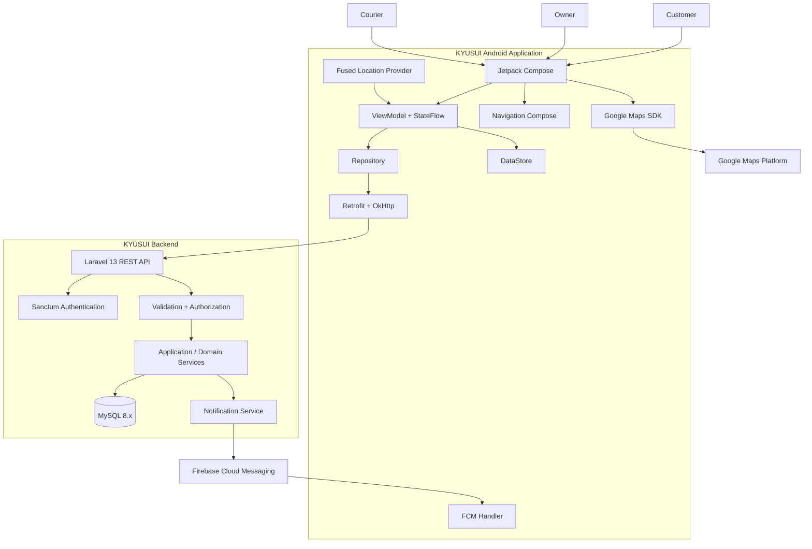

---

## 5. Architecture Style

KYŪSUI menggunakan kombinasi:

- Client-Server Architecture;
- Layered Architecture;
- MVVM pada Android;
- Repository Pattern pada Android;
- service-oriented separation pada Laravel application;
- RESTful API;
- event-driven notification flow;
- transactional persistence pada backend.

KYŪSUI tidak menggunakan microservices sebagai baseline.

Satu Laravel application dipertahankan karena scope sistem adalah satu depot dan satu aplikasi Android. Memecah backend menjadi beberapa service tanpa requirement yang mendukung hanya menambah operational complexity.

Logical architecture:

```text
Presentation
    ↓
ViewModel / State
    ↓
Repository
    ↓
Network / Local Data Source
    ↓
REST API
    ↓
Authentication / Authorization
    ↓
Application / Domain Services
    ↓
Persistence / Notification
    ↓
MySQL
```

---

## 6. Core Architectural Principles

### 6.1 Backend Is the Business Authority

Backend Laravel merupakan authority untuk:

```text
Authentication
Authorization
Ownership
Order Status
Payment Method
Payment Status
Payment Amount
QRIS Configuration
QRIS Verification
Cash Confirmation
Courier Assignment
Delivery State
Tracking Authorization
Business Transition
```

Android hanya mengirim action/intent dan membaca hasil authoritative dari backend.

### 6.2 MySQL Is the Persistent Source of Truth

Data bisnis yang telah dipersist berada pada backend/MySQL.

Local Android state hanya digunakan untuk:

- session;
- UI state;
- local preferences;
- kebutuhan lokal yang memang disetujui.

Local state tidak boleh menggantikan state bisnis server.

### 6.3 UI Is Not a Security Boundary

Menyembunyikan tombol atau screen pada Android bukan authorization.

Backend tetap harus memeriksa:

```text
Authentication
    ↓
Role
    ↓
Ownership / Assignment
    ↓
Current Resource State
    ↓
Allowed Business Transition
```

### 6.4 Client Input Is Untrusted

Semua input dari Android dianggap tidak terpercaya.

Backend wajib melakukan final validation.

### 6.5 No Direct Database Access

```text
Android
   X
   │
   X
MySQL

Android
   │
   ▼
Laravel REST API
   │
   ▼
MySQL
```

### 6.6 Business Logic Boundary

Business rule yang menentukan state dan authorization tidak boleh ditempatkan pada Composable.

Android boleh melakukan validation untuk UX, tetapi validation tersebut bukan pengganti backend validation.

### 6.7 External Dependency Minimization

Dependency hanya ditambahkan jika requirement benar-benar membutuhkan.

Tidak menambahkan provider payment, WebSocket, Redis, Room, atau service lain hanya untuk future-proofing apabila belum ada requirement.

---

## 7. Android Architecture

### 7.1 Android Layering

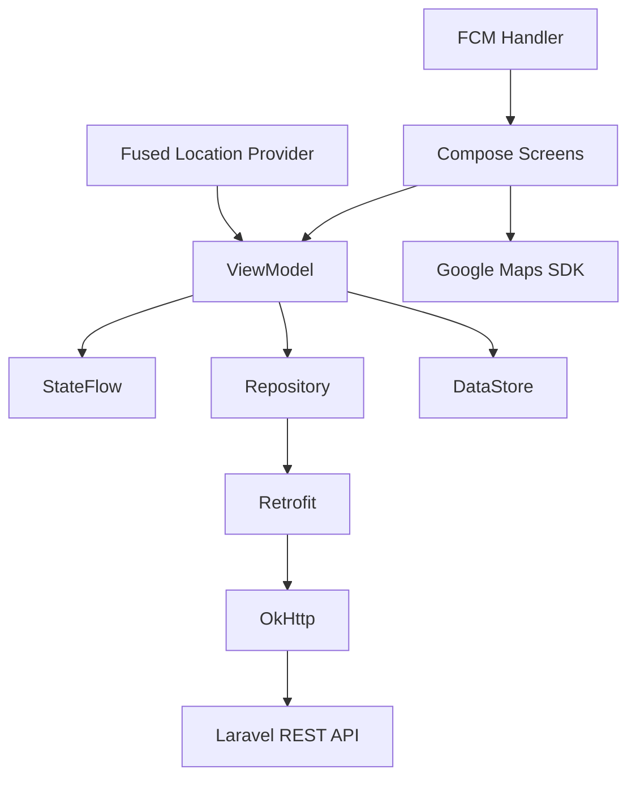

### 7.2 Presentation Layer

Jetpack Compose bertanggung jawab atas:

- rendering UI;
- user interaction;
- displaying state;
- loading state;
- empty state;
- success state;
- error state;
- navigation event presentation.

Composable tidak boleh:

- memanggil Retrofit secara langsung;
- mengakses database;
- menentukan payment status;
- menentukan order status;
- melakukan authorization;
- menghitung business amount authoritative;
- menjalankan business workflow kompleks.

### 7.3 ViewModel Layer

ViewModel bertanggung jawab atas:

- UI state;
- event handling;
- orchestration;
- lifecycle-aware state;
- pemanggilan repository;
- mapping domain response menjadi UI state.

State utama menggunakan StateFlow.

Konsep state:

```text
Loading
Success
Empty
Error
```

### 7.4 Repository Layer

Repository menjadi data access boundary.

Tanggung jawab:

- membaca data dari API;
- mengirim action ke API;
- memisahkan ViewModel dari Retrofit;
- menangani mapping data source;
- menyediakan interface stabil untuk ViewModel.

Repository tidak boleh mengambil alih business authority backend.

### 7.5 Retrofit

Retrofit menjadi client untuk REST API.

Retrofit tidak boleh:

- mengakses MySQL;
- memanggil payment provider;
- menjalankan provider webhook;
- menyimpan payment secret;
- menentukan payment state final.

### 7.6 OkHttp

OkHttp menangani transport HTTP dan concern jaringan yang diperlukan.

Production logging tidak boleh membocorkan:

```text
Access Token
Password
Payment Credential
Database Credential
Sensitive Payload
```

### 7.7 DataStore

DataStore digunakan untuk:

- session/token state;
- preference;
- local flags;
- data lokal non-authoritative.

DataStore bukan source of truth untuk:

```text
Order Status
Payment Status
Payment Amount
Courier Assignment
QRIS Configuration
```

### 7.8 Navigation

Navigation Compose digunakan untuk satu aplikasi Android dengan role-based navigation.

Role:

```text
CUSTOMER
OWNER
COURIER
```

Role menentukan screen dan navigation yang tersedia pada UI, tetapi backend tetap melakukan authorization.

---

## 8. Backend Architecture

### 8.1 Logical Layers

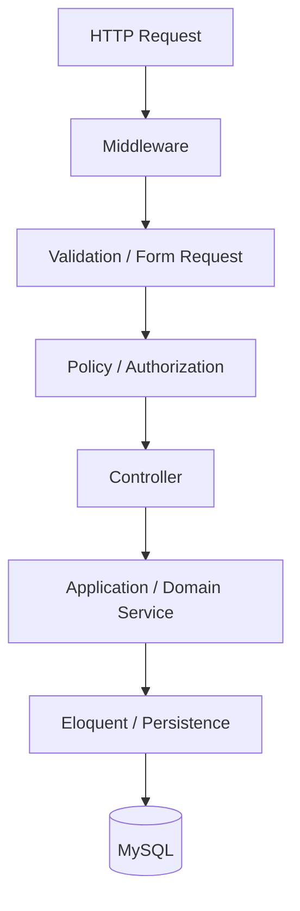

### 8.2 Middleware

Middleware menangani concern lintas endpoint seperti:

- Sanctum authentication;
- role access;
- throttling;
- request filtering bila diperlukan.

### 8.3 Controllers

Controller harus tipis.

Controller:

1. menerima request;
2. menggunakan validation;
3. memanggil service/domain logic;
4. menghasilkan response.

Business logic kompleks tidak ditumpuk di controller.

### 8.4 Validation

Server-side validation adalah validation authoritative.

Validation mencakup:

- format;
- required fields;
- range;
- ownership;
- relationship;
- current state;
- allowed transition.

### 8.5 Policies / Authorization

Policy digunakan untuk memastikan resource dan action sesuai dengan role serta relationship.

Contoh:

```text
Customer A
    ↓
Order Customer B
    ↓
Access denied / resource hidden
```

Resource ID bukan bukti kepemilikan.

### 8.6 Domain/Application Services

Service digunakan ketika workflow membutuhkan orkestrasi.

Contoh konseptual:

```text
OrderService
PaymentService
DeliveryService
TrackingService
NotificationService
```

Abstraction hanya dibuat ketika memiliki responsibility yang jelas.

---

## 9. API Architecture

### 9.1 Communication

```text
Android
   │
   │ HTTPS / JSON
   ▼
Laravel REST API
   │
   ├── Authentication
   ├── Authorization
   ├── Validation
   ├── Business Rules
   └── Persistence
        │
        ▼
      MySQL
```

### 9.2 API Boundary

API menjadi kontrak resmi antara Android dan backend.

API contract harus konsisten dengan:

- domain model;
- workflow;
- database;
- payment specification;
- integration contract.

Android tidak boleh mengarang endpoint yang belum didefinisikan.

### 9.3 Authentication Header

Private API secara konseptual menggunakan:

```text
Authorization: Bearer <sanctum-token>
```

### 9.4 API Response

Response menggunakan contract yang konsisten.

Success:

```json
{
  "data": {},
  "message": "Success."
}
```

Collection:

```json
{
  "data": [],
  "meta": {},
  "message": "Success."
}
```

Validation error:

```json
{
  "message": "Validation failed.",
  "errors": {}
}
```

Format final harus mengikuti `06_KYUSUI_API_SPECIFICATION_REBUILT.md`.

### 9.5 HTTP Status

Baseline:

```text
200 OK
201 Created
204 No Content
400 Bad Request
401 Unauthorized
403 Forbidden
404 Not Found
409 Conflict
422 Unprocessable Entity
429 Too Many Requests
500 Internal Server Error
503 Service Unavailable
```

---

## 10. Authentication and Authorization

### 10.1 Authentication

Laravel Sanctum digunakan sebagai authentication mechanism.

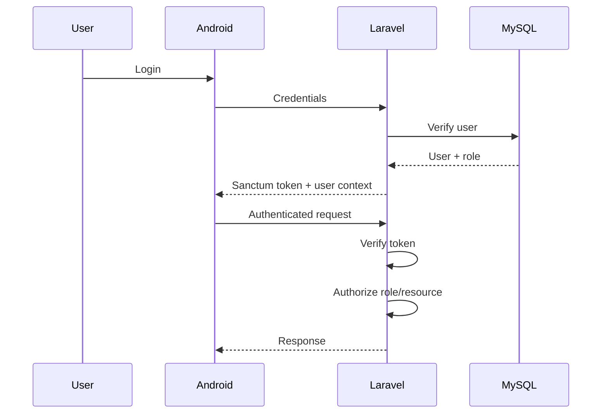

### 10.2 Token Rules

Token:

- dibuat backend;
- tidak di-hardcode;
- tidak masuk Git;
- tidak dicetak ke production log;
- tidak dikirim ke endpoint public;
- disimpan pada local storage yang sesuai.

### 10.3 Role

Canonical roles:

```text
CUSTOMER
OWNER
COURIER
```

### 10.4 Customer Boundary

Customer dapat melakukan operasi terhadap resource miliknya sesuai API policy:

- profile sendiri;
- product catalog;
- order sendiri;
- payment order sendiri;
- active QRIS;
- QRIS proof order sendiri;
- tracking order sendiri;
- notification sendiri.

### 10.5 Owner Boundary

Owner dapat melakukan operasi dalam operational scope Berkah Water, termasuk:

- incoming orders;
- order processing;
- QRIS verification;
- active QRIS management;
- courier assignment;
- operational monitoring.

Owner bukan actor untuk konfirmasi pembayaran CASH.

### 10.6 Courier Boundary

Courier dapat melakukan operasi terhadap assignment miliknya:

- melihat assigned order;
- update delivery status;
- mengirim location;
- melihat payment CASH pada assignment;
- mengonfirmasi `Uang Diterima` untuk CASH pada assignment aktif.

Courier tidak boleh:

- mengonfirmasi QRIS;
- mengubah QRIS;
- mengonfirmasi CASH order courier lain;
- mengakses resource tanpa delivery context yang sah.

---

## 11. Order Architecture

### 11.1 Order Lifecycle

Order dan payment merupakan domain yang berhubungan tetapi state-nya berbeda.

Canonical order status:

```text
MENUNGGU_PEMBAYARAN
MENUNGGU_DIPROSES
DIPROSES
DITUGASKAN
DALAM_PENGANTARAN
SELESAI
```

### 11.2 Order Flow

```text
Customer
   ↓
Create Order
   ↓
Select Delivery Location
   ↓
Select Payment
   ↓
Payment Workflow
   ↓
Owner Processing
   ↓
Courier Assignment
   ↓
Delivery
   ↓
Tracking
   ↓
Completion
   ↓
History
```

### 11.3 Order Amount

Nominal authoritative berasal dari backend.

```text
Order Items
    ↓
Subtotal
    ↓
Delivery Fee sesuai business rule
    ↓
Order Total
    ↓
Payment Amount
```

Android tidak menjadi source of truth nominal.

---

## 12. Payment Architecture — FINAL

### 12.1 Payment Decision

Payment architecture final KYŪSUI hanya:

```text
QRIS
CASH
```

Payment flow:

```text
Android
   ↓
Laravel Payment Business Rules
   ↓
MySQL
```

Tidak ada external payment gateway.

### 12.2 Explicitly Removed

Konsep berikut dihapus dari active architecture:

```text
Midtrans
Payment Gateway
Payment Provider
Dynamic QRIS Provider
Provider Transaction
Provider Transaction ID
Provider Reference
Provider Callback
Provider Webhook
Automatic Provider Verification
Provider Payment Status
Provider Credential
Provider Secret
PaymentLauncher
Payment Provider SDK
payment_transactions
```

Tidak boleh ada class, package, dependency, endpoint, database field, webhook route, callback handler, UI screen, atau configuration aktif yang masih bergantung pada konsep tersebut.

### 12.3 Payment State Authority

Backend Laravel adalah authority payment state.

```text
Android
   ↓
Payment Action
   ↓
Laravel Validation
   ↓
Payment Business Rules
   ↓
MySQL Transaction
   ↓
Authoritative Payment State
   ↓
Android Response / Refresh
```

Android tidak boleh menetapkan:

```text
payment_status = PAID
```

### 12.4 Payment Methods

#### QRIS

QRIS adalah static QRIS milik Berkah Water.

Karakteristik:

- satu active QRIS;
- Customer dapat melihat active QRIS;
- Owner dapat mengganti active QRIS;
- Customer melakukan pembayaran menggunakan QRIS;
- Customer mengunggah bukti pembayaran;
- Owner melakukan verifikasi manual;
- tidak ada automatic verification;
- tidak ada callback provider.

Flow:

```text
PENDING
   ↓
Customer Upload Proof
   ↓
WAITING_VERIFICATION
   ↓
Owner Approves
   ↓
PAID
```

Rejection:

```text
WAITING_VERIFICATION
   ↓
Owner Rejects
   ↓
PENDING
   ↓
Customer May Upload New Proof
```

Upload ulang tidak membuat payment record baru.

#### CASH

CASH adalah Cash on Delivery.

Flow:

```text
PENDING
   ↓
Order may continue according to workflow
   ↓
Courier delivers
   ↓
Customer pays cash
   ↓
Assigned Courier selects "Uang Diterima"
   ↓
Backend validates assignment + payment state
   ↓
PAID
```

Pemilihan CASH bukan bukti payment telah berhasil.

Owner bukan actor Cash confirmation.

Customer tidak dapat mengonfirmasi pembayaran Cash untuk dirinya sendiri.

### 12.5 Canonical Payment Status

Hanya:

```text
PENDING
WAITING_VERIFICATION
PAID
```

Tidak digunakan:

```text
PROCESSING
CONFIRMED
FAILED
EXPIRED
REJECTED
```

Rejection QRIS bukan status payment. Rejection mengembalikan state dari `WAITING_VERIFICATION` ke `PENDING`.

### 12.6 One Order — One Payment

```text
Order 1 : 1 Payment
```

Satu order hanya memiliki satu business payment record.

Re-upload proof QRIS tetap menggunakan payment yang sama.

### 12.7 Payment Data Model

Konsep final:

```text
payments
├── id
├── order_id
├── payment_method
├── payment_status
├── amount
├── proof_image
├── verified_by
├── verified_at
├── created_at
└── updated_at
```

Detail final mengikuti database specification.

Tidak ada:

```text
provider_name
provider_reference
provider_transaction_id
transaction_id
transaction_status
transaction_type
raw_payload
webhook_id
provider_event_id
idempotency_key
payment_transactions
```

### 12.8 Payment State Machine

QRIS:

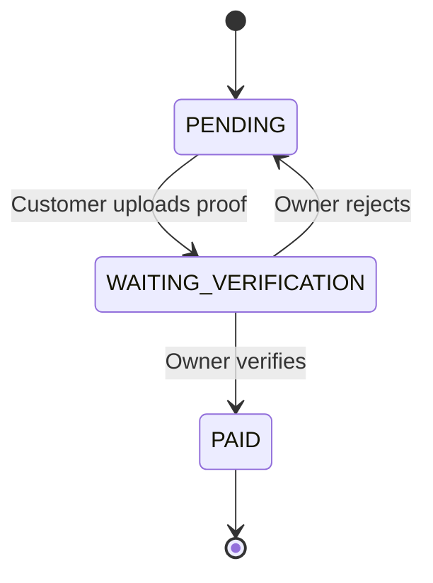

CASH:

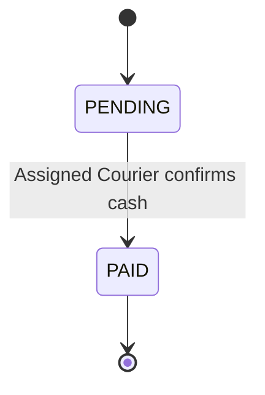

Tidak ada normal transition:

```text
PENDING → PAID
```

untuk QRIS tanpa verifikasi Owner.

### 12.9 Payment Authorization

```text
Customer
    → choose method
    → upload QRIS proof for own order
    → view payment state

Owner
    → verify/reject QRIS proof
    → manage active QRIS

Courier
    → confirm CASH only for assigned active delivery
```

### 12.10 Payment Consistency

Payment amount:

```text
payments.amount = orders.total_amount
```

Nominal authoritative dihitung backend.

### 12.11 Payment and Order Independence

Tidak berlaku rule global:

```text
Order hanya boleh diproses jika payment = PAID
```

Rule yang berlaku:

```text
QRIS
→ payment harus PAID sebelum order memasuki processing workflow sesuai workflow specification.

CASH
→ payment dapat tetap PENDING ketika order diproses dan dikirim.
→ payment menjadi PAID ketika cash diterima dan dikonfirmasi Assigned Courier.
```

---

## 13. QRIS Configuration Architecture

Active QRIS adalah business configuration, bukan payment provider transaction.

```text
Berkah Water
     ↓
Active Static QRIS
     ↓
Backend / business_settings
     ↓
Customer Android
     ↓
Display QRIS
```

Owner dapat mengganti active QRIS sesuai authorization.

Customer hanya dapat melihat active QRIS.

Android tidak boleh meng-hardcode QRIS aktif.

QRIS configuration bukan payment status.

QRIS replacement tidak membuat payment transaction baru.

---

## 14. Tracking Architecture

### 14.1 Technology

Tracking menggunakan:

```text
Fused Location Provider
Google Maps SDK
Laravel REST API
MySQL
```

### 14.2 Tracking Boundary

```text
Courier Device
   ↓
Fused Location Provider
   ↓
Android ViewModel
   ↓
Repository
   ↓
Laravel REST API
   ↓
Authorization + Delivery Validation
   ↓
MySQL
   ↓
Customer Tracking API
   ↓
Customer Android
   ↓
Google Maps SDK
```

Tidak ada direct device-to-device tracking.

### 14.3 Courier Location Authorization

Backend memvalidasi:

```text
Authenticated Courier
        ↓
Courier owns assignment
        ↓
Order belongs to assignment
        ↓
Delivery context active
        ↓
Location accepted
```

Courier tidak boleh mengirim location untuk assignment courier lain.

### 14.4 Customer Tracking Authorization

Customer hanya dapat melihat tracking untuk order miliknya dan delivery context yang sah.

```text
Customer
   ↓
Own Order
   ↓
Active Delivery
   ↓
Latest Authorized Location
   ↓
Map
```

### 14.5 Location Privacy

Courier location bukan data publik.

Akses location dibatasi berdasarkan:

- ownership;
- assignment;
- order relationship;
- operational role.

### 14.6 Tracking Lifecycle

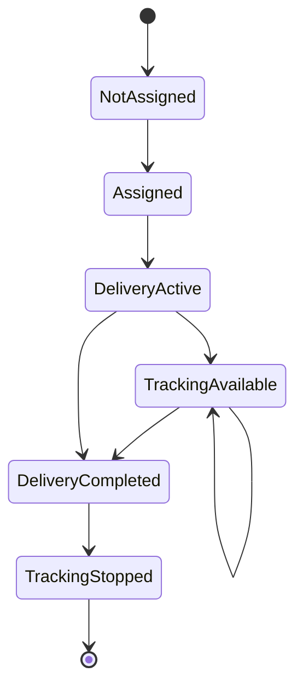

### 14.7 Realtime Strategy

WebSocket bukan komponen wajib.

Baseline menggunakan REST-based location submission dan retrieval/polling.

Interval update dan polling belum boleh di-hardcode sebelum keputusan teknis/testing menetapkannya.

### 14.8 Location Permission

Jika permission lokasi ditolak:

```text
Permission Denied
    ↓
Explain State
    ↓
Recovery Action
```

Android tidak boleh mengasumsikan permission selalu tersedia.

### 14.9 Tracking Failure

Kondisi dapat mencakup:

```text
GPS unavailable
Permission denied
Network unavailable
Delivery inactive
Unauthorized request
No location history
Stale location
```

Tracking failure tidak otomatis berarti order gagal.

---

## 15. Notification Architecture

### 15.1 Technology

Firebase Cloud Messaging digunakan sebagai notification transport.

### 15.2 Notification Authority

Notification bukan source of truth.

```text
Business Action
   ↓
Authorization
   ↓
Business Mutation
   ↓
Database Commit
   ↓
Notification Event
   ↓
Notification Record
   ↓
FCM
   ↓
Android
   ↓
API Refresh
   ↓
Authoritative State
```

### 15.3 Active Notification Domains

```text
ORDER
PAYMENT
DELIVERY
TRACKING
```

### 15.4 Payment Notification Events

```text
PAYMENT_QRIS_PROOF_UPLOADED
PAYMENT_QRIS_APPROVED
PAYMENT_QRIS_REJECTED
PAYMENT_CASH_CONFIRMED
```

### 15.5 Other Notification Events

```text
ORDER_CREATED
ORDER_PROCESSED
COURIER_ASSIGNED
DELIVERY_STARTED
TRACKING_AVAILABLE
ORDER_COMPLETED
```

Daftar final trigger harus mengikuti notification specification.

### 15.6 FCM Boundary

FCM hanya transport.

FCM tidak:

- menentukan payment status;
- menentukan order status;
- melakukan authorization;
- menyimpan business state;
- menggantikan REST API.

### 15.7 Notification Recipient

Recipient ditentukan berdasarkan business relationship:

```text
Customer
→ own order / own payment

Owner
→ operational scope Berkah Water

Courier
→ assigned delivery
```

---

## 16. External Service Boundary

### 16.1 Active External Services

External services yang tetap aktif:

```text
Firebase Cloud Messaging
Google Maps Platform
Location Services
```

Tidak ada external payment service.

### 16.2 Firebase

Firebase Cloud Messaging digunakan hanya untuk push notification transport.

### 16.3 Google Maps

Google Maps SDK digunakan untuk:

- map rendering;
- marker;
- visualization;
- delivery/tracking presentation.

Google Maps bukan source of truth location business data.

### 16.4 Fused Location Provider

Fused Location Provider digunakan untuk memperoleh location sample dari device courier.

Location provider tidak menentukan authorization bisnis.

---

## 17. Security Architecture

### 17.1 Trust Boundary

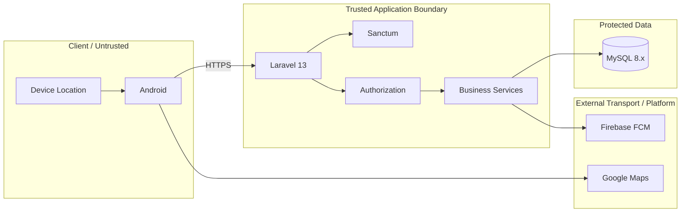

### 17.2 Sensitive Secrets

Tidak boleh berada pada Android:

```text
Database Password
Database Credential
Laravel Application Secret
Payment Secret
Provider Secret
FCM Server Credential
Private Key
Production Credential
```

### 17.3 HTTPS

Production menggunakan HTTPS.

```text
Production
→ HTTPS only
```

HTTP hanya boleh digunakan pada local development jika diperlukan.

### 17.4 IDOR Protection

Resource ID dari client bukan proof of ownership.

Backend wajib melakukan authorization terhadap resource.

### 17.5 Payment Security

Payment action wajib mengikuti:

```text
Authentication
    ↓
Role
    ↓
Ownership / Assignment
    ↓
Payment Method
    ↓
Current Payment State
    ↓
Allowed Transition
    ↓
Database Transaction
```

### 17.6 File Upload Security

QRIS proof upload harus divalidasi backend berdasarkan API/payment specification.

Android validation hanya UX-level.

---

## 18. Data Architecture

### 18.1 Core Domains

```text
Identity
├── users
├── roles
├── customers
├── owners
└── couriers

Catalog
└── products

Order
├── orders
├── order_items
└── order_status_histories

Payment
└── payments

Delivery
└── courier_assignments

Tracking
└── courier_locations

Notification
└── notifications

Configuration
└── business_settings
```

### 18.2 Payment Relationship

```text
orders
   │
   │ 1 : 1
   ▼
payments
```

Tidak ada:

```text
payments
   ↓
payment_transactions
```

### 18.3 Database Authority

Database final harus mengikuti:

- MySQL 8.x;
- InnoDB;
- foreign keys;
- referential integrity;
- appropriate indexes;
- transactional consistency.

Detail schema berada pada database specification, bukan architecture document ini.

---

## 19. Data Flow Architecture

### 19.1 General

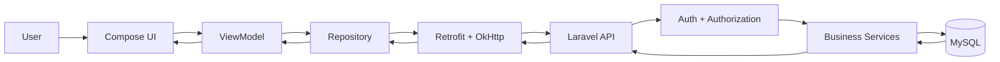

### 19.2 Order

```text
Customer
   ↓
Android
   ↓
Laravel
   ↓
Validation + Authorization
   ↓
Order Service
   ↓
MySQL
   ↓
Order Response
   ↓
Android
```

### 19.3 Payment

```text
Android
   ↓
Laravel Payment API
   ↓
Payment Business Rules
   ↓
MySQL
   ↓
Authoritative Payment State
   ↓
Android
```

Tidak ada:

```text
Android → Payment Gateway
Android → Payment Provider
Provider → Laravel Webhook
```

### 19.4 QRIS

```text
Customer Android
   ↓
Get Active QRIS
   ↓
Display QRIS
   ↓
Customer pays using QRIS
   ↓
Upload Proof
   ↓
Laravel validates
   ↓
WAITING_VERIFICATION
   ↓
Owner verifies
   ↓
PAID
   ↓
Notification
   ↓
Customer refreshes state
```

### 19.5 CASH

```text
CASH selected
   ↓
PENDING
   ↓
Order continues according to workflow
   ↓
Courier delivery
   ↓
Customer pays cash
   ↓
Courier confirms
   ↓
Laravel validates assignment
   ↓
PAID
   ↓
Notification
```

### 19.6 Tracking

```text
Courier GPS
   ↓
Fused Location Provider
   ↓
Android
   ↓
Laravel
   ↓
Authorization + Delivery Validation
   ↓
MySQL
   ↓
Customer Tracking API
   ↓
Google Maps SDK
```

---

## 20. Error Architecture

### 20.1 Error Flow

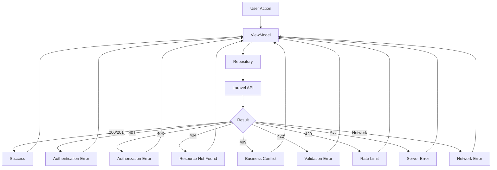

### 20.2 User-Facing Error

Technical exception tidak boleh langsung ditampilkan mentah.

```text
Technical Error
      ↓
Repository / ViewModel Mapping
      ↓
User-Friendly Error State
```

### 20.3 401

```text
401
 ↓
Invalidate session if appropriate
 ↓
Return to authentication flow
```

### 20.4 403

```text
403
 ↓
Do not blindly retry
 ↓
Show unavailable/forbidden state
```

### 20.5 409

Digunakan untuk business state conflict seperti action yang tidak lagi valid karena state telah berubah.

### 20.6 422

Validation failure harus dapat dipetakan ke field atau action yang relevan.

---

## 21. Concurrency and Transaction Consistency

Business mutation yang sensitif harus mempertimbangkan request berulang atau bersamaan.

Area penting:

```text
Payment verification
QRIS proof upload
Cash confirmation
Courier assignment
Order status update
Delivery status update
Notification dispatch
```

Pattern:

```text
Request
   ↓
Authentication
   ↓
Authorization
   ↓
Current State Validation
   ↓
Business Rule
   ↓
Database Transaction
   ↓
Commit
   ↓
Notification / Side Effect
```

### 21.1 Payment Concurrency

Contoh:

```text
Two Owner requests
        ↓
Same WAITING_VERIFICATION payment
        ↓
Backend must prevent invalid double transition
```

### 21.2 Cash Concurrency

Contoh:

```text
Two confirmation requests
        ↓
Same CASH payment
        ↓
Only one valid transition
        ↓
PAID
```

### 21.3 One Payment Record

Retry atau re-upload tidak boleh membuat payment record baru untuk order yang sama.

---

## 22. Performance Strategy

Performance baseline:

1. efficient database queries;
2. proper indexing;
3. pagination untuk collection;
4. measured API payload;
5. controlled image upload;
6. asynchronous notification work jika diperlukan;
7. controlled location update frequency;
8. avoid unnecessary polling.

Tidak menambahkan Redis, WebSocket, cache layer, atau queue system hanya karena alasan future-proofing.

Jika kebutuhan muncul, perubahan dilakukan melalui impact analysis dan technical decision.

---

## 23. Deployment Architecture

### 23.1 Environments

Minimal:

```text
LOCAL
TESTING / QA
PRODUCTION
```

Environment configuration dipisahkan.

### 23.2 Production

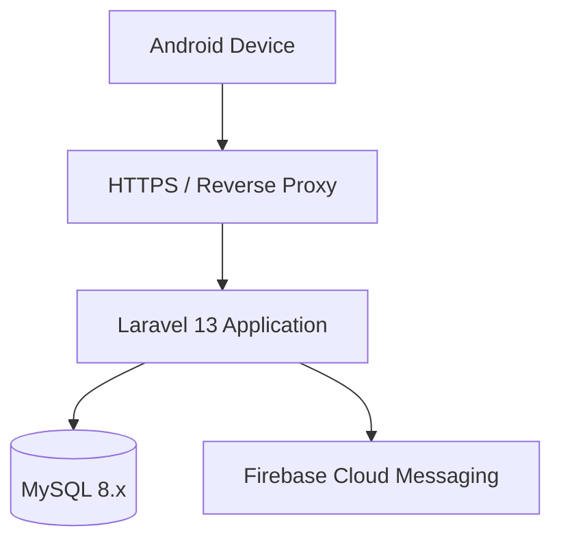

Tidak ada payment provider pada production architecture.

### 23.3 Database Network

```text
Internet
   ↓
HTTPS Application
   ↓
Laravel
   ↓
Protected Database Network
   ↓
MySQL
```

MySQL tidak diekspos langsung ke public internet.

### 23.4 Environment Secrets

Secret disimpan melalui secure environment configuration.

Tidak disimpan:

- pada source code;
- pada Git;
- pada Android APK;
- pada documentation examples.

---

## 24. Observability and Logging

Minimal observability:

```text
Application Logs
    ↓
Error Context
    ↓
Operational Diagnosis
```

Log tidak boleh berisi:

```text
Password
Sanctum Token
Database Credential
Payment Secret
Private Key
Unnecessary Sensitive Location
```

Business event penting harus dapat ditelusuri tanpa mengekspos secret.

---

## 25. Testing Architecture

Testing harus dapat dilakukan per boundary:

```text
Compose UI
   ↓
ViewModel
   ↓
Repository
   ↓
API Contract
   ↓
Laravel Service
   ↓
Database
   ↓
FCM / Maps / Location
```

Test area:

```text
Authentication
Authorization
Ownership
Order
Payment
QRIS
CASH
Courier Assignment
Delivery
Tracking
Notification
Database Integrity
API Contract
Concurrency
Security
End-to-End
Regression
```

### 25.1 Payment Test Boundary

Minimal:

```text
QRIS PENDING
QRIS WAITING_VERIFICATION
QRIS PAID

QRIS rejected → PENDING

CASH PENDING
CASH PAID

Unauthorized Customer
Unauthorized Owner
Unauthorized Courier
Wrong Courier Assignment
Duplicate Confirmation
Re-upload Proof
QRIS Replacement
```

### 25.2 Tracking Test Boundary

Minimal:

```text
GPS available
GPS unavailable
Permission granted
Permission denied
Network available
Network unavailable
Courier assigned
Courier not assigned
Delivery active
Delivery completed
Customer owns order
Customer does not own order
```

### 25.3 Regression

Payment revision tidak boleh merusak:

- authentication;
- order;
- courier assignment;
- delivery;
- tracking;
- notification;
- history.

---

## 26. Failure Isolation

### 26.1 FCM Failure

```text
Business Mutation
   ↓
Database Commit
   ↓
FCM Failure
   ↓
Business State remains valid
```

Notification failure tidak boleh membatalkan committed business transaction.

### 26.2 Maps Failure

Map failure tidak boleh menghapus atau mengubah order state.

### 26.3 GPS Failure

GPS failure tidak otomatis membuat order failed.

### 26.4 Network Failure

Android menampilkan recoverable state.

Tidak boleh menganggap local button click sebagai successful server mutation.

### 26.5 Payment Proof Upload Failure

Upload failure tidak boleh mengubah payment menjadi `PAID`.

---

## 27. Module Boundaries

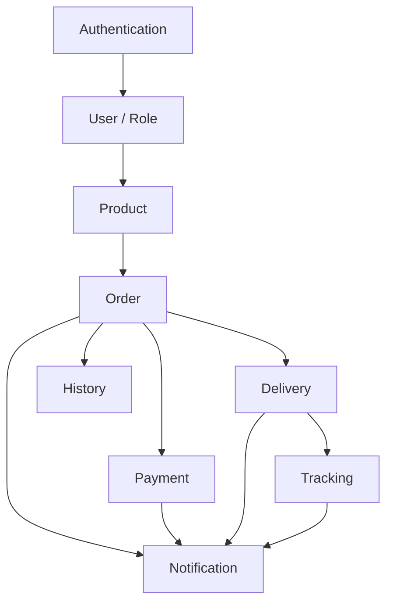

### Authentication

Login, register, logout, session.

### User / Role

Identity dan role context.

### Product

Catalog produk air galon.

### Order

Pembuatan dan lifecycle order.

### Payment

QRIS, CASH, proof, verification, confirmation, payment state.

### Delivery

Courier assignment dan delivery lifecycle.

### Tracking

Courier location dan customer tracking.

### Notification

Push notification berbasis committed business event.

### History

Riwayat order sesuai business requirement.

---

## 28. State Ownership Matrix

| Data | Authority |
|---|---|
| User identity | Laravel + MySQL |
| Role | Laravel + MySQL |
| Product data | Laravel + MySQL |
| Order | Laravel + MySQL |
| Order status | Laravel + MySQL |
| Payment method | Laravel + MySQL |
| Payment status | Laravel + MySQL |
| Payment amount | Laravel + MySQL |
| Active QRIS | Laravel + MySQL |
| QRIS verification | Laravel + MySQL |
| Cash confirmation | Laravel + MySQL |
| Courier assignment | Laravel + MySQL |
| Courier location persistence | Laravel + MySQL |
| Notification record | Laravel + MySQL |
| FCM delivery | Firebase transport |
| UI state | Android ViewModel + StateFlow |
| Session/local preference | Android DataStore |
| Map rendering | Android Google Maps SDK |

---

## 29. Architectural Decisions

### ADR-001 — Native Android

**Decision:** Android Native + Kotlin + Jetpack Compose.

**Status:** Accepted.

### ADR-002 — MVVM

**Decision:** MVVM + ViewModel + StateFlow + Repository.

**Status:** Accepted.

### ADR-003 — REST API

**Decision:** Android berkomunikasi melalui Laravel REST API.

**Status:** Accepted.

### ADR-004 — Laravel Monolith

**Decision:** Satu Laravel 13 application.

**Reason:** Scope satu depot tidak membutuhkan distributed service architecture.

**Status:** Accepted.

### ADR-005 — MySQL Source of Truth

**Decision:** MySQL 8.x menjadi persistent source of truth.

**Status:** Accepted.

### ADR-006 — Sanctum

**Decision:** Laravel Sanctum digunakan untuk authentication.

**Status:** Accepted.

### ADR-007 — QRIS + CASH

**Decision:** Payment hanya menggunakan QRIS static dan CASH.

**Reason:** Simpler MVP, tidak menggunakan payment gateway.

**Status:** Accepted.

### ADR-008 — Manual QRIS Verification

**Decision:** QRIS proof diverifikasi manual oleh Owner.

**Status:** Accepted.

### ADR-009 — Courier Cash Confirmation

**Decision:** CASH dikonfirmasi oleh Assigned Courier setelah menerima uang.

**Status:** Accepted.

### ADR-010 — FCM

**Decision:** FCM digunakan sebagai notification transport.

**Status:** Accepted.

### ADR-011 — REST-Based Tracking Baseline

**Decision:** Tracking menggunakan REST API sebagai transport dan authorization boundary.

**Reason:** WebSocket bukan dependency wajib.

**Status:** Accepted as baseline.

### ADR-012 — No Payment Provider

**Decision:** Tidak ada payment gateway/provider dependency.

**Status:** Accepted.

---

## 30. Removed Legacy Architecture

Konsep berikut secara eksplisit tidak lagi menjadi bagian dari active architecture:

```text
Midtrans
Payment Gateway
Payment Provider
Dynamic QRIS
Provider Transaction
Provider Transaction ID
Provider Reference
Provider Webhook
Provider Callback
Automatic Provider Verification
Provider Payment Status
Payment Provider SDK
PaymentLauncher
Provider Credential
Provider Secret
payment_transactions
```

Legacy reference tidak boleh dipertahankan sebagai compatibility layer yang tidak diperlukan.

Jika ditemukan pada implementation artifact:

```text
Detect
   ↓
Classify as Legacy
   ↓
Remove / Synchronize
   ↓
Test
```

---

## 31. Unresolved Technical Decisions

Arsitektur tidak boleh mengarang keputusan yang belum ditetapkan.

### UD-ARCH-001 — API Versioning

Status:

```text
UNRESOLVED
```

Harus mengikuti API specification final.

### UD-ARCH-002 — Tracking Update Interval

Status:

```text
UNRESOLVED
```

Interval harus ditentukan melalui requirement/testing sebelum production.

### UD-ARCH-003 — Customer Tracking Retrieval Strategy

Status:

```text
UNRESOLVED
```

Pilihan seperti fixed polling atau adaptive polling harus ditetapkan sebelum dikunci.

### UD-ARCH-004 — Location Retention

Status:

```text
UNRESOLVED
```

Durasi penyimpanan location history mengikuti keputusan tracking/database.

### UD-ARCH-005 — Background Tracking

Status:

```text
UNRESOLVED
```

Jangan mengaktifkan continuous background tracking tanpa requirement dan technical decision.

### UD-ARCH-006 — Offline Location Queue

Status:

```text
UNRESOLVED
```

Jangan membuat offline queue tanpa requirement.

### UD-ARCH-007 — Production Hosting Provider

Status:

```text
UNRESOLVED
```

Tidak mengunci vendor hosting pada architecture baseline.

### UD-ARCH-008 — Backup and Recovery Policy

Status:

```text
UNRESOLVED
```

Frequency, retention, restore test, dan disaster recovery target ditentukan pada deployment/operations decision.

---

## 32. Traceability

| Architecture Area | Authority |
|---|---|
| Android stack | `00` + `01` |
| Backend stack | `00` + `01` |
| Database | `00` + `01` + `05` + `13` |
| Authentication | `01` + `06` |
| Authorization | `01` + `06` |
| Order workflow | `00` + `04` |
| Payment | `08` |
| QRIS | `08` |
| CASH | `08` |
| Tracking | `09` |
| Notification | `10` |
| Android implementation boundary | `07` |
| Visual/UI behavior | `03` + `12` |
| Integration | `13_KYUSUI_INTEGRATION_CONTRACT.md` |
| Testing | `11` |

---

## 33. Final Architecture Diagram

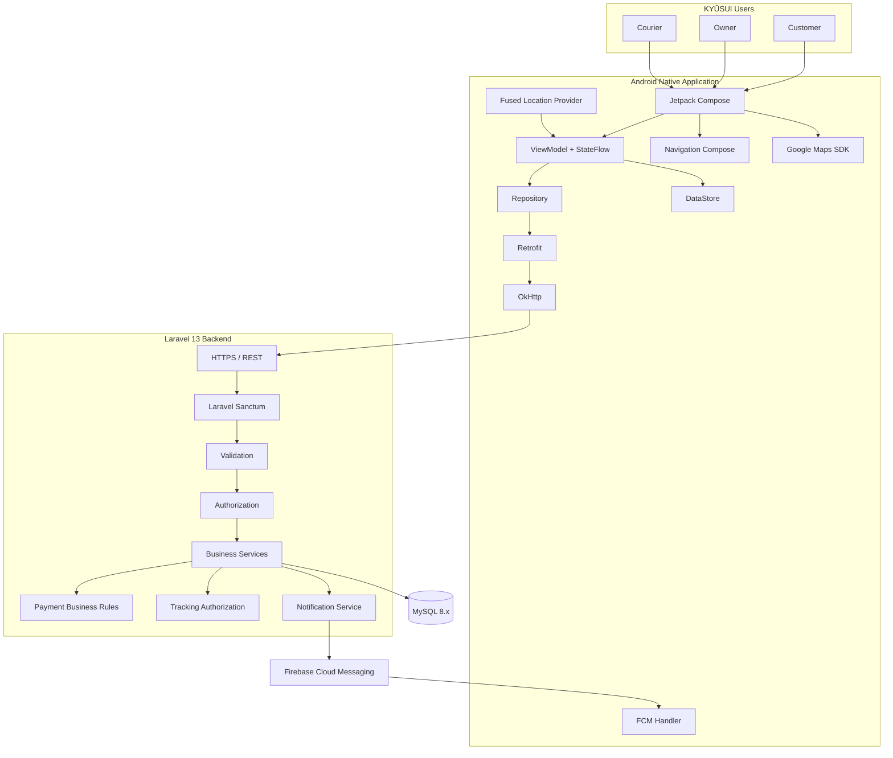

Payment path:

```text
Android
   ↓
Laravel Payment Business Rules
   ↓
MySQL
```

Tidak ada external payment gateway.

---

## 34. Architectural Summary

KYŪSUI menggunakan satu aplikasi Android Native berbasis Kotlin dan Jetpack Compose yang berkomunikasi dengan Laravel 13 REST API melalui HTTPS.

Android menggunakan:

```text
Kotlin
Jetpack Compose
Material 3
MVVM
ViewModel
StateFlow
Repository
Navigation Compose
Retrofit
OkHttp
DataStore
Google Maps SDK
Fused Location Provider
Firebase Cloud Messaging
```

Backend menggunakan:

```text
Laravel 13
PHP 8.3+
REST API
Laravel Sanctum
MySQL 8.x
```

Backend merupakan security dan business boundary.

MySQL merupakan persistent source of truth.

Payment architecture final:

```text
QRIS
CASH
```

QRIS:

```text
Static QRIS
→ Customer pays
→ Upload proof
→ Owner verifies
→ PAID
```

CASH:

```text
CASH
→ Customer pays Courier
→ Assigned Courier confirms
→ PAID
```

Payment state:

```text
PENDING
WAITING_VERIFICATION
PAID
```

Tidak ada:

```text
Midtrans
Payment Gateway
Payment Provider
Dynamic QRIS
Provider Transaction
Provider Webhook
Automatic Provider Verification
payment_transactions
```

Seluruh arsitektur non-payment tetap dipertahankan:

```text
Authentication
Authorization
Order
Product
Delivery
Courier Assignment
Tracking
Google Maps
Fused Location
Notification
FCM
History
Security
Deployment
Testing
```

---

## 35. Definition of Architecture Done

```text
[✓] Final stack defined
[✓] Android architecture defined
[✓] Backend architecture defined
[✓] Database boundary defined
[✓] REST API boundary defined
[✓] Sanctum authentication defined
[✓] Authorization boundary defined
[✓] Role boundaries defined
[✓] Order architecture defined
[✓] Payment architecture rebuilt
[✓] QRIS architecture defined
[✓] CASH architecture defined
[✓] Payment state defined
[✓] Payment authority defined
[✓] One Order → One Payment defined
[✓] QRIS configuration defined
[✓] Tracking architecture preserved
[✓] Location authorization preserved
[✓] Google Maps boundary defined
[✓] Fused Location boundary defined
[✓] Notification architecture preserved
[✓] FCM transport boundary defined
[✓] Security boundary defined
[✓] Data flow defined
[✓] Error flow defined
[✓] Concurrency boundary defined
[✓] Deployment baseline defined
[✓] Testing boundary defined
[✓] Legacy payment provider dependency removed
[✓] Provider webhook removed
[✓] Dynamic QRIS removed
[✓] Provider transaction removed
[✓] payment_transactions removed
[✓] No payment gateway dependency
[✓] Source authority defined
[✓] Traceability defined
[✓] Unresolved decisions explicitly marked
```

---

**End of `02_KYUSUI_SYSTEM_ARCHITECTURE.md`**
