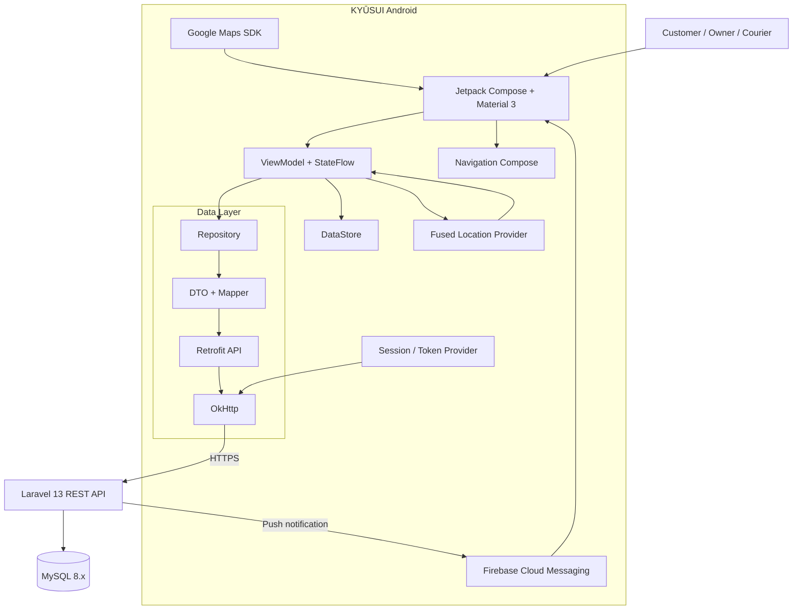
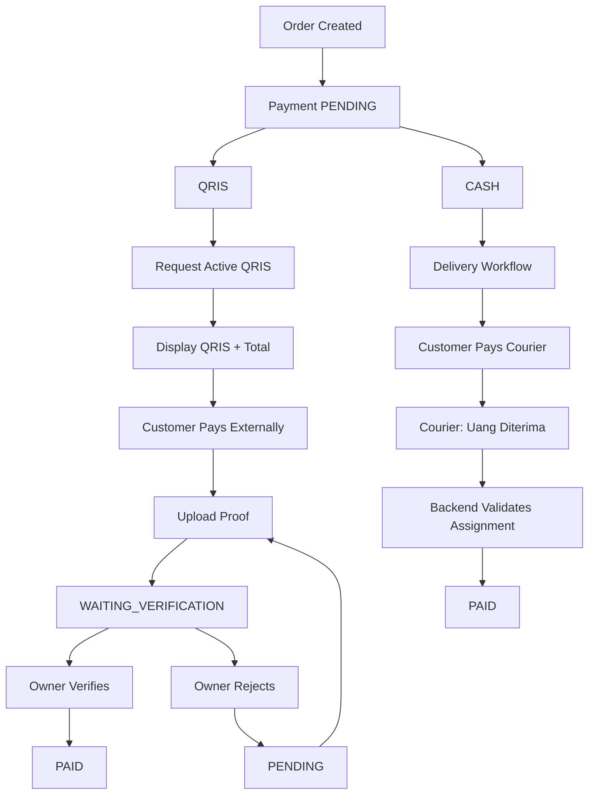

# 07_KYŪSUI_ANDROID_ARCHITECTURE

**Project:** KYŪSUI  
**Study Case:** Berkah Water  
**Document:** `07_KYUSUI_ANDROID_ARCHITECTURE.md`  
**Status:** REBUILT — PAYMENT ARCHITECTURE SYNCHRONIZED  
**Platform:** Android Native  
**Language:** Kotlin  
**UI:** Jetpack Compose + Material 3  
**Architecture:** MVVM + Repository  
**State Management:** ViewModel + StateFlow  
**Network:** Retrofit + OkHttp  
**Local Storage:** DataStore; Room only if a concrete local relational-storage requirement is later approved  
**Navigation:** Jetpack Navigation Compose  
**Maps:** Google Maps SDK  
**Location:** Fused Location Provider  
**Authentication:** Laravel Sanctum  
**Payment:** QRIS + CASH  
**Notification:** Firebase Cloud Messaging  
**Backend:** Laravel 13 / PHP 8.3+  
**Database:** MySQL 8.x  

**Authority:**

```text
00_KYUSUI_MASTER_SPECIFICATION.md
        ↓
01_KYUSUI_PROJECT_RULES.md
        ↓
02_KYUSUI_SYSTEM_ARCHITECTURE.md
        ↓
03_KYUSUI_UI_UX_SPECIFICATION.md
        ↓
04_KYUSUI_SYSTEM_WORKFLOW_REBUILT.md
        ↓
05_KYUSUI_DATABASE_SCHEMA_REBUILT.md
        ↓
06_KYUSUI_API_SPECIFICATION_REBUILT.md
        ↓
08_KYUSUI_PAYMENT_SPECIFICATION_REBUILT.md
        ↓
09_KYUSUI_TRACKING_SPECIFICATION.md
        ↓
10_KYUSUI_NOTIFICATION_SPECIFICATION.md
```

> **Payment Architecture Override:** Android payment architecture tidak lagi menggunakan Midtrans, payment gateway SDK, PaymentLauncher, dynamic QRIS provider, provider transaction, provider webhook, atau provider callback. Payment aktif hanya `QRIS` dan `CASH`. Backend tetap menjadi authority untuk seluruh payment state.

---

# 1. Purpose

Dokumen ini mendefinisikan arsitektur internal aplikasi Android KYŪSUI agar implementasi Kotlin dapat dilakukan secara konsisten terhadap REST API, database, workflow, payment, tracking, dan notification architecture.

Dokumen menetapkan:

1. project structure;
2. package structure;
3. naming convention;
4. presentation/UI layer;
5. ViewModel layer;
6. Repository layer;
7. remote data source;
8. local storage;
9. Retrofit;
10. OkHttp;
11. DataStore;
12. StateFlow;
13. Navigation;
14. authentication/session;
15. role-based navigation;
16. API error handling;
17. loading/empty/error state;
18. payment architecture;
19. QRIS architecture;
20. CASH architecture;
21. payment state handling;
22. Google Maps integration;
23. location permission;
24. courier tracking;
25. FCM notification handling;
26. dependency management;
27. security boundary;
28. testing direction;
29. implementation order.

Dokumen ini adalah architecture specification. Tidak berisi source code Kotlin.

---

# 2. Architectural Decisions

## 2.1 Final Android Stack

```text
Platform          : Android Native
Language          : Kotlin
UI                : Jetpack Compose
Design System     : Material 3
Architecture      : MVVM + Repository
State             : ViewModel + StateFlow
Navigation        : Jetpack Navigation Compose
HTTP Client       : Retrofit
HTTP Transport    : OkHttp
Serialization     : JSON converter sesuai Retrofit configuration
Local Storage     : DataStore
Optional Storage  : Room only when concrete requirement exists
Maps              : Google Maps SDK
Location          : Fused Location Provider
Notification      : Firebase Cloud Messaging
Backend           : Laravel 13 REST API
Authentication    : Laravel Sanctum
Database          : MySQL 8.x
Payment           : QRIS + CASH
```

Stack ini locked. Jangan mengganti Android Native menjadi Flutter, React Native, atau framework lain.

## 2.2 Primary Data Flow

```text
Jetpack Compose
      ↓
ViewModel + StateFlow
      ↓
Repository
      ↓
Remote / Local Data Source
      ↓
Retrofit + OkHttp
      ↓
HTTPS / REST / JSON
      ↓
Laravel 13 API
      ↓
MySQL / Backend Services
```

Android tidak pernah mengakses MySQL secara langsung.

## 2.3 Payment Data Flow

```text
Customer Android
      ↓
Payment ViewModel
      ↓
Payment Repository
      ↓
Payment API
      ↓
Laravel
      ↓
MySQL
      ↓
Authoritative Payment State
      ↓
Android refresh / response
      ↓
Payment UI
```

QRIS:

```text
GET active QRIS
      ↓
Display QRIS + total
      ↓
Customer pays externally
      ↓
Upload proof
      ↓
WAITING_VERIFICATION
      ↓
Owner verification through backend
      ↓
PAID
      ↓
Android receives authoritative state
```

CASH:

```text
Payment PENDING
      ↓
Order may continue according to workflow
      ↓
Courier receives delivery
      ↓
Customer pays cash
      ↓
Courier selects "Uang Diterima"
      ↓
Backend validates assignment + payment state
      ↓
PAID
      ↓
Android receives authoritative state
```

## 2.4 Architectural Boundary

```text
┌─────────────────────────────────────────────┐
│ Presentation                                │
│ Compose + Screen + UI State                 │
└──────────────────────┬──────────────────────┘
                       ↓
┌─────────────────────────────────────────────┐
│ State / MVVM                                │
│ ViewModel + StateFlow + UI Events           │
└──────────────────────┬──────────────────────┘
                       ↓
┌─────────────────────────────────────────────┐
│ Data Access                                 │
│ Repository                                  │
└──────────────────────┬──────────────────────┘
                       ↓
┌─────────────────────────────────────────────┐
│ Data Sources                                │
│ Retrofit / DataStore / Location / FCM       │
└──────────────────────┬──────────────────────┘
                       ↓
             Laravel REST API
```

Backend tetap menjadi authority untuk:

- authentication;
- authorization;
- ownership;
- courier assignment;
- order state;
- payment state;
- payment verification;
- payment amount;
- active QRIS;
- business transition.

---

# 3. Core Architecture Principles

## 3.1 Single Android Application

KYŪSUI menggunakan satu aplikasi Android.

```text
One Android Application
        ↓
Authenticated User
        ↓
Role
 ┌──────┼──────┐
 ↓      ↓      ↓
CUSTOMER OWNER COURIER
```

Tidak membuat tiga APK terpisah.

Role hanya menentukan UI dan navigation. Role bukan security boundary.

## 3.2 MVVM

```text
Compose UI
    ↓ events
ViewModel
    ↓
Repository
    ↓
Data Sources
```

Composable tidak boleh:

- memanggil Retrofit secara langsung;
- membuat HTTP request sendiri;
- mengakses DataStore secara sembarangan;
- menentukan payment status;
- menentukan authorization;
- menentukan harga authoritative;
- melakukan query database;
- melakukan business workflow kompleks.

## 3.3 Repository as Data Boundary

ViewModel hanya mengetahui contract Repository.

ViewModel tidak perlu mengetahui:

- URL endpoint;
- Retrofit implementation;
- OkHttp interceptor;
- response parsing;
- multipart implementation;
- DataStore implementation;
- FCM token persistence.

## 3.4 Server as Business Authority

Android boleh melakukan validation untuk UX, tetapi bukan untuk menggantikan backend.

Contoh:

```text
Android:
quantity harus > 0

Backend:
apakah quantity valid?
apakah product tersedia?
berapa harga authoritative?
apakah customer boleh membuat order?
apakah payment transition diizinkan?
apakah courier memiliki assignment tersebut?
```

## 3.5 No Client-Side PAID

Aturan kritis:

```text
Android TIDAK menentukan:
payment_status = PAID
```

Android hanya:

```text
send action
      ↓
receive backend response
      ↓
display authoritative state
```

Jangan membuat local transition:

```text
upload proof selesai → PAID
```

atau:

```text
Uang Diterima diklik → PAID
```

Yang benar:

```text
upload proof
      ↓
backend
      ↓
WAITING_VERIFICATION
      ↓
backend verification
      ↓
PAID
```

dan:

```text
Uang Diterima
      ↓
backend validation
      ↓
PAID
```

---

# 4. Project Structure

Satu module `app` menjadi baseline.

```text
kyusui-android/
│
├── build.gradle.kts
├── settings.gradle.kts
├── gradle.properties
├── gradle/
│   └── libs.versions.toml
│
└── app/
    ├── build.gradle.kts
    ├── proguard-rules.pro
    │
    └── src/
        ├── main/
        │   ├── AndroidManifest.xml
        │   └── java/
        │       └── com/
        │           └── kyusui/
        │               └── app/
        │
        ├── test/
        │   └── java/
        │       └── com/kyusui/app/
        │
        └── androidTest/
            └── java/
                └── com/kyusui/app/
```

Package root yang direkomendasikan:

```text
com.kyusui.app
```

Jika project Android sudah menggunakan package identifier berbeda, pertahankan package existing untuk menghindari perubahan yang tidak diperlukan.

---

# 5. Package Structure

```text
com.kyusui.app
│
├── KyusuiApplication.kt
│
├── core/
│   ├── common/
│   ├── datastore/
│   ├── location/
│   ├── maps/
│   ├── navigation/
│   ├── network/
│   ├── notification/
│   ├── security/
│   ├── ui/
│   └── util/
│
├── data/
│   ├── local/
│   ├── mapper/
│   ├── remote/
│   │   ├── api/
│   │   └── dto/
│   └── repository/
│
├── domain/
│   ├── model/
│   └── repository/
│
└── feature/
    ├── auth/
    │
    ├── customer/
    │   ├── home/
    │   ├── order/
    │   ├── payment/
    │   ├── tracking/
    │   ├── history/
    │   └── profile/
    │
    ├── owner/
    │   ├── dashboard/
    │   ├── orders/
    │   ├── payment/
    │   ├── courier/
    │   └── profile/
    │
    └── courier/
        ├── dashboard/
        ├── deliveries/
        ├── navigation/
        ├── tracking/
        ├── history/
        └── profile/
```

Tidak ada package payment provider.

Tidak ada package:

```text
midtrans/
paymentgateway/
provider/
webhook/
paymentlauncher/
```

---

# 6. Detailed Folder Responsibility

## 6.1 Core

```text
core/
├── common/
├── datastore/
├── location/
├── maps/
├── navigation/
├── network/
├── notification/
├── security/
├── ui/
└── util/
```

Core berisi infrastructure yang digunakan lintas feature.

## 6.2 Data

```text
data/
├── local/
├── mapper/
├── remote/
│   ├── api/
│   └── dto/
└── repository/
```

Data layer bertanggung jawab terhadap komunikasi dan mapping data.

## 6.3 Domain

```text
domain/
├── model/
└── repository/
```

Domain model digunakan oleh ViewModel dan UI.

## 6.4 Feature

Feature package mengelompokkan:

```text
Screen
ViewModel
Feature-specific UI state
Feature-specific event
```

Repository dan API yang shared tidak ditempatkan di feature.

---

# 7. Naming Convention

## 7.1 Package

```text
com.kyusui.app
com.kyusui.app.feature.customer.payment
```

## 7.2 Screen

```text
LoginScreen
CustomerHomeScreen
CreateOrderScreen
PaymentScreen
OrderDetailScreen
TrackingScreen
OwnerPaymentScreen
CourierDeliveryDetailScreen
```

## 7.3 ViewModel

```text
LoginViewModel
CreateOrderViewModel
PaymentViewModel
TrackingViewModel
OwnerPaymentViewModel
CourierDeliveryViewModel
```

## 7.4 Repository

```text
AuthRepository
CustomerRepository
OwnerRepository
CourierRepository
PaymentRepository
TrackingRepository
NotificationRepository
```

Implementation:

```text
AuthRepositoryImpl
PaymentRepositoryImpl
TrackingRepositoryImpl
```

## 7.5 API

```text
AuthApi
CustomerApi
OwnerApi
CourierApi
PaymentApi
NotificationApi
```

## 7.6 DTO

```text
LoginRequest
LoginResponse
CreateOrderRequest
PaymentResponse
UploadPaymentProofResponse
ActiveQrisResponse
CashConfirmationResponse
TrackingResponse
```

## 7.7 Domain Model

```text
User
Role
Product
Order
OrderItem
Payment
CourierAssignment
CourierLocation
Notification
```

Jangan menggunakan DTO sebagai UI model.

---

# 8. UI Layer

## 8.1 Responsibilities

Compose UI bertanggung jawab untuk:

- rendering state;
- user interaction;
- navigation event;
- loading;
- empty state;
- error state;
- success feedback;
- validation feedback;
- payment state presentation.

## 8.2 UI Data Flow

```text
StateFlow
   ↓
Composable
   ↓
User Event
   ↓
ViewModel
```

## 8.3 State Hoisting

Screen kompleks menggunakan pola konseptual:

```text
Screen
    state
    onEvent
        ↓
ViewModel
```

Composable tidak membuat network call.

## 8.4 Payment UI

Payment UI harus menampilkan state backend, bukan state lokal yang dibuat Android.

Contoh:

```text
PENDING
WAITING_VERIFICATION
PAID
```

Untuk QRIS:

```text
PENDING
    ↓
Tampilkan QRIS + total
    ↓
Upload proof
    ↓
WAITING_VERIFICATION
    ↓
PAID
```

Untuk CASH:

```text
PENDING
    ↓
Tampilkan CASH + total
    ↓
Courier confirms
    ↓
PAID
```

---

# 9. ViewModel Layer

## 9.1 Responsibilities

ViewModel menangani:

- UI state;
- event;
- orchestration repository;
- loading;
- error;
- refresh;
- navigation intent;
- payment action;
- tracking state;
- notification-driven refresh.

## 9.2 ViewModel Restrictions

ViewModel tidak boleh:

- menentukan `PAID`;
- menentukan ownership;
- bypass API;
- menghitung nominal authoritative;
- mengubah role;
- membuat Retrofit client sendiri;
- menyimpan password plaintext;
- menganggap notification sebagai source of truth.

## 9.3 StateFlow

StateFlow menjadi mekanisme state utama.

Contoh state konseptual:

```text
PaymentUiState
├── isLoading
├── payment
├── activeQris
├── total
├── isUploadingProof
├── isProcessingAction
├── error
└── uploadState
```

State payment harus berasal dari response backend.

---

# 10. Repository Layer

## 10.1 Repository Responsibility

Repository menjadi boundary:

```text
ViewModel
    ↓
Repository
    ↓
API / DataStore / Location
```

Repository melakukan:

- request execution;
- DTO mapping;
- error mapping;
- session interaction;
- multipart upload orchestration;
- refresh;
- response normalization.

## 10.2 PaymentRepository

PaymentRepository menangani:

```text
getActiveQris()
getPayment(orderId)
selectPaymentMethod(orderId, method)
uploadQrisProof(orderId, proof)
getPaymentHistory()
ownerGetPendingQrisPayments()
ownerGetPaymentProof(orderId)
ownerVerifyQris(orderId)
ownerRejectQris(orderId)
ownerReplaceActiveQris(qris)
courierConfirmCash(orderId)
```

Nama endpoint aktual harus mengikuti API Specification. Android tidak boleh mengarang endpoint baru.

## 10.3 TrackingRepository

```text
getTracking(orderId)
sendCourierLocation(assignmentId, location)
```

Authorization tetap dilakukan backend.

---

# 11. Remote Data Source

Remote communication menggunakan Retrofit.

Boundary:

```text
API Interface
      ↓
Retrofit
      ↓
OkHttp
      ↓
HTTPS
      ↓
Laravel
```

API interface tidak berisi business rule.

---

# 12. Retrofit Architecture

## 12.1 Purpose

Retrofit digunakan sebagai HTTP API client untuk REST API Laravel.

Retrofit bertanggung jawab terhadap:

- endpoint invocation;
- HTTP method;
- request body;
- query;
- path parameter;
- multipart;
- response deserialization.

Retrofit bukan tempat business authorization.

## 12.2 API Separation

Minimal API boundary:

```text
AuthApi
CustomerApi
OwnerApi
CourierApi
PaymentApi
NotificationApi
```

Tracking dapat ditempatkan pada API yang sesuai dengan API specification selama boundary tetap jelas.

## 12.3 Payment API Boundary

PaymentApi hanya berkomunikasi dengan backend KYŪSUI.

```text
Android
   ↓
PaymentApi
   ↓
Laravel Payment Endpoint
```

Tidak ada:

```text
Android
   ↓
Midtrans SDK
```

Tidak ada:

```text
Android
   ↓
Payment Gateway
```

Tidak ada:

```text
Android
   ↓
Provider Webhook
```

---

# 13. OkHttp Architecture

OkHttp menjadi HTTP transport layer.

Responsibilities:

- connection;
- timeout;
- authentication header;
- logging pada development;
- retry yang aman secara teknis;
- interceptor.

## 13.1 Authentication Interceptor

Konseptual:

```text
Request
  ↓
Read Sanctum token
  ↓
Add Authorization header
  ↓
Send request
```

Token berasal dari secure session storage abstraction.

## 13.2 Logging

Production tidak boleh mencetak:

- access token;
- password;
- payment proof URL private;
- sensitive customer data.

Logging harus disesuaikan dengan environment.

## 13.3 Retry

Jangan melakukan blind retry terhadap action yang dapat menghasilkan perubahan bisnis.

Khusus request payment:

```text
POST action
    ↓
network timeout
    ↓
JANGAN langsung mengasumsikan failed
    ↓
refresh authoritative payment state
```

Tujuannya menghindari duplicate business action.

---

# 14. DataStore and Session

## 14.1 DataStore Usage

DataStore digunakan untuk:

```text
Sanctum token
session metadata
role/session hints
small user preferences
```

## 14.2 DataStore Is Not Business Source of Truth

Jangan menyimpan authoritative:

```text
payment_status
order_status
product_price
active_qris
courier_location
```

sebagai sumber utama.

## 14.3 Session Lifecycle

```text
App Start
   ↓
Read local session
   ↓
If no token → Auth UI
   ↓
If token exists → validate session with backend
   ↓
Valid → role-based navigation
Invalid → clear session → Auth UI
```

---

# 15. Authentication Architecture

Authentication menggunakan Laravel Sanctum.

```text
Login Screen
   ↓
LoginViewModel
   ↓
AuthRepository
   ↓
AuthApi
   ↓
Laravel Sanctum
   ↓
Token + User
   ↓
DataStore
   ↓
Session State
```

Token:

- dibuat backend;
- disimpan secara aman;
- tidak di-hardcode;
- tidak dimasukkan ke source code;
- tidak ditampilkan pada log production.

---

# 16. Role-Based Navigation

Satu application shell digunakan.

```text
Authentication
      ↓
Current User
      ↓
Role
 ┌────┼────┐
 ↓    ↓    ↓
CUSTOMER OWNER COURIER
```

Customer:

```text
Home
Order
Payment
Orders
Tracking
History
Profile
```

Owner:

```text
Dashboard
Orders
Payment Verification
QRIS Settings
Courier Assignment
Profile
```

Courier:

```text
Dashboard
Assigned Deliveries
Delivery Detail
Tracking
Navigation
Payment Cash Confirmation
History
Profile
```

Navigation tidak menggantikan backend authorization.

---

# 17. Order Architecture

Order screen membaca data dari backend.

```text
Order List
   ↓
Order Detail
   ↓
Payment / Delivery State
```

Android tidak boleh membuat order status baru.

Canonical order status mengikuti API:

```text
MENUNGGU_PEMBAYARAN
MENUNGGU_DIPROSES
DIPROSES
DITUGASKAN
DALAM_PENGANTARAN
SELESAI
```

Display label dapat menggunakan Bahasa Indonesia sesuai UI/UX.

---

# 18. Payment Architecture — Final

## 18.1 Payment Methods

Hanya:

```text
QRIS
CASH
```

Tidak digunakan:

```text
MIDTRANS
DIGITAL
PAYMENT_GATEWAY
DYNAMIC_QRIS
```

## 18.2 Payment Status

Hanya:

```text
PENDING
WAITING_VERIFICATION
PAID
```

Tidak digunakan pada active architecture:

```text
PROCESSING
CONFIRMED
FAILED
EXPIRED
```

## 18.3 Payment Model

```text
Order
  │
  │ 1 : 1
  ↓
Payment
```

Tidak ada Android concept:

```text
PaymentTransaction
ProviderTransaction
ProviderCallback
ProviderWebhook
```

---

# 19. QRIS Android Architecture

## 19.1 QRIS Principle

KYŪSUI menggunakan static QRIS milik Berkah Water.

Android tidak membuat dynamic QRIS.

Android tidak berkomunikasi dengan provider QRIS.

Android hanya mendapatkan konfigurasi QRIS dari backend.

## 19.2 QRIS Flow

```text
Order
   ↓
Payment PENDING
   ↓
Request active QRIS
   ↓
Display QRIS
   ↓
Display authoritative total
   ↓
Customer pays externally
   ↓
Customer selects payment proof
   ↓
Upload proof
   ↓
Backend validates
   ↓
WAITING_VERIFICATION
   ↓
Owner verifies
   ↓
PAID
```

## 19.3 Android Responsibilities

Android:

1. request active QRIS;
2. display QRIS;
3. display total;
4. display payment instructions;
5. select image/file sesuai API contract;
6. upload proof;
7. display upload result;
8. display `WAITING_VERIFICATION`;
9. refresh payment state;
10. display `PAID`;
11. display `PENDING` after rejection;
12. allow upload again when backend permits.

Android tidak:

- melakukan verifikasi bukti;
- membaca rekening bank;
- melakukan OCR untuk menentukan pembayaran berhasil;
- menghubungi payment provider;
- mengubah status menjadi PAID.

## 19.4 QRIS UI State

```text
PENDING
│
├── Active QRIS available
│
├── Total available
│
└── Upload Proof Action
```

Setelah upload berhasil:

```text
WAITING_VERIFICATION
│
├── Proof submitted
├── Waiting for Owner
└── No "Mark as Paid" action
```

Setelah backend verified:

```text
PAID
│
└── Payment completed
```

Jika rejected:

```text
WAITING_VERIFICATION
       ↓
Backend rejection
       ↓
PENDING
       ↓
Upload New Proof
```

## 19.5 Proof Upload

Upload menggunakan endpoint backend yang ditetapkan API Specification.

Android harus menangani:

```text
Selecting file
Uploading
Upload success
Validation error
Network error
Server error
Retry
Refresh
```

Upload berhasil tidak sama dengan payment berhasil.

---

# 20. CASH Android Architecture

## 20.1 Cash Principle

CASH adalah Cash on Delivery.

Payment dimulai:

```text
PENDING
```

Order CASH dapat melanjutkan workflow order sesuai business rule walaupun payment masih PENDING.

## 20.2 Customer

Customer melihat:

```text
Payment Method : CASH
Total          : authoritative backend amount
Status         : PENDING
```

Customer tidak memiliki action:

```text
Mark as Paid
Confirm Cash
```

Customer tidak mengunggah proof Cash.

## 20.3 Courier

Courier pada delivery assignment yang sah melihat:

```text
Payment Method : CASH
Total          : authoritative backend amount
Payment Status : PENDING
Action         : Uang Diterima
```

Ketika Courier memilih:

```text
Uang Diterima
```

Android hanya mengirim action ke backend.

## 20.4 Backend Result

```text
Courier Action
      ↓
Backend validates:
- authenticated courier
- assignment ownership
- order context
- payment method = CASH
- payment status = PENDING
      ↓
Allowed
      ↓
Payment = PAID
```

Android menerima response dan menampilkan state tersebut.

Jika backend menolak:

```text
Android remains in authoritative state
```

Android tidak mengubah state menjadi PAID secara lokal.

---

# 21. Payment State Handling

## 21.1 QRIS

Allowed:

```text
PENDING → WAITING_VERIFICATION
WAITING_VERIFICATION → PAID
WAITING_VERIFICATION → PENDING
```

## 21.2 CASH

Allowed:

```text
PENDING → PAID
```

## 21.3 Forbidden Client Transitions

Android tidak boleh membuat:

```text
PENDING → PAID
```

untuk QRIS.

Android tidak boleh membuat:

```text
WAITING_VERIFICATION → PAID
```

tanpa backend response.

Android tidak boleh membuat:

```text
PAID → PENDING
```

## 21.4 PAID Is Terminal

Dalam payment workflow normal:

```text
PAID
```

adalah final payment state.

UI tidak menyediakan action untuk mengubahnya kembali.

---

# 22. Payment Error Handling

Active architecture tidak mempunyai payment failure status.

Kesalahan teknis ditangani sebagai UI/network error, bukan payment state baru.

## 22.1 Upload Error

```text
Upload failed
   ↓
Keep authoritative server state
   ↓
Show error
   ↓
Retry
```

## 22.2 Verification Action Error

```text
Owner action failed
   ↓
Do not locally change payment state
   ↓
Show error
   ↓
Refresh payment
```

## 22.3 Cash Confirmation Error

```text
Courier selects Uang Diterima
   ↓
API request
   ↓
Error
   ↓
Do not set PAID locally
   ↓
Display server/error response
   ↓
Refresh when appropriate
```

## 22.4 Timeout

Jika action timeout:

```text
Unknown client result
        ↓
Do not assume success
        ↓
GET authoritative payment state
```

---

# 23. Payment Amount Handling

Nominal authoritative berasal dari backend.

```text
Products
   ↓
Order Items
   ↓
Subtotal
   ↓
Delivery Fee according to business rule
   ↓
Order Total
   ↓
Payment Amount
```

Android hanya menampilkan amount yang dikirim backend.

Android boleh melakukan display formatting:

```text
Rp 10.000
```

tetapi tidak boleh mengganti nominal transaksi authoritative.

---

# 24. Owner Payment Architecture

Owner mempunyai payment-related experience:

```text
Owner Dashboard
      ↓
Pending QRIS Verification
      ↓
Payment Detail
      ↓
Proof Image
      ↓
Verify / Reject
```

Owner juga mempunyai:

```text
QRIS Settings
      ↓
View active QRIS
      ↓
Replace active QRIS
```

Android tidak memverifikasi isi proof.

Android hanya mengirim action:

```text
VERIFY
REJECT
```

Backend menentukan apakah action valid.

## 24.1 Owner QRIS Replacement

Android:

```text
Select QRIS image
      ↓
Upload to backend
      ↓
Backend validates
      ↓
Active QRIS updated
      ↓
Android refreshes configuration
```

Jangan menyimpan active QRIS sebagai hardcoded Android asset.

---

# 25. Courier Payment Architecture

Courier payment UI hanya untuk CASH pada assignment yang valid.

```text
Courier
  ↓
Assigned Delivery
  ↓
Delivery Detail
  ↓
Payment Section
  ↓
CASH
  ↓
Total
  ↓
Uang Diterima
```

Tidak ada:

```text
QRIS verification
QRIS approval
QRIS rejection
provider payment action
```

Courier tidak boleh mengonfirmasi Cash order courier lain.

Backend tetap memvalidasi assignment.

---

# 26. Payment Refresh Strategy

Payment screen harus dapat melakukan refresh authoritative state.

Refresh dapat dipicu oleh:

- initial screen load;
- return ke screen;
- notification tap;
- explicit refresh;
- selesai upload proof;
- selesai owner verification;
- selesai cash confirmation;
- recovery setelah network error.

Android tidak boleh menggunakan timer/polling untuk payment kecuali kebutuhan tersebut memang ditentukan oleh API/workflow dan implementasinya disetujui.

Jika notification menyatakan payment berubah:

```text
Notification
   ↓
Open relevant payment/order
   ↓
GET current resource
   ↓
Render authoritative state
```

---

# 27. Tracking Architecture

Tracking mengikuti `09_KYUSUI_TRACKING_SPECIFICATION.md`.

```text
Courier
  ↓
Fused Location Provider
  ↓
Courier ViewModel
  ↓
Tracking Repository
  ↓
Retrofit + OkHttp
  ↓
Laravel
  ↓
MySQL
  ↓
Customer Tracking API
  ↓
Customer ViewModel
  ↓
Google Maps SDK
```

Tracking hanya aktif ketika delivery context valid.

## 27.1 Courier Side

Courier Android bertanggung jawab terhadap:

- permission;
- location acquisition;
- lifecycle tracking;
- upload location;
- network error handling;
- battery-aware behavior.

## 27.2 Customer Side

Customer Android bertanggung jawab terhadap:

- request tracking;
- display latest location;
- display map;
- refresh;
- loading/error state.

Google Maps hanya visualization layer.

Google Maps bukan source of truth tracking.

---

# 28. Location Permission

Location permission hanya diperlukan untuk courier ketika fitur delivery tracking membutuhkan lokasi.

Lifecycle:

```text
Delivery Context
      ↓
Permission Check
      ↓
Permission Granted
      ↓
Location Available
      ↓
Tracking Active
```

Jika permission ditolak:

```text
Tracking cannot start
```

Android harus memberikan feedback yang jelas.

Android tidak boleh memaksa permission tanpa user interaction yang sesuai platform.

---

# 29. GPS Tracking Boundary

Tidak ada continuous GPS acquisition ketika tidak ada delivery aktif.

```text
No Active Delivery
      ↓
No Active Tracking
      ↓
No Continuous GPS Upload
```

Tracking harus delivery-bound:

```text
Authenticated Courier
+
Valid Assignment
+
Assignment belongs to Courier
+
Delivery Active
```

Backend melakukan validasi ulang.

## 29.1 Tracking Interval

Interval GPS belum dianggap sebagai business requirement final.

Jangan membuat nilai fixed seolah-olah berasal dari specification jika belum dikunci.

Pertimbangan teknis:

```text
Battery
Bandwidth
Network
Database load
UX
Location freshness
```

Keputusan interval harus mengikuti keputusan tracking yang berlaku.

---

# 30. Navigation and Maps

Google Maps SDK digunakan untuk visualisasi lokasi.

Customer:

```text
Tracking Screen
   ↓
Map
   ↓
Latest Courier Location
```

Courier:

```text
Delivery Detail
   ↓
Customer Location
   ↓
Map / Navigation Support
```

Navigation engine eksternal tidak dianggap sebagai source of truth delivery.

---

# 31. Notification Architecture

FCM digunakan sebagai push notification transport.

```text
Laravel
   ↓
FCM
   ↓
Android
   ↓
Notification Handler
   ↓
Navigation / Refresh
   ↓
Laravel API
   ↓
Authoritative UI State
```

Notification bukan source of truth.

## 31.1 Payment Notification

Event yang relevan dapat mencakup:

```text
Payment proof submitted
Payment proof verified
Payment proof rejected
Cash payment confirmed
```

Event aktual harus mengikuti notification specification.

Android ketika menerima notification:

```text
Receive notification
      ↓
Parse routing/context
      ↓
Open relevant screen if user taps
      ↓
Refresh resource from API
```

Jangan:

```text
notification payload says PAID
      ↓
set local payment = PAID
```

Yang benar:

```text
notification
      ↓
GET payment/order
      ↓
backend response
      ↓
PAID
```

---

# 32. FCM Token Handling

FCM token adalah device notification identifier, bukan authentication credential.

Token lifecycle:

```text
FCM token generated/refreshed
      ↓
Android sends token to backend
      ↓
Backend associates token with authenticated user
      ↓
Notification can be delivered
```

Jangan menyimpan Firebase server secret di Android.

Jika multi-device behavior belum dikunci, Android harus mengikuti API/notification contract yang berlaku dan tidak membuat asumsi baru.

---

# 33. API Error Handling

HTTP status harus dipetakan secara konsisten.

```text
200 → success
201 → created
204 → success without body
400 → malformed request
401 → unauthenticated
403 → unauthorized
404 → not found / hidden resource
409 → business conflict
422 → validation error
429 → rate limit
500 → server error
503 → service unavailable
```

## 33.1 401

```text
401
 ↓
Clear/refresh authentication state according to session strategy
 ↓
Return to authentication flow when necessary
```

## 33.2 403

Jangan blind retry.

## 33.3 404

Tampilkan resource tidak tersedia tanpa membocorkan resource yang disembunyikan backend.

## 33.4 422

Map field validation ke UI.

## 33.5 500 / 503

Tampilkan generic error yang aman dan sediakan retry jika operation aman untuk diulang.

---

# 34. Loading, Empty, Error, Success State

Setiap screen harus memiliki state yang jelas.

## Loading

```text
Initial loading
Refresh loading
Action loading
Upload loading
```

## Empty

Contoh:

```text
Tidak ada pesanan
Tidak ada pembayaran menunggu verifikasi
Tidak ada assignment
```

## Error

Error harus:

- dapat dipahami user;
- tidak menampilkan stack trace;
- tidak menampilkan secret;
- menyediakan retry jika aman.

## Success

Success state berasal dari response backend, terutama untuk:

```text
Order created
Proof uploaded
QRIS verified
QRIS rejected
Cash confirmed
```

---

# 35. Security Architecture

## 35.1 Android Is Not Trusted Boundary

Jangan mempercayai:

```text
role local
price local
payment status local
order status local
assignment local
```

Server response adalah authority.

## 35.2 Token Security

Token:

- tidak di-hardcode;
- tidak disimpan plaintext dalam source;
- tidak dimasukkan log;
- tidak dikirim ke endpoint yang tidak memerlukannya.

## 35.3 File Upload Security

Android harus mengikuti file constraints dari API.

Sisi client dapat melakukan:

```text
file type validation
file size pre-check
image selection validation
```

tetapi backend tetap melakukan validation final.

## 35.4 Payment Proof Privacy

Proof QRIS dapat mengandung informasi transaksi.

Android tidak boleh:

- membagikan proof secara tidak perlu;
- memasukkan URL private ke log;
- membuat public share link tanpa requirement.

---

# 36. Dependency Management

Gunakan Gradle Version Catalog:

```text
gradle/libs.versions.toml
```

Kategori dependency:

```text
Compose
AndroidX
Lifecycle / ViewModel
Navigation Compose
Retrofit
OkHttp
Serialization
DataStore
Google Maps
Location Services
Firebase Messaging
Testing
```

## 36.1 Explicitly Removed Payment Dependencies

Jangan menambahkan:

```text
Midtrans SDK
Payment Gateway SDK
Dynamic QRIS SDK
Payment Provider SDK
PaymentLauncher
Provider Webhook Client
Provider Transaction SDK
```

Tidak ada payment SDK di Android.

## 36.2 Room

Room bukan dependency wajib pada baseline.

Gunakan Room hanya jika muncul kebutuhan nyata untuk local relational persistence yang tidak dapat dipenuhi secara tepat oleh DataStore.

Jangan menambahkan Room hanya untuk "persiapan masa depan".

## 36.3 Additional Libraries

Sebelum menambah dependency:

```text
Need
 ↓
Existing capability sufficient?
 ↓
Security / maintenance impact
 ↓
Compatibility
 ↓
Add dependency if justified
```

---

# 37. Dependency Injection Strategy

Dependency injection digunakan agar:

```text
ViewModel
   ↓
Repository Interface
   ↓
Repository Implementation
   ↓
API / DataStore / Location
```

tidak dibuat manual di setiap screen.

Baseline tidak mewajibkan framework DI tertentu.

Konseptual container:

```text
AppContainer
├── Retrofit
├── OkHttp
├── API interfaces
├── DataStore
├── Repositories
├── Location client
└── Notification components
```

Jangan mencampur beberapa framework DI tanpa alasan.

---

# 38. Feature Architecture

## 38.1 Authentication

```text
feature/auth/
├── splash/
├── login/
├── register/
└── session/
```

## 38.2 Customer

```text
feature/customer/
├── home/
├── order/
│   ├── list/
│   ├── create/
│   ├── confirmation/
│   └── detail/
├── payment/
├── tracking/
├── history/
└── profile/
```

Customer flow:

```text
Memesan
  ↓
Membayar
  ↓
Memantau
  ↓
Menerima
  ↓
History
```

## 38.3 Owner

```text
feature/owner/
├── dashboard/
├── orders/
│   ├── list/
│   └── detail/
├── payment/
├── courier/
└── profile/
```

Owner flow:

```text
Menerima
  ↓
Verifikasi QRIS jika diperlukan
  ↓
Memproses
  ↓
Menugaskan
  ↓
Memantau
```

## 38.4 Courier

```text
feature/courier/
├── dashboard/
├── deliveries/
│   ├── list/
│   └── detail/
├── navigation/
├── tracking/
├── history/
└── profile/
```

Courier flow:

```text
Menerima assignment
  ↓
Menuju lokasi
  ↓
Mengirim
  ↓
Konfirmasi CASH bila applicable
  ↓
Selesai
```

---

# 39. Screen-to-Architecture Mapping

| Screen | ViewModel | Repository | Main Data Source |
|---|---|---|---|
| Splash | `SplashViewModel` | AuthRepository | DataStore + Auth API |
| Login | `LoginViewModel` | AuthRepository | Auth API |
| Register | `RegisterViewModel` | AuthRepository | Auth API |
| Customer Home | `CustomerHomeViewModel` | CustomerRepository | API |
| Customer Orders | `CustomerOrdersViewModel` | CustomerRepository | API |
| Order Detail | `OrderDetailViewModel` | CustomerRepository | API |
| Create Order | `CreateOrderViewModel` | CustomerRepository | Product + Order API |
| Payment | `PaymentViewModel` | PaymentRepository | Payment API |
| Tracking | `TrackingViewModel` | TrackingRepository | Tracking API |
| Owner Orders | `OwnerOrdersViewModel` | OwnerRepository | API |
| Owner Payment | `OwnerPaymentViewModel` | PaymentRepository | Payment API |
| Owner QRIS Settings | `OwnerPaymentViewModel` | PaymentRepository | Payment API |
| Courier Deliveries | `CourierDeliveriesViewModel` | CourierRepository | API |
| Courier Delivery Detail | `CourierDeliveryViewModel` | CourierRepository + PaymentRepository | API |
| Courier Tracking | `CourierTrackingViewModel` | TrackingRepository | Location + API |
| Profile | Role-specific ViewModel | Role-specific Repository | API |

---

# 40. Payment Screen State Matrix

| Condition | Android UI | Android Action |
|---|---|---|
| QRIS + `PENDING` | QRIS, total, instructions, upload button | Upload proof |
| QRIS + `WAITING_VERIFICATION` | Proof submitted, waiting message | Refresh/view status |
| QRIS + `PAID` | Paid state | Continue order flow |
| QRIS proof rejected | Backend returns `PENDING` | Upload new proof |
| CASH + `PENDING` | CASH, total, waiting payment | No customer confirmation |
| CASH + `PAID` | Paid state | Continue/finish workflow |
| Upload error | Error | Retry |
| Verification action error | Error | Refresh/retry if safe |
| Cash confirmation error | Error | Keep authoritative state |

---

# 41. Payment Authorization Matrix

| Action | Customer | Owner | Assigned Courier | Android Authority |
|---|---:|---:|---:|---|
| View active QRIS | Yes | Yes | As allowed | Backend |
| Replace active QRIS | No | Yes | No | Backend |
| Select QRIS | Own order | As allowed | No | Backend |
| Upload QRIS proof | Own order | No | No | Backend |
| Re-upload rejected proof | Own order | No | No | Backend |
| View QRIS proof | No | Yes | No | Backend |
| Verify QRIS | No | Yes | No | Backend |
| Reject QRIS proof | No | Yes | No | Backend |
| Select CASH | Own order | As allowed | No | Backend |
| Upload CASH proof | No | No | No | Not supported |
| Confirm CASH | No | No | Assigned order only | Backend |
| Set `PAID` directly | No | No | No | Backend only through valid workflow |

Android hanya mengirim action yang sesuai UI.

---

# 42. Testing Architecture

Testing minimal:

```text
Unit Test
    ↓
ViewModel / Mapper / Error Mapping
    ↓
Repository/API Contract Test
    ↓
Compose UI Test
    ↓
Integration Test
    ↓
End-to-End Test
```

## 42.1 Payment Test Cases

Minimal:

```text
PAY-001 QRIS displays active QRIS
PAY-002 QRIS displays backend total
PAY-003 QRIS proof upload success
PAY-004 QRIS becomes WAITING_VERIFICATION
PAY-005 Android does not locally set PAID
PAY-006 Owner verification result PAID is displayed
PAY-007 QRIS rejection returns PENDING
PAY-008 rejected proof can be uploaded again
PAY-009 CASH displays PENDING
PAY-010 Customer cannot mark CASH as PAID
PAY-011 Assigned Courier can submit Uang Diterima
PAY-012 backend-confirmed CASH PAID is displayed
PAY-013 unassigned Courier confirmation is rejected
PAY-014 payment timeout refreshes authoritative state
PAY-015 no Midtrans/provider dependency exists
```

## 42.2 Security Test Cases

```text
Customer cannot access owner payment actions
Customer cannot verify QRIS
Courier cannot verify QRIS
Courier cannot confirm another courier's CASH order
Customer cannot set payment PAID
Android cannot bypass backend authorization
Payment proof access follows backend authorization
```

---

# 43. Build and Environment Strategy

Minimum environments:

```text
development
testing
production
```

Environment-specific:

```text
API_BASE_URL
Google Maps configuration
Firebase configuration
logging configuration
```

Tidak ada payment provider configuration pada Android.

Production secret tidak boleh masuk Git.

---

# 44. Recommended Android Implementation Order

```text
1. Project initialization
        ↓
2. Gradle / Version Catalog
        ↓
3. Theme + Material 3
        ↓
4. Core result/error model
        ↓
5. Retrofit + OkHttp
        ↓
6. DataStore + Session
        ↓
7. Auth API + Repository
        ↓
8. Authentication state
        ↓
9. Navigation graph
        ↓
10. Login / Register / Splash
        ↓
11. Customer foundation
        ↓
12. Order module
        ↓
13. Payment module
        ↓
14. Owner module
        ↓
15. Courier module
        ↓
16. Google Maps
        ↓
17. Location permission
        ↓
18. GPS tracking
        ↓
19. FCM notification
        ↓
20. Error/offline hardening
        ↓
21. Testing
        ↓
22. Production build
```

Payment implementation harus menunggu:

```text
API contract
+
authentication
+
repository foundation
+
session
```

stabil.

---

# 45. Coding Rules

1. Satu Android application.
2. Kotlin sebagai bahasa.
3. Jetpack Compose sebagai UI.
4. Material 3 sebagai design system.
5. MVVM + ViewModel + StateFlow.
6. Repository sebagai data boundary.
7. Retrofit untuk REST API.
8. OkHttp untuk transport.
9. DataStore untuk session/preferences yang sesuai.
10. Navigation Compose untuk navigation.
11. Google Maps SDK untuk map UI.
12. Fused Location Provider untuk location acquisition.
13. FCM untuk notification.
14. Tidak ada Midtrans SDK.
15. Tidak ada payment gateway SDK.
16. Tidak ada PaymentLauncher.
17. Tidak ada dynamic QRIS provider.
18. Tidak ada provider transaction.
19. Tidak ada provider webhook client.
20. Tidak ada provider callback handling di Android.
21. Tidak ada `payment_transactions` concept pada Android.
22. Android tidak mengakses MySQL.
23. Android tidak menyimpan server secret.
24. Server menjadi authority untuk payment dan business state.
25. UI role-based bukan security boundary.
26. Composable tidak melakukan API call langsung.
27. ViewModel tidak mengetahui detail Retrofit.
28. DTO tidak digunakan langsung sebagai UI model.
29. Payment `PAID` tidak pernah ditentukan client.
30. QRIS upload success tidak sama dengan PAID.
31. CASH selection tidak sama dengan PAID.
32. CASH confirmation hanya dilakukan melalui backend.
33. Courier hanya dapat confirm CASH untuk assignment yang valid.
34. QRIS proof rejection kembali ke PENDING.
35. QRIS WAITING_VERIFICATION hanya berasal dari valid proof upload.
36. PAID berasal dari authoritative backend response.
37. Notification hanya trigger/hint untuk refresh.
38. Local cache bukan authority payment/order.
39. Tracking hanya aktif pada delivery context yang sah.
40. Jangan hardcode tracking interval sebelum keputusan final.
41. Jangan menambah business rule baru di Android.
42. Jangan membuat dependency hanya untuk future-proofing.
43. Jangan membuat provider abstraction yang sudah tidak dibutuhkan.
44. Setiap perubahan harus build dan test.
45. Blocking error harus diperbaiki sebelum feature dependent dilanjutkan.
46. API endpoint harus mengikuti API Specification.
47. Jika API belum menyediakan endpoint, jangan mengarang contract dari sisi Android.
48. Semua payment action harus dapat dipetakan kembali ke backend state transition.
49. UI harus dapat merepresentasikan `PENDING`, `WAITING_VERIFICATION`, dan `PAID`.
50. Payment architecture harus tetap konsisten dengan workflow, API, dan database.

---

# 46. Definition of Android Architecture Done

```text
[✓] Android stack defined
[✓] Project structure defined
[✓] Package structure defined
[✓] Naming convention defined
[✓] UI layer defined
[✓] ViewModel layer defined
[✓] Repository layer defined
[✓] Data source defined
[✓] Retrofit boundary defined
[✓] OkHttp boundary defined
[✓] DataStore purpose defined
[✓] StateFlow strategy defined
[✓] Navigation defined
[✓] Authentication state defined
[✓] Role-based navigation defined
[✓] API error handling defined
[✓] Loading state defined
[✓] Empty state defined
[✓] Offline/error state defined
[✓] Google Maps integration defined
[✓] Location permission defined
[✓] GPS tracking boundary defined
[✓] FCM notification handling defined
[✓] QRIS architecture defined
[✓] CASH architecture defined
[✓] Payment state handling defined
[✓] Payment authorization boundary defined
[✓] Payment amount authority defined
[✓] Provider dependencies removed
[✓] PaymentLauncher removed
[✓] Provider webhook client removed
[✓] Provider transaction concept removed
[✓] Dependency management defined
[✓] Security boundary defined
[✓] Testing direction defined
[✓] Implementation order defined
```

---

# 47. Removed Legacy Architecture

The following concepts are explicitly removed from the active Android architecture:

```text
Midtrans SDK
Midtrans Android UI
Payment Gateway SDK
PaymentLauncher
Dynamic QRIS Provider
Provider Transaction
Provider Transaction ID
Provider Callback
Provider Webhook Client
Provider Payment Status
Provider-specific Payment Result
Payment Provider Authentication
Payment Provider Secret
```

Tidak boleh ada class, package, dependency, interface, screen, ViewModel, Repository, interceptor, callback, atau configuration Android yang masih bergantung pada konsep tersebut.

Legacy reference yang ditemukan saat implementasi harus dihapus atau diselaraskan, bukan dipertahankan sebagai compatibility layer yang tidak diperlukan.

---

# 48. Final Architecture Diagram



---

# 49. Final Payment Architecture Diagram



---

# 50. Final Payment Responsibility Boundary

```text
                    ANDROID
                       │
          ┌────────────┴────────────┐
          │                         │
       Display                   Action
          │                         │
          ↓                         ↓
 QRIS / Total / Status       Upload Proof
 CASH / Total / Status       Uang Diterima
          │                         │
          └────────────┬────────────┘
                       ↓
                 Laravel API
                       ↓
              Authentication
                       ↓
                Authorization
                       ↓
             Ownership / Assignment
                       ↓
               Current State
                       ↓
              Allowed Transition
                       ↓
                    MySQL
                       ↓
            Authoritative Response
                       ↓
                  Android UI
```

Android tidak menjadi authority di titik mana pun pada payment state.

---

# 51. Final Rules for Payment Implementation

```text
QRIS

PENDING
   ↓
Display active QRIS
   ↓
Display total
   ↓
Customer pays
   ↓
Upload proof
   ↓
WAITING_VERIFICATION
   ↓
Owner verifies
   ↓
PAID
```

Rejection:

```text
WAITING_VERIFICATION
   ↓
Owner rejects
   ↓
PENDING
   ↓
Upload again
```

CASH:

```text
PENDING
   ↓
Order may continue
   ↓
Delivery
   ↓
Customer pays Courier
   ↓
Courier "Uang Diterima"
   ↓
Backend validates
   ↓
PAID
```

Critical invariant:

```text
ANDROID ≠ PAYMENT AUTHORITY

BACKEND = PAYMENT AUTHORITY
```

---

# 52. Implementation Entry Point

Developer dapat mulai dari:

```text
app/src/main/java/com/kyusui/app/
```

Urutan foundation:

```text
KyusuiApplication
      ↓
core/common
      ↓
core/network
      ↓
core/datastore
      ↓
data/remote/api
      ↓
data/remote/dto
      ↓
domain/model
      ↓
domain/repository
      ↓
data/repository
      ↓
feature/auth
      ↓
core/navigation
      ↓
feature/customer
      ↓
feature/owner
      ↓
feature/courier
```

Setelah foundation build:

```text
Authentication
      ↓
Order
      ↓
Payment QRIS/CASH
      ↓
Owner verification
      ↓
Courier delivery
      ↓
Tracking
      ↓
Notification
      ↓
Testing
```

---

# 53. Source Consistency Rule

Jika terdapat konflik antara implementasi Android dan specification:

```text
Do not invent.
Do not silently override.
Do not create client-side workaround.
```

Lakukan:

```text
Identify conflict
      ↓
Check authority hierarchy
      ↓
Use latest authoritative document
      ↓
Update Android mapping
      ↓
Synchronize with Backend Developer
```

Untuk payment, dokumen yang harus dijadikan acuan adalah payment specification rebuilt dan API/database/workflow rebuilt yang sudah diselaraskan.

---

# 54. Final Architectural Statement

KYŪSUI Android adalah aplikasi Android Native berbasis Kotlin, Jetpack Compose, MVVM, ViewModel, StateFlow, Repository, Retrofit, OkHttp, Jetpack Navigation, DataStore, Google Maps SDK, Fused Location Provider, dan Firebase Cloud Messaging.

Arsitektur payment aktif:

```text
QRIS + CASH
```

State aktif:

```text
PENDING
WAITING_VERIFICATION
PAID
```

QRIS menggunakan static QRIS milik Berkah Water dan payment proof yang diverifikasi Owner.

CASH menggunakan pembayaran langsung kepada Courier dan action `Uang Diterima` yang divalidasi backend.

Tidak ada:

```text
Midtrans
Payment Gateway
Payment SDK
PaymentLauncher
Dynamic QRIS Provider
Provider Transaction
Provider Webhook
Provider Callback
```

Android hanya mengirim intent dan menampilkan state.

Backend melakukan:

```text
Authenticate
   ↓
Authorize
   ↓
Validate ownership / assignment
   ↓
Validate payment method
   ↓
Validate current payment state
   ↓
Validate allowed transition
   ↓
Persist authoritative state
   ↓
Return authoritative response
```

Prinsip final:

```text
ANDROID REQUESTS
      ↓
BACKEND DECIDES
      ↓
DATABASE PERSISTS
      ↓
ANDROID DISPLAYS
```

`PAID` tidak pernah ditentukan oleh Android.
