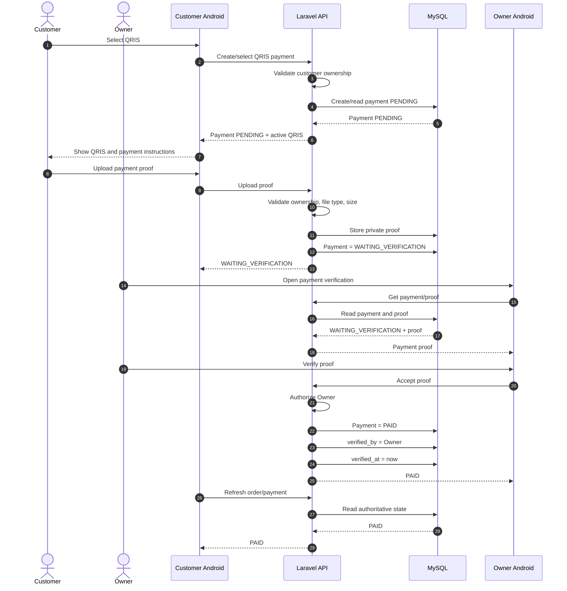
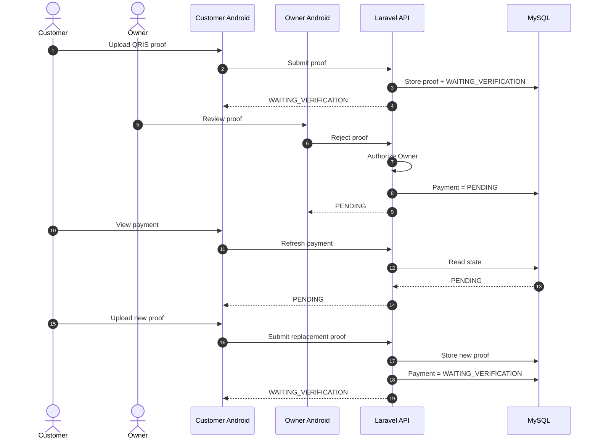
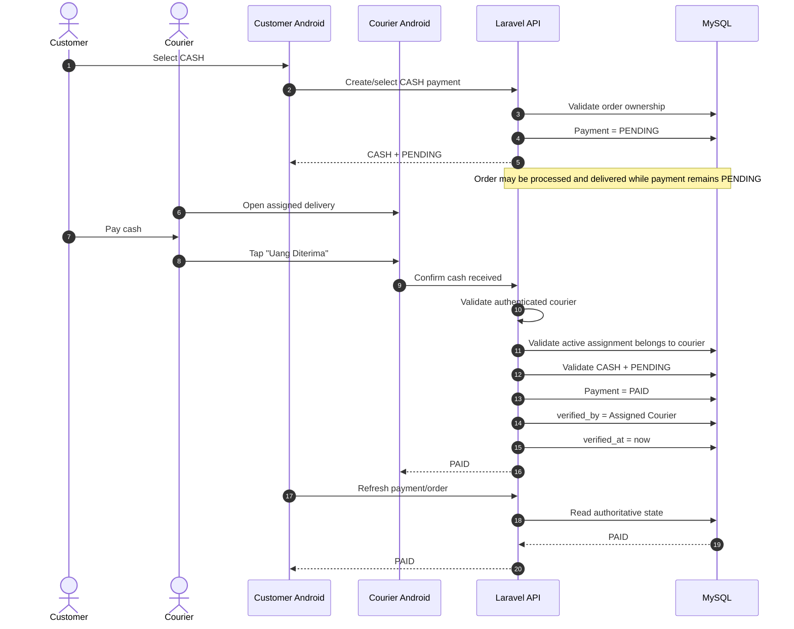
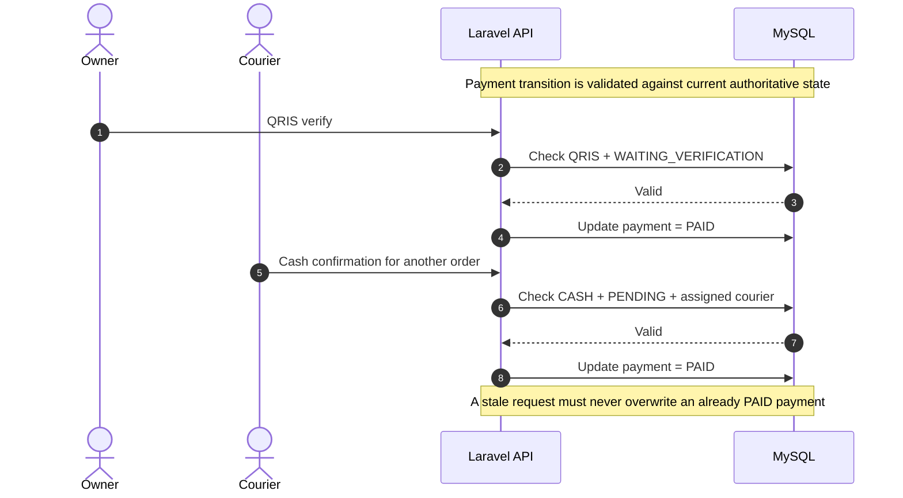
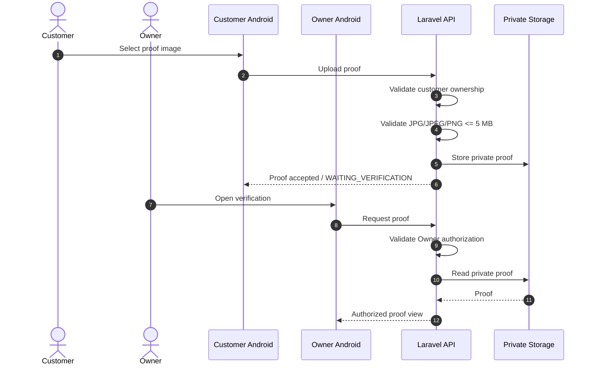

# KYŪSUI — PAYMENT SPECIFICATION

**Project:** KYŪSUI  
**Study Case:** Berkah Water  
**Document:** `08_KYUSUI_PAYMENT_SPECIFICATION.md`  
**Status:** REBUILT  
**Platform:** Android Native  
**Backend:** Laravel 13 / PHP 8.3+  
**Database:** MySQL 8.x  

**Authority Context:**
`00_KYUSUI_MASTER_SPECIFICATION.md` →
`01_KYUSUI_PROJECT_RULES.md` →
`02_KYUSUI_SYSTEM_ARCHITECTURE.md` →
`03_KYUSUI_UI_UX_SPECIFICATION.md` →
`04_KYUSUI_SYSTEM_WORKFLOW.md` →
`05_KYUSUI_DATABASE_SCHEMA.md` →
`06_KYUSUI_API_SPECIFICATION.md` →
`07_KYUSUI_ANDROID_ARCHITECTURE.md`

> **Payment Architecture Decision Override:** Dokumen ini adalah sumber kebenaran baru untuk domain payment. Keputusan payment baru di dokumen ini menggantikan keputusan payment lama yang masih menggunakan Midtrans, payment gateway, provider transaction, webhook provider, dan status payment lama. Dokumen lain yang masih memuat keputusan lama harus diselaraskan secara terpisah.

------------------------------------------------------------------------

## 1. Purpose

Dokumen ini mendefinisikan arsitektur pembayaran KYŪSUI untuk satu depot, Berkah Water.

Payment architecture hanya memiliki dua metode:

```text
QRIS
CASH
```

Dokumen menetapkan:

- payment lifecycle;
- canonical payment status;
- relationship Order–Payment;
- QRIS payment flow;
- Cash on Delivery flow;
- QRIS proof upload dan verification;
- payment authorization;
- payment state transition;
- database payment concept;
- Android responsibility boundary;
- Laravel/backend responsibility boundary;
- security rules;
- concurrency dan consistency rules;
- order-payment synchronization;
- notification integration boundary;
- testing requirements;
- sequence diagram;
- cross-document dependencies;
- konflik yang masih terdapat pada dokumen lain.

Dokumen ini tidak berisi source code, Kotlin implementation, Laravel implementation, atau migration SQL.

------------------------------------------------------------------------

# 2. Payment Architecture Principles

## 2.1 Backend Is the Source of Truth

Backend Laravel merupakan authority untuk seluruh payment state.

```text
Android
   ↓
Laravel REST API
   ↓
Payment Business Rules
   ↓
MySQL
```

Android tidak boleh menetapkan sendiri bahwa payment telah `PAID`.

Customer hanya dapat:

- memilih QRIS atau CASH;
- melihat QRIS aktif;
- mengunggah bukti QRIS untuk order miliknya;
- melihat status payment;
- melakukan upload ulang setelah bukti ditolak.

Owner hanya dapat melakukan tindakan payment yang memang menjadi kewenangannya, yaitu:

- melihat payment QRIS yang menunggu verifikasi;
- melihat bukti QRIS;
- menerima/verifikasi bukti QRIS;
- menolak bukti QRIS;
- mengganti QRIS aktif Berkah Water.

Courier hanya dapat melakukan konfirmasi Cash untuk order yang benar-benar ditugaskan kepadanya:

- melihat order CASH yang ditugaskan;
- memilih tindakan `Uang Diterima`;
- backend memvalidasi assignment dan payment state sebelum mengubah status.

------------------------------------------------------------------------

## 2.2 No Payment Gateway

KYŪSUI tidak menggunakan payment gateway.

Tidak ada integrasi:

```text
Midtrans
payment gateway
payment provider
provider webhook
provider transaction
provider callback
```

QRIS yang digunakan adalah static QRIS milik Berkah Water.

------------------------------------------------------------------------

## 2.3 Payment State Is Server-Controlled

Client tidak boleh mengirim atau memaksakan status final payment.

Contoh yang dilarang:

```text
Customer → payment_status = PAID
Courier → payment_status = PAID untuk order courier lain
Owner → payment_status = PAID tanpa workflow verifikasi QRIS
```

Backend harus menentukan transition berdasarkan:

```text
authenticated user
        ↓
role
        ↓
resource ownership / assignment
        ↓
payment method
        ↓
current payment status
        ↓
allowed transition
```

------------------------------------------------------------------------

# 3. Payment Methods

## 3.1 QRIS

QRIS merupakan metode pembayaran digital menggunakan static QRIS milik Berkah Water.

Karakteristik:

- satu QRIS aktif;
- QRIS merupakan milik Berkah Water;
- customer hanya dapat melihat QRIS;
- owner dapat mengganti QRIS aktif;
- customer melakukan pembayaran di luar sistem pembayaran otomatis;
- customer wajib mengunggah bukti pembayaran;
- bukti diverifikasi manual oleh Owner;
- sistem tidak menerima callback provider;
- sistem tidak melakukan automatic payment verification.

Flow canonical:

```text
PENDING
   ↓
Customer upload proof
   ↓
WAITING_VERIFICATION
   ↓
Owner verifies
   ↓
PAID
```

Jika bukti ditolak:

```text
WAITING_VERIFICATION
   ↓
Owner rejects proof
   ↓
PENDING
   ↓
Customer may upload new proof
```

## 3.2 CASH

Cash merupakan Cash on Delivery.

Karakteristik:

- payment awal `PENDING`;
- order CASH boleh diproses/dikirim ketika payment masih `PENDING`;
- customer membayar kepada Courier saat delivery;
- hanya Assigned Courier yang dapat memilih `Uang Diterima`;
- backend memvalidasi bahwa courier memang assigned ke order tersebut;
- setelah valid, payment berubah menjadi `PAID`;
- Owner bukan actor konfirmasi Cash;
- tidak ada proof image untuk Cash.

Flow canonical:

```text
PENDING
   ↓
Courier assigned menerima uang
   ↓
Courier memilih "Uang Diterima"
   ↓
Backend validates assignment
   ↓
PAID
```

------------------------------------------------------------------------

# 4. Payment Domain Model

Payment domain terdiri dari business payment dan konfigurasi QRIS.

```text
Order
  │
  │ 1 : 1
  ▼
Payment
```

QRIS aktif merupakan konfigurasi bisnis Berkah Water dan bukan transaksi payment provider.

```text
Berkah Water
    ↓
Active Static QRIS
    ↓
Customer View
```

Tidak terdapat `PaymentTransaction` pada active payment architecture.

## Order

Order adalah business transaction pemesanan air galon.

## Payment

Payment adalah representasi pembayaran untuk satu order.

## Active QRIS

Active QRIS adalah QRIS static milik Berkah Water yang sedang digunakan oleh customer untuk pembayaran QRIS.

------------------------------------------------------------------------

# 5. Order–Payment Relationship

## 5.1 One Order, One Business Payment

Setiap order memiliki satu business payment record.

```text
Order #1001
    │
    └── Payment #7001
```

Tidak membuat payment record baru hanya karena customer mengunggah ulang bukti QRIS setelah ditolak.

Upload ulang hanya memperbarui proof yang masih berada pada lifecycle payment yang sama.

## 5.2 Payment Amount

Nominal payment berasal dari total order yang dihitung backend.

```text
order_items
    ↓
subtotal
    ↓
delivery fee sesuai business rule
    ↓
total_amount
    ↓
payments.amount
```

Android tidak menjadi source of truth nominal transaksi.

## 5.3 Payment Cannot Exist Independently

Payment selalu terkait dengan order.

```text
payments.order_id → orders.id
```

Tidak boleh ada payment tanpa order.

------------------------------------------------------------------------

# 6. Payment Status

## 6.1 Canonical Payment Status

Hanya tiga status payment yang digunakan pada active architecture:

```text
PENDING
WAITING_VERIFICATION
PAID
```

### PENDING

Payment belum berada pada kondisi `PAID`.

Makna berdasarkan method:

- QRIS: customer belum mengirim bukti, atau bukti sebelumnya telah ditolak;
- CASH: customer belum menyerahkan uang kepada Courier atau Courier belum melakukan konfirmasi.

### WAITING_VERIFICATION

Hanya digunakan untuk QRIS ketika customer telah mengunggah bukti pembayaran dan bukti menunggu pemeriksaan Owner.

### PAID

Payment telah berhasil dikonfirmasi melalui workflow yang sah:

- QRIS → Owner melakukan verifikasi bukti;
- CASH → Assigned Courier mengonfirmasi uang diterima dan backend memvalidasi assignment.

Tidak ada status:

```text
PROCESSING
CONFIRMED
FAILED
EXPIRED
```

### Important distinction

```text
payment_method = QRIS
```

tidak berarti:

```text
payment_status = PAID
```

Demikian juga:

```text
payment_method = CASH
```

tidak berarti:

```text
payment_status = PAID
```

Pemilihan method hanya menentukan workflow pembayaran.

------------------------------------------------------------------------

# 7. Payment State Machine

## 7.1 QRIS

```text
                 ┌──────────────────────────────┐
                 │                              │
                 ▼                              │
              PENDING                           │
                 │                              │
                 │ Customer uploads proof      │
                 ▼                              │
       WAITING_VERIFICATION                     │
          │                 │                   │
          │ Owner accepts   │ Owner rejects     │
          ▼                 └───────────────────┘
         PAID
```

Allowed QRIS transitions:

```text
PENDING → WAITING_VERIFICATION
WAITING_VERIFICATION → PAID
WAITING_VERIFICATION → PENDING
```

Tidak ada transition customer langsung:

```text
PENDING → PAID
```

Tidak ada transition Owner tanpa bukti dari:

```text
PENDING → PAID
```

## 7.2 CASH

```text
PENDING
   │
   │ Assigned Courier confirms "Uang Diterima"
   ▼
PAID
```

Allowed Cash transition:

```text
PENDING → PAID
```

Hanya Assigned Courier yang dapat memicu action konfirmasi tersebut.

## 7.3 Common Terminal Rule

`PAID` adalah final payment state.

Tidak boleh:

```text
PAID → PENDING
PAID → WAITING_VERIFICATION
```

Payment yang telah `PAID` tidak dapat diubah kembali melalui workflow payment normal.

------------------------------------------------------------------------

# 8. Payment Lifecycle

## 8.1 Common Lifecycle

```text
ORDER CREATED
     ↓
PAYMENT CREATED
     ↓
PENDING
     ↓
Method-specific payment workflow
     ↓
PAID
     ↓
Order continues according to order workflow
```

QRIS:

```text
PENDING
   ↓
Upload proof
   ↓
WAITING_VERIFICATION
   ↓
Owner verification
   ↓
PAID
```

Cash:

```text
PENDING
   ↓
Delivery
   ↓
Courier receives cash
   ↓
PAID
```

------------------------------------------------------------------------

# 9. QRIS Payment Architecture

## 9.1 Static QRIS

QRIS KYŪSUI adalah static QRIS milik Berkah Water.

Tidak menggunakan dynamic QRIS dan tidak menghasilkan QRIS baru per order.

```text
Berkah Water
    ↓
One Active Static QRIS
    ↓
Customer views QRIS
    ↓
Customer completes payment
```

## 9.2 Single Active QRIS

Pada satu waktu hanya ada satu QRIS aktif yang digunakan oleh customer.

Requirement:

```text
one depot
one active QRIS
```

Tidak membuat mekanisme multi-depot atau multi-merchant.

## 9.3 Customer Access

Customer hanya dapat membaca QRIS aktif.

Customer tidak dapat:

- mengganti QRIS;
- menghapus QRIS;
- mengaktifkan QRIS lain;
- menentukan QRIS sebagai `PAID`.

## 9.4 Owner Access

Owner dapat:

- melihat QRIS aktif;
- mengganti QRIS aktif sesuai konfigurasi bisnis Berkah Water.

Owner action terhadap QRIS tidak sama dengan verifikasi payment.

------------------------------------------------------------------------

# 10. QRIS Payment Source of Truth

Sumber kebenaran payment QRIS adalah kombinasi:

```text
Payment record
+
Proof image
+
Owner verification action
```

Bukti upload customer hanya membuat payment masuk ke:

```text
WAITING_VERIFICATION
```

Bukti upload tidak membuat:

```text
PAID
```

Owner harus melakukan verification action melalui backend-authorized workflow.

------------------------------------------------------------------------

# 11. QRIS Proof Upload

## 11.1 Proof Requirement

Customer wajib mengunggah bukti pembayaran untuk QRIS.

Format yang diperbolehkan:

```text
JPG
JPEG
PNG
```

Ukuran maksimum:

```text
5 MB
```

## 11.2 Storage

Proof disimpan pada private backend storage.

Proof tidak boleh menjadi public file hanya karena URL file diketahui.

Akses proof harus melewati authorization backend.

## 11.3 Ownership

Customer hanya dapat mengunggah proof untuk order miliknya sendiri.

Backend harus memvalidasi:

```text
authenticated customer
        ↓
order belongs to customer
        ↓
payment belongs to order
        ↓
payment method = QRIS
        ↓
status allows upload
```

## 11.4 Upload Eligibility

Upload diperbolehkan ketika payment berada pada:

```text
PENDING
```

Setelah upload valid:

```text
PENDING → WAITING_VERIFICATION
```

Upload tidak diperbolehkan ketika:

```text
PAID
```

## 11.5 Re-upload After Rejection

Jika Owner menolak bukti:

```text
WAITING_VERIFICATION → PENDING
```

Customer kemudian dapat mengunggah bukti baru.

Bukti baru menggantikan proof yang sedang digunakan untuk verification workflow berikutnya.

------------------------------------------------------------------------

# 12. QRIS Verification

## 12.1 Owner Verification

Owner memeriksa bukti pembayaran QRIS secara manual.

Jika bukti valid:

```text
WAITING_VERIFICATION
        ↓
Owner verifies
        ↓
PAID
```

Jika bukti tidak valid:

```text
WAITING_VERIFICATION
        ↓
Owner rejects
        ↓
PENDING
```

## 12.2 Customer Cannot Verify

Customer tidak memiliki permission untuk menjalankan transition:

```text
WAITING_VERIFICATION → PAID
```

## 12.3 Verification Timestamp

Ketika verification berhasil, backend mencatat waktu pada:

```text
verified_at
```

## 12.4 Verification Actor

Untuk QRIS:

```text
verified_by = Owner
```

`verified_by` mengacu pada actor owner yang melakukan verification action sesuai model user/owner yang digunakan sistem.

------------------------------------------------------------------------

# 13. QRIS Rejection

Rejection bukan payment failure provider.

Rejection berarti bukti yang dikirim customer belum diterima oleh Owner.

State:

```text
WAITING_VERIFICATION
        ↓
REJECT
        ↓
PENDING
```

Tidak membuat status baru seperti:

```text
REJECTED
FAILED
EXPIRED
```

Rejection memungkinkan customer melakukan upload ulang.

------------------------------------------------------------------------

# 14. QRIS Configuration Lifecycle

Konfigurasi QRIS aktif mengikuti lifecycle:

```text
Owner authenticated
       ↓
View current QRIS
       ↓
Owner replaces QRIS
       ↓
New QRIS becomes active
       ↓
Customer retrieves latest QRIS
```

Customer tidak menyimpan QRIS sebagai source of truth permanen.

Android harus mengambil konfigurasi QRIS dari backend sesuai contract API.

------------------------------------------------------------------------

# 15. QRIS Security Requirements

Backend harus memastikan:

- customer tidak dapat mengubah QRIS;
- customer tidak dapat mengakses QRIS configuration mutation endpoint;
- customer hanya dapat upload proof milik order sendiri;
- Owner dapat melihat proof sesuai operational scope;
- proof storage bersifat private;
- proof tidak dapat diganti setelah payment `PAID`;
- payment status tidak dapat diubah melalui request client arbitrer.

Jangan menganggap route/menu yang disembunyikan pada Android sebagai authorization.

------------------------------------------------------------------------

# 16. Cash Payment Flow

## 16.1 Customer Flow

```text
Customer creates order
        ↓
Select CASH
        ↓
Payment created
        ↓
PENDING
        ↓
Order may continue to processing/delivery workflow
```

Customer tidak perlu mengunggah proof.

## 16.2 Delivery Flow

```text
Courier assigned
        ↓
Courier receives order
        ↓
Delivery
        ↓
Customer gives cash to Courier
        ↓
Courier selects "Uang Diterima"
        ↓
Backend validates assignment
        ↓
Payment = PAID
```

## 16.3 Cash Does Not Block Processing

Untuk CASH:

```text
payment = PENDING
```

tidak mencegah order untuk diproses atau dikirim.

Ini berbeda dari QRIS yang membutuhkan verification sebelum payment dianggap `PAID`.

------------------------------------------------------------------------

# 17. Cash Confirmation Authorization

## 17.1 Authorized Actor

Actor konfirmasi Cash adalah:

```text
Assigned Courier
```

Bukan Owner.

## 17.2 Assignment Validation

Backend wajib memvalidasi:

```text
authenticated user
        ↓
role = COURIER
        ↓
order exists
        ↓
payment exists
        ↓
payment method = CASH
        ↓
payment status = PENDING
        ↓
active assignment exists
        ↓
assignment belongs to authenticated courier
```

Hanya setelah seluruh validasi terpenuhi:

```text
PENDING → PAID
```

## 17.3 Invalid Courier Attempt

Request harus ditolak jika courier:

- bukan assigned courier;
- mencoba mengonfirmasi order courier lain;
- payment bukan CASH;
- payment sudah PAID;
- order tidak memiliki assignment valid.

## 17.4 No Cash Proof

Cash tidak menggunakan:

```text
proof_image
```

Untuk Cash:

```text
proof_image = NULL
```

------------------------------------------------------------------------

# 18. Cash Payment and Order Consistency

Cash payment `PENDING` tidak berarti order tidak boleh diproses.

```text
CASH
  ↓
PENDING
  ↓
Order may be processed
  ↓
Courier delivery
  ↓
Cash received
  ↓
PAID
```

Payment completion tetap tidak otomatis berarti order selesai.

```text
Payment = PAID
      ↓
Delivery/order workflow continues
      ↓
Order = SELESAI only through order completion workflow
```

------------------------------------------------------------------------

# 19. Order–Payment State Matrix

| Payment Method | Initial | Actor/Action | Intermediate | Success | Reject/Reset | Can Order Continue While PENDING? |
|---|---|---|---|---|---|---|
| QRIS | `PENDING` | Customer uploads proof | `WAITING_VERIFICATION` | Owner verifies → `PAID` | Owner rejects → `PENDING` | Mengikuti aturan order workflow; payment belum dianggap berhasil |
| CASH | `PENDING` | Assigned Courier selects `Uang Diterima` | - | Backend validates → `PAID` | Tidak ada rejection state payment | **Ya** |

Untuk QRIS, `PAID` hanya berasal dari verification Owner.

Untuk Cash, `PAID` hanya berasal dari confirmation Assigned Courier yang lolos validation backend.

------------------------------------------------------------------------

# 20. Payment Authorization Matrix

| Action | Customer | Owner | Assigned Courier | Backend Authority |
|---|---:|---:|---:|---:|
| View active QRIS | Yes | Yes | sesuai kebutuhan akses | Yes |
| Replace active QRIS | No | Yes | No | Yes |
| Create/select QRIS payment | Yes, own order | sesuai workflow | No | Yes |
| Upload QRIS proof | Yes, own order | No | No | Yes |
| Re-upload after rejection | Yes, own order | No | No | Yes |
| View QRIS proof for verification | No | Yes | No | Yes |
| Verify QRIS | No | Yes | No | Yes |
| Reject QRIS proof | No | Yes | No | Yes |
| Create/select CASH payment | Yes, own order | sesuai workflow | No | Yes |
| Upload CASH proof | No | No | No | Yes |
| Confirm CASH | No | No | Yes, assigned order only | Yes |
| Set payment to `PAID` directly | No | No | No | Yes, only through allowed workflow |

Backend tetap melakukan authentication, authorization, ownership, assignment, dan state validation.

------------------------------------------------------------------------

# 21. Payment State Transition Rules

## 21.1 QRIS

Allowed:

```text
PENDING → WAITING_VERIFICATION
WAITING_VERIFICATION → PAID
WAITING_VERIFICATION → PENDING
```

Conditions:

```text
PENDING → WAITING_VERIFICATION
= valid proof upload by owning Customer

WAITING_VERIFICATION → PAID
= valid Owner verification

WAITING_VERIFICATION → PENDING
= Owner rejects proof
```

## 21.2 CASH

Allowed:

```text
PENDING → PAID
```

Condition:

```text
valid confirmation by Assigned Courier
```

## 21.3 Invalid Transitions

Backend harus menolak transition:

```text
PAID → PENDING
PAID → WAITING_VERIFICATION

PENDING → PAID for QRIS by Customer
PENDING → PAID for QRIS without verification

WAITING_VERIFICATION → PAID by Customer
WAITING_VERIFICATION → PAID by Courier

CASH PENDING → WAITING_VERIFICATION
QRIS PENDING → PAID without proof verification
```

------------------------------------------------------------------------

# 22. Payment Failure Handling

Active architecture tidak memiliki payment failure status.

Kesalahan teknis tidak boleh diterjemahkan secara sembarangan menjadi:

```text
PAID
```

atau membuat status baru.

## 22.1 Upload Failure

Jika upload proof gagal karena network/server error:

```text
payment state remains authoritative server state
```

Android harus melakukan refresh/retry sesuai API response.

## 22.2 Verification Request Failure

Jika request Owner verification gagal:

```text
payment state tidak boleh diasumsikan PAID
```

Owner harus memperoleh state terbaru dari backend.

## 22.3 Cash Confirmation Request Failure

Jika request `Uang Diterima` timeout:

Courier tidak boleh langsung menganggap payment `PAID`.

Backend state harus dibaca kembali sebelum tindakan lanjutan dilakukan.

------------------------------------------------------------------------

# 23. Payment Retry Rules

Retry hanya berlaku pada operasi yang belum menghasilkan authoritative success.

## 23.1 QRIS Upload Retry

Customer dapat mencoba upload kembali jika:

- upload sebelumnya gagal secara teknis; atau
- bukti sebelumnya telah ditolak sehingga payment kembali `PENDING`.

Jika payment sudah:

```text
PAID
```

upload tidak boleh dilakukan lagi.

## 23.2 Owner Verification Retry

Jika verification request mengalami network failure, Owner dapat memuat ulang payment state dan mengulangi action hanya jika status masih:

```text
WAITING_VERIFICATION
```

Jika payment sudah `PAID`, action verification tidak boleh diulang sebagai transition baru.

## 23.3 Cash Confirmation Retry

Jika request Courier timeout, Courier harus membaca state terbaru.

Jika backend sudah menyimpan:

```text
PAID
```

jangan mengirim transition baru.

Jika masih:

```text
PENDING
```

dan assignment tetap valid, action dapat dicoba kembali.

------------------------------------------------------------------------

# 24. Android Refresh Rule

Android tidak menjadikan local UI state sebagai payment source of truth.

Setelah operasi payment:

```text
User Action
    ↓
API Request
    ↓
Backend
    ↓
Authoritative Payment State
    ↓
Android refresh/state update
```

FCM notification, jika digunakan untuk memberitahukan payment event, hanya menjadi trigger untuk refresh.

Payload notification tidak boleh menjadi satu-satunya source of truth.

------------------------------------------------------------------------

# 25. Laravel Payment Flow

## 25.1 QRIS Payment Creation / Selection

Backend:

```text
Authenticate Customer
        ↓
Validate order ownership
        ↓
Validate order/payment state
        ↓
Create or obtain payment record
        ↓
Payment method = QRIS
        ↓
Payment status = PENDING
```

## 25.2 QRIS Proof Submission

```text
Authenticate Customer
        ↓
Validate order ownership
        ↓
Validate payment method = QRIS
        ↓
Validate status = PENDING
        ↓
Validate file type and size
        ↓
Store proof privately
        ↓
Payment = WAITING_VERIFICATION
```

## 25.3 QRIS Verification

```text
Authenticate Owner
        ↓
Validate Owner scope
        ↓
Validate payment method = QRIS
        ↓
Validate status = WAITING_VERIFICATION
        ↓
Inspect proof
        ↓
Accept OR Reject
```

Accept:

```text
WAITING_VERIFICATION → PAID
verified_by = Owner
verified_at = verification time
```

Reject:

```text
WAITING_VERIFICATION → PENDING
```

## 25.4 Cash Selection

```text
Authenticate Customer
        ↓
Validate order ownership
        ↓
Payment method = CASH
        ↓
Payment status = PENDING
```

Tidak ada proof.

## 25.5 Cash Confirmation

```text
Authenticate Courier
        ↓
Validate role = COURIER
        ↓
Validate assigned courier
        ↓
Validate payment method = CASH
        ↓
Validate payment status = PENDING
        ↓
Confirm "Uang Diterima"
        ↓
Payment = PAID
verified_by = Assigned Courier
verified_at = confirmation time
```

------------------------------------------------------------------------

# 26. Laravel Transaction and Concurrency Rules

Payment state changes bersifat concurrency-sensitive.

Backend harus mencegah dua request valid mengubah payment secara bertentangan.

Contoh:

```text
Owner verification request
Courier confirmation request
Customer upload request
```

hanya boleh menghasilkan state sesuai payment method dan current state.

Invariant utama:

```text
One business payment
    ↓
One authoritative current payment state
```

State `PAID` tidak boleh diturunkan kembali oleh request lama.

Contoh:

```text
Owner → PAID
        ↓
old request → PENDING
```

Request lama tidak boleh overwrite state yang lebih baru.

------------------------------------------------------------------------

# 27. Database Requirements

## 27.1 Active `payments` Concept

Struktur payment aktif yang menjadi target domain:

```text
payments
- id
- order_id
- payment_method
- payment_status
- amount
- proof_image
- verified_by
- verified_at
- created_at
- updated_at
```

Relationship:

```text
orders 1 ──── 1 payments
```

## 27.2 Payment Method Values

```text
QRIS
CASH
```

## 27.3 Payment Status Values

```text
PENDING
WAITING_VERIFICATION
PAID
```

## 27.4 Proof

```text
QRIS  → proof_image dapat berisi private storage reference
CASH  → proof_image NULL
```

## 27.5 Verification Actor

```text
QRIS  → verified_by = Owner
CASH  → verified_by = Assigned Courier
```

## 27.6 Payment Transactions Removed

`payment_transactions` tidak termasuk active payment architecture.

Tidak diperlukan karena KYŪSUI tidak lagi menggunakan:

- payment gateway;
- provider transaction;
- provider webhook;
- provider reference;
- provider event history;
- automatic provider reconciliation.

Jika database baseline masih memiliki tabel tersebut, tabel itu merupakan legacy schema yang harus diselaraskan oleh dokumen database terpisah.

------------------------------------------------------------------------

# 28. Removed Legacy Payment Data

Field/konsep berikut tidak boleh menjadi bagian active payment model:

```text
provider_name
provider_reference
provider_transaction_id
transaction_id
raw_payload
provider idempotency key
payment_transactions
```

Juga tidak digunakan:

```text
paid_at sebagai requirement baru terpisah
```

Kecuali dokumen database final memilihnya sebagai timestamp turunan tanpa mengubah business model. Active payment concept yang diwajibkan dokumen ini adalah `verified_at`.

------------------------------------------------------------------------

# 29. Payment and Order Status Synchronization

Payment success tidak berarti order selesai.

```text
Payment = PAID
       ↓
Order may continue through valid order workflow
       ↓
Courier / Delivery
       ↓
Completion
       ↓
Order = SELESAI
```

QRIS:

```text
WAITING_VERIFICATION → PAID
       ↓
Order dapat melanjutkan sesuai order workflow
```

Cash:

```text
PENDING
       ↓
Order may already be processed/delivered
       ↓
Courier confirms cash
       ↓
PAID
```

Payment module tidak boleh menetapkan:

```text
Order = SELESAI
```

karena completion merupakan domain order/delivery.

------------------------------------------------------------------------

# 30. Payment and Order Processing Rule

QRIS dan Cash memiliki perbedaan penting.

QRIS:

```text
Payment PENDING / WAITING_VERIFICATION
        ↓
Payment belum PAID
        ↓
Order processing harus mengikuti rule order yang mensyaratkan payment verified
```

Cash:

```text
Payment PENDING
        ↓
Order boleh diproses/dikirim
        ↓
Payment dapat menjadi PAID saat delivery
```

Aturan Cash ini adalah keputusan payment architecture baru dan harus dianggap canonical untuk payment domain.

------------------------------------------------------------------------

# 31. Security Requirements

## 31.1 Authentication

Payment endpoints private harus menggunakan Laravel Sanctum sesuai architecture baseline.

## 31.2 Authorization

Backend memvalidasi:

```text
authentication
role
ownership / assignment
payment method
payment status
allowed transition
```

## 31.3 Amount Integrity

Backend menghitung dan mengotorisasi amount berdasarkan data order.

Android tidak boleh menjadi sumber kebenaran amount.

## 31.4 Proof Access

Proof QRIS harus berada pada private backend storage.

Customer hanya dapat mengakses konteks proof miliknya sesuai authorization.

Owner dapat melihat proof untuk payment yang berada dalam scope operasional Berkah Water.

## 31.5 No Client Status Trust

Request seperti:

```text
payment_status = PAID
verified_by = OWNER
```

tidak boleh dipercaya hanya karena dikirim oleh client.

Backend menentukan nilai tersebut berdasarkan authenticated actor dan workflow.

## 31.6 Secrets

Tidak ada payment provider secret pada Android karena tidak ada payment provider integration.

Tetap dilarang menyimpan database credential atau backend secret pada Android.

------------------------------------------------------------------------

# 32. Payment Consistency Invariants

### INV-01 — One Order One Payment

Satu order memiliki satu business payment record.

### INV-02 — Backend Authority

Payment status authoritative berasal dari backend.

### INV-03 — Canonical Status

Hanya:

```text
PENDING
WAITING_VERIFICATION
PAID
```

### INV-04 — QRIS Verification

QRIS hanya menjadi `PAID` melalui Owner verification terhadap proof.

### INV-05 — QRIS Rejection

QRIS rejection hanya menghasilkan:

```text
WAITING_VERIFICATION → PENDING
```

### INV-06 — Cash Assignment

Cash hanya menjadi `PAID` melalui Assigned Courier yang dikonfirmasi backend.

### INV-07 — Cash No Proof

Cash tidak menggunakan proof image.

### INV-08 — Paid Is Final

Payment `PAID` tidak kembali ke status sebelumnya melalui normal payment workflow.

### INV-09 — Private Proof

Proof QRIS disimpan secara private dan hanya dapat diakses berdasarkan authorization.

### INV-10 — No Provider Dependency

Payment state tidak bergantung pada payment gateway, provider webhook, atau provider transaction.

------------------------------------------------------------------------

# 33. Payment Failure and Recovery

Karena active architecture tidak memiliki `FAILED` atau `EXPIRED`, recovery dilakukan berdasarkan operasi bisnis yang gagal, bukan dengan membuat payment status baru.

## QRIS

Jika proof ditolak:

```text
WAITING_VERIFICATION → PENDING
```

Customer dapat upload proof baru.

Jika request teknis gagal:

```text
state tetap mengikuti backend
```

## CASH

Jika confirmation gagal secara teknis:

```text
state tetap PENDING sampai backend menerima confirmation yang valid
```

Jika backend sudah mencatat `PAID`, client tidak boleh mengulang transition.

------------------------------------------------------------------------

# 34. Reconciliation Principle

Tidak ada provider reconciliation.

Reconciliation yang relevan hanya memastikan Android dan backend memiliki state yang sama.

```text
Android UI
   ↓
API request
   ↓
Backend state
   ↓
Android refresh
```

Untuk QRIS, verification manual menjadi sumber perubahan state.

Untuk Cash, Courier confirmation menjadi sumber perubahan state.

------------------------------------------------------------------------

# 35. Notification Integration

Notification payment tetap bersifat informational.

Payment event yang relevan dapat diinformasikan melalui notification architecture yang sudah ada, tetapi notification bukan source of truth.

Contoh event konseptual:

```text
PAYMENT_UPDATED
```

Event dapat terjadi ketika:

```text
QRIS proof submitted
QRIS proof rejected
QRIS verified
CASH confirmed
```

Payload notification tidak boleh menjadi authority payment state.

Ketika notification dibuka:

```text
Notification
    ↓
Payment / Order screen
    ↓
GET latest API state
    ↓
Authoritative UI state
```

Dokumen notification yang masih menyebut Midtrans sebagai business source merupakan legacy conflict yang harus diselaraskan secara terpisah.

------------------------------------------------------------------------

# 36. QRIS Payment Sequence Diagram



------------------------------------------------------------------------

# 37. QRIS Rejection Sequence Diagram



------------------------------------------------------------------------

# 38. Cash Payment Sequence Diagram



------------------------------------------------------------------------

# 39. Payment Concurrency Sequence Diagram



------------------------------------------------------------------------

# 40. Proof Storage and Access Sequence



------------------------------------------------------------------------

# 41. API Requirements

API contract harus mendukung operasi konseptual berikut.

## Customer

```text
Get active QRIS
Create/select payment method
Get order payment
Upload QRIS proof
Get current payment status
```

## Owner

```text
Get QRIS payment verification queue
Get QRIS proof for authorized order
Verify QRIS proof
Reject QRIS proof
Get active QRIS
Replace active QRIS
```

## Courier

```text
Get assigned CASH order
Get payment detail for assigned order
Confirm "Uang Diterima"
```

Exact endpoint naming tetap mengikuti `06_KYUSUI_API_SPECIFICATION.md` setelah dokumen tersebut diselaraskan. Dokumen ini tidak mengarang path endpoint baru sebagai canonical API.

------------------------------------------------------------------------

# 42. API Request Rules

## Customer Payment

Backend harus memvalidasi:

```text
authenticated customer
order ownership
order state
payment ownership
payment method
current payment status
authoritative amount
```

## QRIS Proof Upload

Backend harus memvalidasi:

```text
customer authenticated
customer owns order
payment method = QRIS
payment status = PENDING
file type = JPG/JPEG/PNG
file size <= 5 MB
```

## Owner QRIS Verification

Backend harus memvalidasi:

```text
owner authenticated
owner authorized for Berkah Water
payment method = QRIS
payment status = WAITING_VERIFICATION
proof exists
```

## Owner QRIS Rejection

Backend harus memvalidasi kondisi yang sama dengan verification dan menghasilkan:

```text
WAITING_VERIFICATION → PENDING
```

## Courier Cash Confirmation

Backend harus memvalidasi:

```text
courier authenticated
role = COURIER
active assignment exists
assignment belongs to courier
payment method = CASH
payment status = PENDING
```

------------------------------------------------------------------------

# 43. No Direct Client Status Mutation

Client tidak boleh mengirim request yang mengandung arbitrary business transition.

Forbidden examples:

```text
Customer → PAID
Customer → WAITING_VERIFICATION tanpa upload proof
Owner → PAID untuk CASH
Courier → PAID untuk QRIS
Courier → PAID untuk order yang bukan assignment-nya
```

Client action hanya merupakan request untuk melakukan operation yang kemudian divalidasi backend.

------------------------------------------------------------------------

# 44. Payment Observability

Logging dan monitoring payment harus berfokus pada business event tanpa membutuhkan provider transaction data.

Event yang relevan:

```text
PAYMENT_CREATED
QRIS_PROOF_UPLOADED
QRIS_VERIFICATION_ACCEPTED
QRIS_PROOF_REJECTED
CASH_RECEIVED_CONFIRMED
PAYMENT_STATE_CONFLICT
PAYMENT_AUTHORIZATION_DENIED
```

Jangan log:

- authentication token;
- password;
- backend secrets;
- private proof content;
- credential sensitif.

Proof image tidak perlu dimasukkan ke application log.

------------------------------------------------------------------------

# 45. Testing Requirements

Testing harus memverifikasi minimal:

## QRIS

```text
PAY-001 QRIS starts PENDING
PAY-002 Customer can view active QRIS
PAY-003 Customer cannot replace QRIS
PAY-004 Customer uploads valid JPG/JPEG/PNG
PAY-005 File > 5 MB rejected
PAY-006 Unsupported file type rejected
PAY-007 Other customer's order proof upload rejected
PAY-008 Valid proof changes PENDING → WAITING_VERIFICATION
PAY-009 Owner can view authorized proof
PAY-010 Owner verification changes WAITING_VERIFICATION → PAID
PAY-011 Owner rejection changes WAITING_VERIFICATION → PENDING
PAY-012 Customer can re-upload after rejection
PAY-013 Customer cannot set PAID
PAY-014 Proof cannot be changed after PAID
```

## CASH

```text
CASH-001 Cash starts PENDING
CASH-002 Cash order can continue while PENDING
CASH-003 Cash has no proof requirement
CASH-004 Assigned Courier can confirm receipt
CASH-005 Non-assigned Courier cannot confirm
CASH-006 Owner cannot confirm Cash
CASH-007 QRIS cannot use Cash confirmation action
CASH-008 Valid confirmation changes PENDING → PAID
CASH-009 Duplicate confirmation after PAID is rejected or treated as already completed according to API contract
```

## Security

```text
SEC-PAY-001 Customer ownership isolation
SEC-PAY-002 Owner proof authorization
SEC-PAY-003 Courier assignment authorization
SEC-PAY-004 Arbitrary payment status mutation blocked
SEC-PAY-005 Private proof access blocked for unauthorized users
```

------------------------------------------------------------------------

# 46. Final End-to-End Payment Architecture

```text
                         KYŪSUI PAYMENT
                              │
                    ┌─────────┴─────────┐
                    │                   │
                   QRIS                CASH
                    │                   │
                PENDING              PENDING
                    │                   │
             Upload Proof               │
                    │                   │
        WAITING_VERIFICATION            │
             │            │             │
       Owner Verify   Owner Reject      │
             │            │             │
             ▼            ▼             │
            PAID        PENDING         │
                                      │
                           Courier receives cash
                                      │
                              "Uang Diterima"
                                      │
                                  PAID
```

Business architecture:

```text
Customer
   │
   ├── QRIS → Proof → Owner Verification → PAID
   │
   └── CASH → Delivery → Courier Confirmation → PAID
                                      │
                                      ▼
                              Laravel Authority
                                      │
                                      ▼
                                    MySQL
```

Tidak terdapat payment provider pada flow tersebut.

------------------------------------------------------------------------

# 47. Removed Legacy Components

Komponen berikut secara eksplisit dihapus dari active architecture:

```text
Midtrans
payment gateway
payment provider
provider webhook
automatic payment verification
dynamic QRIS
payment_transactions
provider_name
provider_reference
provider_transaction_id
transaction_id
raw_payload
provider idempotency key
PROCESSING
CONFIRMED
FAILED
EXPIRED
Owner Cash confirmation
```

Alasan penghapusan:

- KYŪSUI menggunakan static QRIS milik Berkah Water;
- verification QRIS dilakukan manual oleh Owner;
- Cash dikonfirmasi oleh Assigned Courier;
- tidak ada payment gateway;
- tidak ada provider transaction;
- tidak ada provider webhook;
- hanya tiga canonical payment status yang dibutuhkan.

------------------------------------------------------------------------

# 48. Decisions Locked by This Document

Keputusan payment yang dikunci:

1. Payment methods = `QRIS` dan `CASH`.
2. QRIS adalah static QRIS milik Berkah Water.
3. Hanya satu QRIS aktif.
4. Customer hanya dapat melihat QRIS.
5. Owner dapat mengganti QRIS.
6. Customer wajib upload proof untuk QRIS.
7. Proof QRIS = JPG/JPEG/PNG, maksimum 5 MB.
8. Proof disimpan pada private backend storage.
9. Customer hanya dapat upload proof untuk order sendiri.
10. Owner melakukan verifikasi QRIS secara manual.
11. QRIS `PENDING → WAITING_VERIFICATION → PAID` ketika diverifikasi.
12. QRIS rejection = `WAITING_VERIFICATION → PENDING`.
13. Customer tidak dapat menetapkan `PAID`.
14. Cash adalah Cash on Delivery.
15. Cash dimulai `PENDING`.
16. Order Cash boleh diproses/dikirim ketika payment masih `PENDING`.
17. Customer membayar kepada Courier.
18. Assigned Courier memilih `Uang Diterima`.
19. Backend memvalidasi assignment Courier.
20. Cash `PENDING → PAID` setelah confirmation valid.
21. Owner bukan actor konfirmasi Cash.
22. Cash tidak menggunakan proof.
23. Canonical payment status hanya `PENDING`, `WAITING_VERIFICATION`, `PAID`.
24. Payment record berhubungan 1:1 dengan order.
25. Active payment concept tidak menggunakan `payment_transactions`.
26. Tidak ada Midtrans atau payment gateway.
27. Tidak ada provider webhook atau automatic payment verification.
28. Payment success tidak otomatis membuat order `SELESAI`.

------------------------------------------------------------------------

# 49. Cross-Document Dependencies

Rebuild dokumen ini menyebabkan dependency berikut.

## 49.1 `00_KYUSUI_MASTER_SPECIFICATION.md`

Status:

```text
NO DIRECT CONFLICT ON PROVIDER
```

Master Specification menyatakan provider dan daftar metode pembayaran spesifik belum ditentukan. Keputusan baru pada dokumen ini sekarang mengunci payment method dan architecture.

## 49.2 `01_KYUSUI_PROJECT_RULES.md`

Status:

```text
CONFLICT — REQUIRES SYNCHRONIZATION
```

Dokumen tersebut masih menyebut:

```text
Digital Payment : Midtrans
Cash Payment    : Cash
```

Payment section dan security rules yang masih khusus Midtrans harus diselaraskan pada revisi terpisah.

## 49.3 `02_KYUSUI_SYSTEM_ARCHITECTURE.md`

Status:

```text
CONFLICT — REQUIRES SYNCHRONIZATION
```

Dokumen tersebut masih menggambarkan Midtrans, payment webhook, provider integration, dan payment service berbasis provider.

Dokumen ini tidak mengubah file tersebut secara langsung.

## 49.4 `03_KYUSUI_UI_UX_SPECIFICATION.md`

Status:

```text
DEPENDENCY — PAYMENT UI MUST BE SYNCHRONIZED
```

UI harus merepresentasikan:

```text
QRIS
CASH
PENDING
WAITING_VERIFICATION
PAID
```

serta proof upload, QRIS verification result, dan Cash action pada Courier.

## 49.5 `04_KYUSUI_SYSTEM_WORKFLOW.md`

Status:

```text
CONFLICT — REQUIRES SYNCHRONIZATION
```

Workflow masih menyebut Digital/Midtrans dan Cash confirmation unresolved. Cash processing rule juga harus diperbarui sehingga payment Cash `PENDING` tidak menghalangi proses/delivery.

## 49.6 `05_KYUSUI_DATABASE_SCHEMA.md`

Status:

```text
CONFLICT — REQUIRES SYNCHRONIZATION
```

Database masih memiliki:

```text
payment_transactions
provider_name
provider_reference
transaction_id
provider_transaction_id
idempotency_key
raw_payload
```

dan status payment lama.

Target payment concept pada dokumen ini adalah `payments` dengan field:

```text
id
order_id
payment_method
payment_status
amount
proof_image
verified_by
verified_at
created_at
updated_at
```

## 49.7 `06_KYUSUI_API_SPECIFICATION.md`

Status:

```text
CONFLICT — REQUIRES SYNCHRONIZATION
```

API masih memuat Midtrans, webhook, payment method lama, dan status lama. API perlu diselaraskan agar mendukung QRIS proof, Owner verification/rejection, active QRIS management, serta Courier Cash confirmation.

## 49.8 `07_KYUSUI_ANDROID_ARCHITECTURE.md`

Status:

```text
CONFLICT — REQUIRES SYNCHRONIZATION
```

Android architecture masih mencantumkan Midtrans dan payment integration lama. Payment module Android harus mengikuti QRIS/Cash architecture ini.

## 49.9 `09_KYUSUI_TRACKING_SPECIFICATION.md`

Status:

```text
INDIRECT DEPENDENCY
```

Tidak ada perubahan tracking langsung. Namun Cash confirmation terjadi dalam delivery context sehingga Courier assignment dan delivery state harus tersedia sebagai authorization context.

## 49.10 `10_KYUSUI_NOTIFICATION_SPECIFICATION.md`

Status:

```text
CONFLICT — REQUIRES SYNCHRONIZATION
```

Payment notification masih memiliki source/flow Midtrans dan status lama. Notification harus menjadi informational event untuk payment state baru.

## 49.11 `11_KYUSUI_TESTING_SPECIFICATION.md`

Status:

```text
CONFLICT — REQUIRES SYNCHRONIZATION
```

Test payment masih mencantumkan Midtrans dan status lama. Test harus diganti ke QRIS/Cash state machine baru.

## 49.12 `12_KYUSUI_VISUAL_DESIGN_SPECIFICATION.md`

Status:

```text
CONFLICT — REQUIRES SYNCHRONIZATION
```

Header dan payment references masih mencantumkan Midtrans. Visual payment state harus mengikuti tiga status canonical dan actor flow baru.

## 49.13 `13_KYUSUI_DATABASE_FINALIZATION.md`

Status:

```text
CONFLICT — REQUIRES SYNCHRONIZATION
```

Decision register masih menetapkan Owner sebagai Cash confirmation actor dan status lama. Keputusan baru pada dokumen ini mengganti actor Cash menjadi Assigned Courier dan success state menjadi `PAID`.

## 49.14 `13_KYUSUI_INTEGRATION_CONTRACT.md`

Status:

```text
CONFLICT — REQUIRES SYNCHRONIZATION
```

Integration Contract masih memiliki payment assumptions Midtrans/provider. Contract harus mengikuti payment model baru sebelum implementation handoff.

------------------------------------------------------------------------

# 50. Implementation Boundary

Dokumen ini tidak menentukan source code.

Backend implementation harus menerjemahkan:

```text
payment rules
authorization
state transition
private proof storage
QRIS configuration
Cash assignment validation
```

Android implementation harus menerjemahkan:

```text
payment screens
QRIS display
proof upload
verification state
Cash payment state
Courier "Uang Diterima" action
```

Database implementation harus menerjemahkan:

```text
payments
payment method values
payment status values
proof storage reference
verification actor
verification timestamp
QRIS configuration storage
```

Tidak ada implementation detail tambahan yang dianggap canonical hanya karena belum dituliskan di dokumen ini.

------------------------------------------------------------------------

# 51. Final Payment Architecture Summary

```text
                         KYŪSUI PAYMENT
                              │
                 ┌────────────┴────────────┐
                 │                         │
                QRIS                      CASH
                 │                         │
              PENDING                  PENDING
                 │                         │
          Customer uploads proof      Order may proceed
                 │                         │
      WAITING_VERIFICATION             Delivery
          │             │                 │
       Verify        Reject               │
          │             │                 │
          ▼             ▼                 ▼
         PAID        PENDING       Courier receives cash
                                        │
                                  "Uang Diterima"
                                        │
                                      PAID
```

Canonical data model:

```text
payments
├── id
├── order_id
├── payment_method
├── payment_status
├── amount
├── proof_image
├── verified_by
├── verified_at
├── created_at
└── updated_at
```

Canonical values:

```text
payment_method:
QRIS
CASH

payment_status:
PENDING
WAITING_VERIFICATION
PAID
```

Canonical actors:

```text
QRIS verification → Owner
CASH confirmation → Assigned Courier
```

Canonical principle:

```text
Android requests
      ↓
Laravel validates
      ↓
MySQL persists
      ↓
Backend returns authoritative state
      ↓
Android renders state
```

Payment architecture active KYŪSUI tidak memiliki:

```text
Midtrans
payment gateway
payment provider
provider webhook
dynamic QRIS
automatic payment verification
payment_transactions
provider transaction identifiers
provider payloads
provider idempotency keys
PROCESSING
CONFIRMED
FAILED
EXPIRED
Owner Cash confirmation
```

**STATUS: REBUILT**
