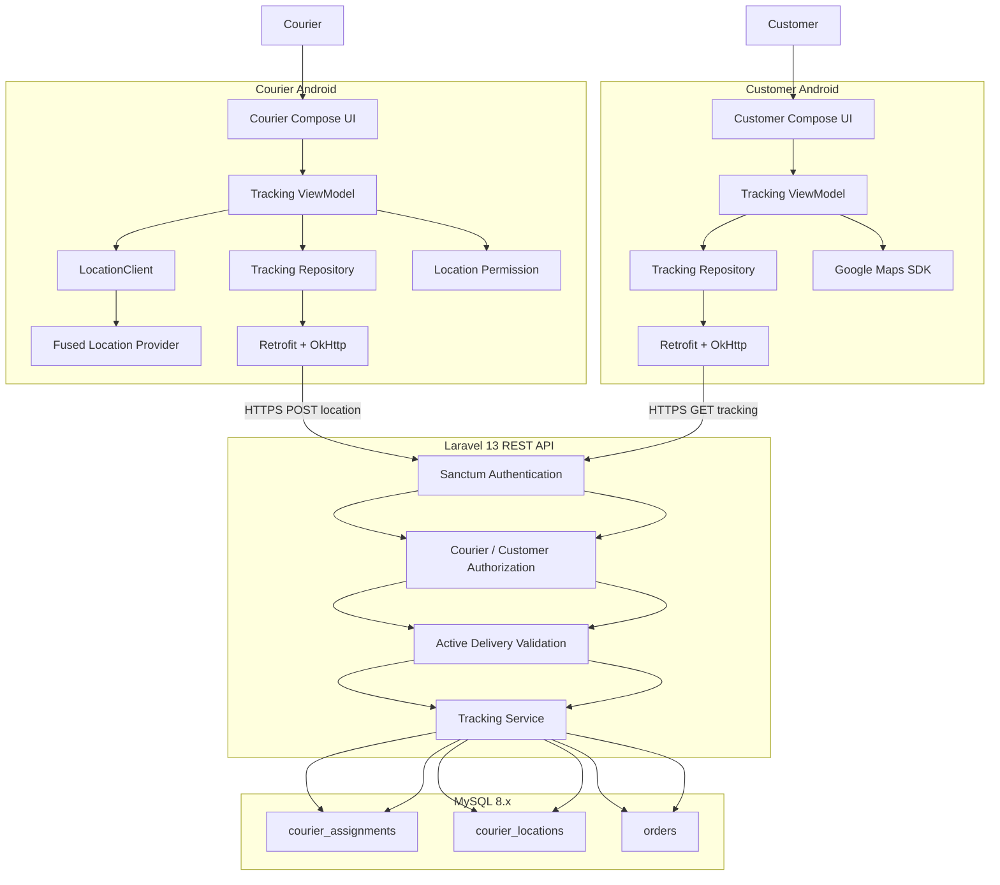
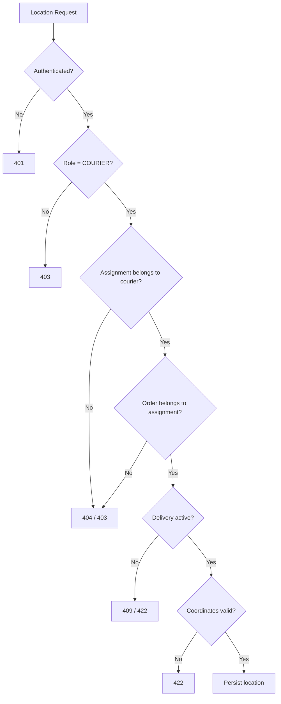
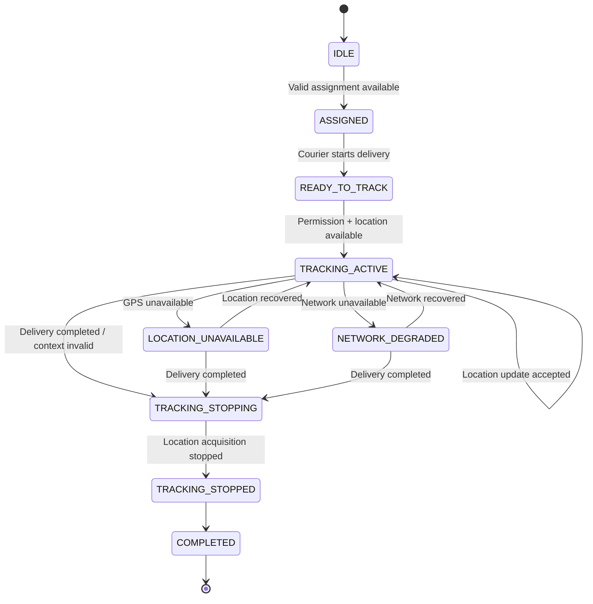
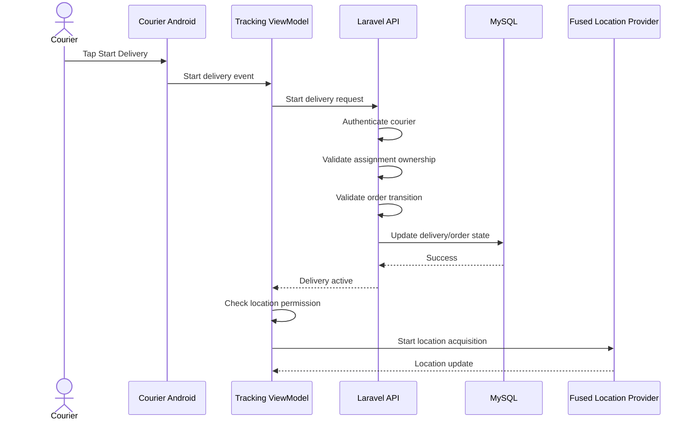
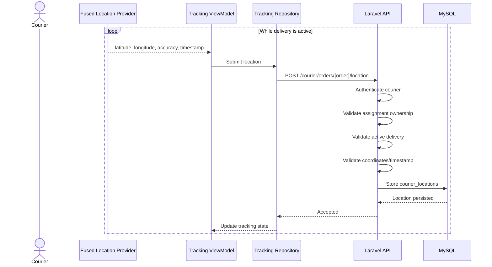
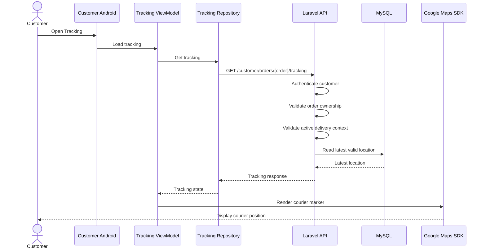
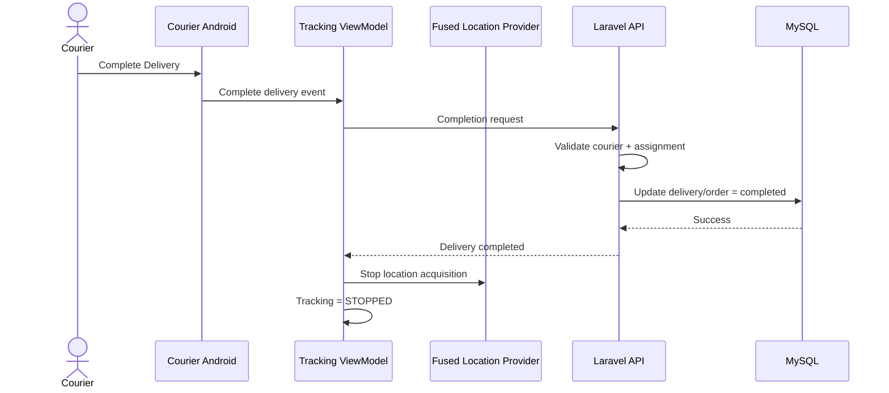

# KYŪSUI — TRACKING SPECIFICATION

**Project:** KYŪSUI  
**Study Case:** Berkah Water  
**Document:** `09_KYUSUI_TRACKING_SPECIFICATION.md`  
**Status:** Tracking Architecture Baseline  
**Platform:** Android Native  
**Language:** Kotlin  
**Map:** Google Maps SDK  
**Location:** Fused Location Provider  
**Backend:** Laravel 13 / PHP 8.3+  
**API:** REST / JSON / HTTPS  
**Database:** MySQL 8.x  
**Authentication:** Laravel Sanctum  
**Architecture:** MVVM + Repository  
**State:** ViewModel + StateFlow

---

# 1. Purpose

Dokumen ini mendefinisikan arsitektur dan aturan teknis untuk fitur location tracking KYŪSUI.

Tracking digunakan untuk satu tujuan utama:

> Memungkinkan pelanggan melihat posisi pengantar selama pesanan berada dalam proses pengantaran.

Tracking tidak merupakan fitur GPS umum dan tidak boleh berjalan terus-menerus di perangkat pengantar.

Prinsip utama:

```text
No active delivery
        ↓
No active tracking
        ↓
No continuous GPS acquisition
        ↓
No location upload
```

Ketika delivery aktif:

```text
Active delivery
        ↓
Permission valid
        ↓
Location service available
        ↓
Fused Location Provider
        ↓
Location update
        ↓
Laravel API
        ↓
Authorization + validation
        ↓
MySQL location history
        ↓
Customer tracking API
        ↓
Google Maps SDK
```

---

# 2. Source Authority

Dokumen ini harus konsisten dengan:

1. `00_KYUSUI_MASTER_SPECIFICATION.md`
2. `01_KYUSUI_PROJECT_RULES.md`
3. `02_KYUSUI_SYSTEM_ARCHITECTURE.md`
4. `06_KYUSUI_API_SPECIFICATION.md`
5. `07_KYUSUI_ANDROID_ARCHITECTURE.md`

Hierarki keputusan:

```text
00 MASTER SPECIFICATION
        ↓
01 PROJECT RULES
        ↓
02 SYSTEM ARCHITECTURE
        ↓
06 API SPECIFICATION
        ↓
07 ANDROID ARCHITECTURE
        ↓
09 TRACKING SPECIFICATION
        ↓
IMPLEMENTATION
```

Master specification menetapkan bahwa customer dapat melihat posisi pengantar selama proses pengantaran, pengantar dapat mengirimkan posisi, posisi ditampilkan melalui peta, dan tracking terikat pada pesanan yang sedang dalam proses pengantaran. Interval update, akurasi minimum, background location, ETA, route history, geofencing, dan mekanisme offline belum ditetapkan sebagai business requirement dan harus diperlakukan sebagai keputusan teknis.  

---

# 3. Scope

Tracking mencakup:

- acquisition lokasi perangkat courier;
- permission lokasi;
- validasi delivery context;
- pengiriman latitude;
- pengiriman longitude;
- pengiriman accuracy jika tersedia;
- timestamp lokasi;
- authorization courier;
- authorization customer;
- active delivery validation;
- latest location;
- location history;
- tracking API;
- Android tracking boundary;
- Google Maps visualization;
- battery management;
- network failure handling;
- security;
- privacy;
- tracking state lifecycle.

Tracking tidak mencakup:

- navigation engine lengkap;
- ETA;
- route optimization;
- geofencing;
- driver behavior analysis;
- permanent location monitoring;
- location tracking ketika courier tidak sedang melakukan delivery.

---

# 4. Tracking Architecture Principles

## 4.1 Server Is the Business Authority

Android memperoleh lokasi dari perangkat, tetapi backend menentukan apakah lokasi tersebut boleh diterima dan kepada siapa lokasi tersebut boleh ditampilkan.

```text
Android
  ↓
Location data
  ↓
Laravel authorization
  ↓
Delivery validation
  ↓
Persistence
```

Client tidak dipercaya untuk menentukan:

- courier ownership;
- active assignment;
- order ownership;
- tracking authorization;
- delivery status;
- latest authoritative location.

## 4.2 Tracking Is Delivery-Bound

Tracking selalu mempunyai konteks:

```text
courier
    +
delivery_assignment
    +
order
```

Tidak boleh ada location update yang hanya dikirim berdasarkan `courier_id` tanpa assignment aktif.

## 4.3 No Direct Device-to-Device Tracking

Customer tidak berkomunikasi langsung dengan perangkat courier.

```text
Courier Device
      ↓
Laravel API
      ↓
Customer API
      ↓
Customer Device
```

Hal ini menjaga authorization dan menghindari backend/business state dilewati.

## 4.4 History and Latest Location Are Different Concepts

`courier_locations` menyimpan accepted location updates sebagai histori.

Latest location adalah:

```text
latest accepted location
```

bukan tabel terpisah yang menggantikan history.

Query logical:

```text
WHERE courier_assignment_id = ?
ORDER BY recorded_at DESC
LIMIT 1
```

---

# 5. Architecture Diagram



Boundary penting:

```text
Fused Location Provider
        = location acquisition

Laravel API
        = authentication + authorization + business validation

MySQL
        = location persistence

Google Maps SDK
        = map visualization
```

Google Maps SDK bukan source of truth tracking.

---

# 6. Tracking Context

Tracking hanya boleh berada pada delivery context yang valid.

Minimal logical condition:

```text
authenticated courier
AND
valid delivery assignment
AND
assignment belongs to authenticated courier
AND
order belongs to assignment
AND
order is in delivery-active state
AND
location permission is granted
AND
device location is available
```

Jika salah satu kondisi authorization/business tidak terpenuhi, Android tidak boleh menganggap tracking aktif.

Backend tetap harus melakukan pemeriksaan yang sama karena client bukan security boundary.

---

# 7. GPS Lifecycle

Lifecycle tracking:

```text
IDLE
  ↓
ASSIGNED
  ↓
READY_TO_TRACK
  ↓
TRACKING_ACTIVE
  ↓
LOCATION_UPDATING
  ↓
TRACKING_STOPPING
  ↓
TRACKING_STOPPED
  ↓
COMPLETED
```

Kondisi failure seperti:

- permission denied;
- GPS unavailable;
- network unavailable;

dipandang sebagai kondisi operasional dari tracking, bukan alasan untuk membuat lifecycle bisnis baru.

Contoh:

```text
TRACKING_ACTIVE
      │
      ├── GPS unavailable
      │       ↓
      │   LOCATION_UNAVAILABLE
      │
      └── Network unavailable
              ↓
          NETWORK_DEGRADED
```

Setelah kondisi pulih, tracking dapat kembali ke `LOCATION_UPDATING` selama delivery masih aktif.

---

# 8. Start Tracking

## 8.1 Trigger

Tracking dimulai ketika courier memulai delivery yang valid.

Baseline workflow:

```text
Courier Dashboard
      ↓
Assigned Order
      ↓
Order Detail
      ↓
Start Delivery
      ↓
Location Permission
      ↓
Active Delivery
      ↓
Location Tracking
```

Start tracking tidak dipicu hanya karena:

- courier login;
- aplikasi dibuka;
- courier melihat dashboard;
- courier mempunyai assignment yang belum dimulai.

## 8.2 Preconditions

Sebelum tracking dimulai:

1. courier authenticated;
2. assignment valid;
3. assignment milik courier;
4. order terkait dengan assignment;
5. order berada pada state yang mengizinkan delivery;
6. location permission tersedia;
7. device location service tersedia;
8. tracking session belum aktif.

## 8.3 Start Operation

Urutan konseptual:

```text
Courier taps Start Delivery
        ↓
Backend validates delivery action
        ↓
Order becomes delivery-active
        ↓
Android verifies location permission
        ↓
Android starts location acquisition
        ↓
Location updates are accepted
```

Perubahan status delivery harus dilakukan melalui API backend. Android tidak boleh hanya mengubah status lokal lalu menganggap delivery aktif.

---

# 9. Stop Tracking

Tracking harus berhenti ketika delivery context tidak lagi membutuhkan tracking.

Minimum trigger:

```text
Order completed
OR
Delivery assignment no longer active
OR
Backend rejects active delivery context
OR
Courier explicitly leaves an active tracking session when allowed by workflow
```

Untuk baseline KYŪSUI, kondisi utama:

```text
DALAM_PENGANTARAN
        ↓
SELESAI
        ↓
Stop location acquisition
        ↓
Stop location upload
```

Setelah order selesai:

```text
No new active delivery location
```

Location history lama tetap menjadi historical record dan tidak dihapus hanya karena tracking dihentikan.

---

# 10. Location Permission

## 10.1 Principle

Permission diminta ketika feature membutuhkan lokasi.

Jangan meminta location permission pada first launch hanya untuk menyiapkan aplikasi.

## 10.2 Courier Permission

Courier membutuhkan location permission ketika:

```text
Assigned Delivery
      ↓
Start Delivery
      ↓
Location feature required
      ↓
Request / verify permission
```

## 10.3 Customer Permission

Customer membutuhkan location permission ketika memilih atau menentukan lokasi pengantaran, sesuai flow create order.

Customer tidak membutuhkan device GPS permission hanya untuk melihat posisi courier.

Customer tracking menggunakan:

```text
API location data
+
Google Maps SDK
```

bukan GPS customer sebagai source posisi courier.

## 10.4 Permission States

```text
NOT_REQUESTED
GRANTED
DENIED
SETTINGS_REQUIRED
```

Behavior:

```text
NOT_REQUESTED
    ↓
Request permission

GRANTED
    ↓
Location feature may run

DENIED
    ↓
Explain requirement
    ↓
Allow user to retry

SETTINGS_REQUIRED
    ↓
Guide user to system settings
```

Jangan melakukan infinite permission request loop.

## 10.5 Permission Does Not Grant Authorization

Location permission hanya berarti Android mengizinkan aplikasi memperoleh lokasi.

Itu bukan authorization untuk mengirim lokasi ke backend.

Authorization tetap:

```text
Sanctum
+
courier identity
+
delivery assignment
+
active delivery
```

---

# 11. Location Acquisition

Fused Location Provider digunakan sebagai location provider utama.

Boundary:

```text
Fused Location Provider
        ↓
LocationClient
        ↓
Tracking ViewModel
```

LocationClient menjadi abstraction Android terhadap provider sehingga ViewModel tidak bergantung langsung pada implementation detail Google Play Services.

---

# 12. Location Update

Setiap accepted location update secara konseptual membawa:

```text
latitude
longitude
accuracy
recorded_at
```

Payload API minimal:

```text
latitude
longitude
accuracy_meters
recorded_at
```

`courier_id` dan `delivery_assignment_id` tidak boleh dipercaya dari arbitrary client input sebagai sumber authorization.

Identity dan assignment harus ditentukan/ditetapkan oleh backend dari authenticated context dan resource yang diminta.

---

# 13. Latitude

Latitude merepresentasikan posisi utara/selatan.

Storage baseline:

```text
DECIMAL(10,7)
```

Validation konseptual:

```text
-90.0000000 ≤ latitude ≤ 90.0000000
```

Nilai di luar range harus ditolak.

Latitude tidak boleh:

- null untuk accepted location;
- string arbitrary;
- NaN;
- infinite;
- di luar range geografis.

---

# 14. Longitude

Longitude merepresentasikan posisi timur/barat.

Storage baseline:

```text
DECIMAL(10,7)
```

Validation konseptual:

```text
-180.0000000 ≤ longitude ≤ 180.0000000
```

Nilai di luar range harus ditolak.

---

# 15. Accuracy

Jika Fused Location Provider menyediakan accuracy, nilai dapat dikirim sebagai informasi kualitas lokasi.

Storage:

```text
DECIMAL(8,2)
```

Unit:

```text
meter
```

Field:

```text
accuracy_meters
```

Akurasi minimum yang menentukan apakah update diterima belum ditetapkan oleh master specification.

Karena itu:

```text
MINIMUM_ACCURACY = UNRESOLVED
```

Jangan membuat threshold business rule tanpa keputusan teknis yang terdokumentasi.

---

# 16. Timestamp

Setiap location update harus mempunyai timestamp.

Field:

```text
recorded_at
```

Makna:

> Waktu ketika lokasi tersebut direkam/dianggap valid sebagai location sample.

Server harus mempunyai timestamp database sebagai audit tambahan jika diperlukan.

Prioritas untuk latest-location ordering:

```text
recorded_at
```

Data lama tidak boleh ditampilkan sebagai realtime hanya karena merupakan record terakhir yang tersedia.

---

# 17. Timestamp and Clock Trust

Client timestamp tidak boleh diperlakukan sebagai bukti mutlak bahwa update diterima pada waktu tertentu.

Backend dapat:

1. menerima timestamp dari device untuk merepresentasikan waktu sample;
2. mencatat waktu server saat request diterima;
3. menggunakan server time untuk audit request;
4. menolak timestamp yang jelas tidak valid jika aturan tersebut ditetapkan.

Dokumen baseline tidak mengunci toleransi clock skew.

Status:

```text
Clock skew tolerance = UNRESOLVED
```

---

# 18. Location History

Database `courier_locations` menyimpan accepted location updates.

Logical structure:

```text
courier_locations
├── id
├── courier_assignment_id
├── courier_id
├── latitude
├── longitude
├── accuracy_meters
├── recorded_at
└── created_at
```

Relationship:

```text
courier_assignments
        1
        │
        └──── N courier_locations
```

History bukan hanya posisi terakhir.

Contoh:

```text
10:00:00  -0.9471000, 100.4172000
10:00:10  -0.9472000, 100.4174000
10:00:20  -0.9473000, 100.4176000
```

Semua record yang diterima secara valid dapat menjadi historical location record.

---

# 19. Latest Location

Latest location adalah location record terbaru yang valid untuk delivery assignment.

Logical query:

```text
WHERE courier_assignment_id = ?
ORDER BY recorded_at DESC
LIMIT 1
```

Database baseline menyediakan composite index:

```text
(courier_assignment_id, recorded_at)
```

Index tambahan:

```text
(courier_id, recorded_at)
```

Latest location response minimal:

```text
order_id
assignment_id
courier
location
status
```

Location:

```text
latitude
longitude
accuracy_meters
recorded_at
```

---

# 20. Customer Authorization

Customer hanya boleh membaca tracking jika:

```text
authenticated customer
        ↓
owns the order
        ↓
order has valid delivery assignment
        ↓
tracking is allowed for current delivery state
```

Customer A tidak boleh:

```text
GET tracking(order milik customer B)
```

Backend harus menolak atau menyembunyikan resource sesuai API authorization policy.

Recommended response untuk resource yang tidak boleh diketahui:

```text
404 Not Found
```

sesuai prinsip resource hiding pada API specification.

---

# 21. Courier Authorization

Courier hanya boleh mengirim location jika:

```text
authenticated courier
        ↓
assignment belongs to courier
        ↓
assignment belongs to order
        ↓
delivery is active
        ↓
location update is valid
```

Courier A tidak boleh mengirim location untuk assignment Courier B.

Client tidak boleh mengubah:

```text
courier ownership
assignment ownership
order ownership
```

melalui payload.

Server adalah authority.

---

# 22. Active Delivery Validation

Backend harus memvalidasi setidaknya:

```text
1. authenticated user
2. role = COURIER
3. order exists
4. assignment exists
5. assignment belongs to authenticated courier
6. assignment belongs to order
7. order state permits tracking
8. location payload is valid
```

Konsep:



Status HTTP final harus mengikuti API implementation convention yang dikunci sebelum implementasi.

---

# 23. Tracking State Model

Tracking state dibagi menjadi lifecycle state dan operational condition.

## 23.1 Lifecycle

```text
IDLE
ASSIGNED
READY_TO_TRACK
TRACKING_ACTIVE
TRACKING_STOPPING
TRACKING_STOPPED
COMPLETED
```

## 23.2 Operational Conditions

```text
LOCATION_AVAILABLE
LOCATION_UNAVAILABLE
NETWORK_AVAILABLE
NETWORK_DEGRADED
PERMISSION_GRANTED
PERMISSION_DENIED
```

Operational condition tidak menggantikan lifecycle.

Contoh valid:

```text
TRACKING_ACTIVE
+
LOCATION_UNAVAILABLE
```

atau:

```text
TRACKING_ACTIVE
+
NETWORK_DEGRADED
```

---

# 24. State Diagram



Catatan:

`LOCATION_UNAVAILABLE` dan `NETWORK_DEGRADED` adalah operational states/conditions. Keduanya tidak berarti order gagal.

---

# 25. Sequence Diagram — Start Tracking



---

# 26. Sequence Diagram — Location Update



---

# 27. Sequence Diagram — Customer Tracking



---

# 28. Sequence Diagram — Stop Tracking



---

# 29. API Requirements

## 29.1 Courier — Submit Location

### Endpoint

```text
POST /courier/orders/{order}/location
```

### Authentication

```text
Laravel Sanctum
```

### Role

```text
COURIER
```

### Purpose

Mengirim location sample courier untuk delivery aktif.

### Request Concept

```json
{
  "latitude": -0.9473000,
  "longitude": 100.4176000,
  "accuracy_meters": 8.50,
  "recorded_at": "2026-09-20T10:15:20Z"
}
```

### Server-Derived Context

Server menentukan:

```text
authenticated courier
order
delivery assignment
```

Client tidak boleh mengirim courier identity sebagai sumber authorization.

### Validation

Minimal:

```text
latitude        required, numeric, range -90..90
longitude       required, numeric, range -180..180
accuracy        optional/numeric, >= 0
recorded_at     required, valid datetime
```

Additional validation dapat mencakup clock skew atau stale update setelah keputusan teknis ditetapkan.

### Authorization

Server wajib memastikan:

```text
authenticated user.role = COURIER
+
assignment belongs to authenticated courier
+
assignment belongs to requested order
+
order is delivery-active
```

### Success

```text
200 OK
```

atau status success yang dikunci pada API implementation contract.

Response concept:

```json
{
  "data": {
    "accepted": true,
    "location": {
      "latitude": -0.9473000,
      "longitude": 100.4176000,
      "accuracy_meters": 8.50,
      "recorded_at": "2026-09-20T10:15:20Z"
    }
  },
  "message": "Location accepted."
}
```

### Failure Conditions

```text
401 Unauthenticated
403 Forbidden
404 Resource unavailable
409 Delivery not active / state conflict
422 Invalid location payload
429 Rate limited
500/503 Server/dependency failure
```

---

# 30. Customer — Get Tracking

### Endpoint

```text
GET /customer/orders/{order}/tracking
```

### Authentication

```text
Laravel Sanctum
```

### Role

```text
CUSTOMER
```

### Purpose

Mengambil tracking state dan latest valid courier location.

### Authorization

```text
authenticated customer
+
order belongs to customer
+
order has valid delivery assignment
```

### Response Concept

```json
{
  "data": {
    "id": 501,
    "assignment_id": 501,
    "order_id": 1001,
    "courier_id": 20,
    "status": "ACTIVE",
    "assigned_at": "2026-09-30T08:00:00Z",
    "started_at": "2026-09-30T09:00:00Z",
    "completed_at": null,
    "courier": {
      "id": 20,
      "name": "Courier"
    },
    "locations": [
      {
        "latitude": -0.9473000,
        "longitude": 100.4176000,
        "accuracy_meters": 8.50,
        "recorded_at": "2026-09-20T10:15:20Z"
      },
      {
        "latitude": -0.9470000,
        "longitude": 100.4170000,
        "accuracy_meters": 9.20,
        "recorded_at": "2026-09-20T10:10:15Z"
      }
    ],
    "location": {
      "latitude": -0.9473000,
      "longitude": 100.4176000,
      "accuracy_meters": 8.50,
      "recorded_at": "2026-09-20T10:15:20Z"
    }
  },
  "message": "Tracking retrieved."
}
```

Jika assignment aktif tapi belum ada location sample:

```json
{
  "data": {
    "id": 501,
    "assignment_id": 501,
    "order_id": 1001,
    "courier_id": 20,
    "status": "ACTIVE",
    "assigned_at": "2026-09-30T08:00:00Z",
    "started_at": "2026-09-30T09:00:00Z",
    "completed_at": null,
    "courier": {
      "id": 20,
      "name": "Courier"
    },
    "locations": [],
    "location": null
  },
  "message": "Tracking retrieved."
}
```

Jika tidak ada assignment aktif:

```json
{
  "data": null,
  "message": "Tracking location is not available yet."
}
```

---

# 31. Tracking API Rules

API tracking harus mematuhi:

1. HTTPS production.
2. Sanctum untuk private user endpoint.
3. Server-side authorization.
4. Ownership validation.
5. Active delivery validation.
6. Coordinate validation.
7. Timestamp validation.
8. Rate limiting.
9. No arbitrary courier identity.
10. No arbitrary assignment ownership.
11. No direct database access from Android.
12. No fabricated location data.
13. Latest location harus berasal dari accepted persisted data.
14. Historical location tidak boleh ditampilkan sebagai realtime tanpa timestamp.
15. API response tidak boleh membocorkan location milik delivery lain.

---

# 32. Android Implementation Boundary

Android bertanggung jawab atas:

```text
Permission UX
        ↓
Location acquisition
        ↓
Location state
        ↓
Repository
        ↓
API submission
        ↓
Tracking UI
        ↓
Google Maps visualization
```

Android tidak bertanggung jawab sebagai authority untuk:

```text
Courier authorization
Customer ownership
Delivery authorization
Order status authority
Location history authority
Tracking permission server-side
```

Backend bertanggung jawab atas hal tersebut.

---

# 33. Android Component Boundary

Recommended conceptual components:

```text
core/location/
├── LocationClient
├── LocationPermissionManager
└── LocationModels

feature/courier/tracking/
├── CourierTrackingScreen
├── CourierTrackingViewModel
└── CourierTrackingUiState

feature/customer/tracking/
├── CustomerTrackingScreen
├── CustomerTrackingViewModel
└── CustomerTrackingUiState

data/repository/
└── TrackingRepository

data/remote/api/
└── TrackingApi
```

Tidak ada source code pada dokumen ini.

---

# 34. Tracking ViewModel Responsibility

ViewModel menangani:

- tracking UI state;
- start/stop event;
- permission state;
- location availability;
- upload result;
- tracking refresh;
- network state;
- error state;
- lifecycle coordination.

ViewModel tidak boleh:

- mengakses MySQL;
- menyimpan API secret;
- menentukan authorization;
- membuat order dianggap active hanya berdasarkan local state.

---

# 35. Tracking Repository Responsibility

Repository menjadi boundary:

```text
ViewModel
    ↓
TrackingRepository
    ├── submitCourierLocation()
    ├── getCustomerTracking()
    └── refreshTracking()
```

Repository tidak menentukan:

```text
"courier ini pasti authorized"
```

Server tetap memvalidasi.

---

# 36. Google Maps SDK Boundary

Google Maps SDK digunakan untuk:

- render map;
- render courier marker;
- render customer location jika diizinkan;
- camera movement;
- visual feedback.

Google Maps SDK tidak digunakan sebagai:

- database;
- authorization provider;
- order state manager;
- location history store;
- payment/order source of truth.

Boundary:

```text
Tracking State
      ↓
Map UI State
      ↓
Google Maps SDK
```

---

# 37. Customer Map State

Conceptual state:

```text
MapUiState
├── cameraPosition
├── courierLocation
├── customerLocation
├── isLocationAvailable
├── locationUpdatedAt
└── isStale
```

Jika koneksi customer terputus:

```text
Map remains visible
+
last known location may remain visible
+
show "location may be outdated"
```

Posisi lama tidak boleh diberi label sebagai realtime.

---

# 38. Location Freshness

Tracking UI harus membedakan:

```text
Latest location received
```

dengan:

```text
Realtime location
```

Jika `recorded_at` sudah cukup lama menurut freshness policy yang kelak ditentukan, UI harus dapat menampilkan:

```text
Lokasi terakhir diperbarui pada ...
```

bukan:

```text
Pengantar sekarang berada di ...
```

Freshness threshold:

```text
UNRESOLVED
```

karena belum ditetapkan pada master specification.

---

# 39. Battery Considerations

GPS tracking adalah salah satu komponen yang berpotensi meningkatkan konsumsi baterai.

Karena itu:

```text
No active delivery
        ↓
No continuous location acquisition
```

Saat delivery aktif:

- gunakan Fused Location Provider;
- hindari acquisition yang tidak diperlukan;
- hindari duplicate location listeners;
- hentikan acquisition segera setelah tracking selesai;
- jangan menjalankan tracking pada seluruh lifecycle aplikasi;
- jangan melakukan upload untuk sample yang tidak diperlukan;
- sesuaikan update strategy berdasarkan hasil pengujian.

Interval location:

```text
UNRESOLVED
```

Jangan menetapkan angka final hanya berdasarkan asumsi.

Battery optimization harus mempertimbangkan trade-off:

```text
Update frequency
    ↕
Battery consumption
    ↕
Tracking responsiveness
    ↕
Network usage
    ↕
Server/database load
```

---

# 40. Network Failure

Network failure tidak boleh menghasilkan koordinat palsu.

Jika courier offline:

```text
Location acquired
      ↓
Upload fails
      ↓
Do not fabricate coordinates
      ↓
Mark upload as pending/failed
      ↓
Resume according to retry policy
```

Retry policy harus mencegah:

- request storm;
- duplicate upload berlebihan;
- battery drain;
- bandwidth waste.

Offline buffering jangka panjang belum ditetapkan.

Status:

```text
Offline location queue = UNRESOLVED
```

Implementasi baseline tidak boleh mengklaim bahwa historical offline points pasti akan tersimpan jika fitur buffering belum dirancang dan diuji.

---

# 41. Customer Network Failure

Jika customer kehilangan koneksi:

```text
Existing map state
        ↓
May remain visible
        ↓
Latest known location may remain visible
        ↓
Show stale/outdated indication
```

Customer tidak boleh menganggap lokasi terakhir sebagai posisi realtime.

Ketika koneksi pulih:

```text
Refresh tracking
        ↓
Get latest server state
        ↓
Update map
```

---

# 42. Server Failure

Jika location submission gagal karena server:

```text
5xx / 503
        ↓
Do not mark location as accepted
        ↓
Keep current local operational state
        ↓
Retry according to controlled policy
```

Jika customer tracking API gagal:

```text
Keep existing map state if available
+
show temporary tracking unavailable state
+
allow retry
```

---

# 43. Security

Location data harus diperlakukan sebagai sensitive operational data.

Security requirements:

1. Production menggunakan HTTPS.
2. Authentication menggunakan Sanctum.
3. Authorization dilakukan server-side.
4. Courier hanya dapat mengirim lokasi untuk assignment miliknya.
5. Customer hanya dapat melihat tracking order miliknya.
6. Owner hanya mendapat location information yang diperlukan untuk operational scope.
7. Tidak ada location endpoint public.
8. Tidak menyimpan token pada log.
9. Tidak menyimpan API secret di Android.
10. Tidak mengekspos database credential.
11. Tidak mempercayai courier_id dari client sebagai authorization.
12. Tidak mempercayai customer_id dari client sebagai authorization.
13. Tidak mengizinkan arbitrary order/assignment relationship.
14. Rate limiting diterapkan pada location submission.
15. Error response tidak membocorkan internal database/server information.

---

# 44. Privacy

Location tracking harus mengikuti prinsip data minimization.

## 44.1 Collection Limitation

Collect location hanya ketika:

```text
delivery membutuhkan tracking
```

Jangan mengumpulkan:

```text
courier location 24/7
```

jika courier tidak sedang melakukan delivery.

## 44.2 Purpose Limitation

Location digunakan untuk:

```text
delivery tracking
```

bukan secara default untuk:

- employee surveillance;
- behavioral profiling;
- advertising;
- unrelated analytics.

Feature tambahan tersebut berada di luar scope.

## 44.3 Access Limitation

```text
Courier
  → own operational location context

Customer
  → courier location for own active delivery

Owner
  → operationally necessary tracking information
```

Authorization detail final harus konsisten dengan API policy.

## 44.4 Retention

Location history diperlukan secara teknis untuk histori tracking dan audit delivery.

Durasi retention belum ditentukan oleh master specification.

Status:

```text
LOCATION_RETENTION_PERIOD = UNRESOLVED
```

Jangan menghapus location history otomatis berdasarkan angka yang belum disetujui.

---

# 45. Location History and Privacy

Location history memiliki risiko privasi lebih besar daripada latest location karena menyimpan pola pergerakan.

Karena itu:

```text
Latest location
    ≠
Unlimited historical location
```

Akses history tidak boleh otomatis diberikan kepada customer hanya karena customer boleh melihat latest tracking.

Customer-facing API baseline hanya membutuhkan latest tracking location.

Jika suatu saat historical route ditampilkan kepada user, diperlukan keputusan tambahan mengenai:

- siapa yang boleh melihat;
- rentang waktu;
- tujuan;
- retention;
- pagination;
- privacy policy;
- deletion policy.

Status:

```text
Historical route visualization = OUT OF SCOPE
```

---

# 46. Tracking Rate Limiting

Location submission berpotensi menghasilkan request dalam jumlah tinggi.

Backend harus menyediakan rate-limiting strategy untuk endpoint:

```text
POST /courier/orders/{order}/location
```

Tujuan:

- mencegah abuse;
- mencegah accidental request storm;
- melindungi API;
- melindungi database;
- mengendalikan bandwidth.

Nilai rate limit:

```text
UNRESOLVED
```

harus ditentukan berdasarkan:

```text
location interval
active courier count
expected concurrent delivery
database capacity
network conditions
```

---

# 47. Duplicate Location Updates

Duplicate location update tidak selalu merupakan security problem, tetapi harus dikendalikan.

Contoh:

```text
same coordinates
same timestamp
same assignment
```

dapat muncul karena retry network.

Server tidak boleh menghasilkan state yang salah hanya karena request retry.

Idempotency strategy untuk location update:

```text
UNRESOLVED
```

Pilihan teknis dapat mencakup:

- request id;
- client-generated sample identifier;
- timestamp + assignment constraint;
- controlled duplicate acceptance.

Keputusan final harus dibuat sebelum implementasi production jika retry buffering digunakan.

---

# 48. Stale Location

Stale location berarti:

```text
location record valid
but too old to represent current movement
```

Stale location tidak otomatis berarti courier berhenti.

Possible causes:

- GPS unavailable;
- network failure;
- device battery issue;
- application lifecycle restriction;
- server failure.

UI harus membedakan:

```text
No location
```

dan:

```text
Last known location is outdated
```

---

# 49. No Fabricated Location

Dilarang membuat:

```text
latitude = 0
longitude = 0
```

sebagai fallback untuk location yang tidak tersedia.

Dilarang:

```text
reuse old coordinates
```

lalu menandainya sebagai current tanpa timestamp/stale indication.

Dilarang menggunakan:

```text
customer location
```

sebagai pengganti courier location.

---

# 50. Tracking Completion

Completion flow:

```text
Courier arrives
      ↓
Delivery completion action
      ↓
Backend validates assignment
      ↓
Order = SELESAI
      ↓
Tracking context becomes inactive
      ↓
Android stops location acquisition
      ↓
No new location upload
```

Historical locations tetap disimpan sesuai retention policy.

---

# 51. API Requirements Summary

| Requirement | Endpoint | Actor | Authorization |
|---|---|---|---|
| Submit courier location | `POST /courier/orders/{order}/location` | Courier | Authenticated courier + own active assignment |
| Get customer tracking | `GET /customer/orders/{order}/tracking` | Customer | Authenticated customer + own order |
| Start delivery | `PATCH /courier/orders/{order}/status` | Courier | Active assignment + valid transition |
| Complete delivery | `PATCH /courier/orders/{order}/status` | Courier | Active assignment + valid transition |

Status endpoint bukan generic arbitrary status setter. Backend harus memvalidasi current state, requested state, actor role, dan active assignment.

---

# 52. API/Data Flow Requirements

## Courier Upload

```text
Fused Location Provider
        ↓
LocationClient
        ↓
Tracking ViewModel
        ↓
Tracking Repository
        ↓
POST /courier/orders/{order}/location
        ↓
Sanctum
        ↓
Courier Authorization
        ↓
Active Delivery Validation
        ↓
Coordinate Validation
        ↓
courier_locations
```

## Customer Read

```text
Customer Tracking Screen
        ↓
Tracking ViewModel
        ↓
Tracking Repository
        ↓
GET /customer/orders/{order}/tracking
        ↓
Sanctum
        ↓
Customer Ownership Validation
        ↓
Active Delivery Validation
        ↓
Latest courier_locations
        ↓
Google Maps SDK
```

---

# 53. Error Matrix

| Condition | Expected Handling |
|---|---|
| No authentication | `401` |
| Wrong role | `403` |
| Courier does not own assignment | `403` or `404` according to resource hiding policy |
| Customer does not own order | `404` or `403` according to resource hiding policy |
| Delivery not active | State conflict response |
| Invalid latitude | `422` |
| Invalid longitude | `422` |
| Invalid timestamp | `422` |
| GPS unavailable | Android operational state |
| Location permission denied | Android permission state |
| Network timeout | Retry/recoverable network state |
| API rate limited | Controlled retry / backoff |
| Server unavailable | Retry later |
| No location history | `location = null` |
| Stale location | Return timestamp; UI marks stale |

---

# 54. Unresolved Technical Decisions

Karena project rules melarang invented requirements, keputusan berikut tetap harus dikunci sebelum implementasi production:

### UD-TRACK-01 — Location Update Interval

Question:

```text
Berapa interval atau adaptive strategy untuk location update courier?
```

Factors:

- battery;
- bandwidth;
- database load;
- responsiveness.

Status:

```text
UNRESOLVED
```

### UD-TRACK-02 — Customer Refresh Strategy

Options:

```text
Fixed polling
Adaptive polling
Other mechanism
```

WebSocket bukan komponen wajib pada architecture baseline.

Status:

```text
UNRESOLVED
```

### UD-TRACK-03 — Minimum Location Accuracy

Question:

```text
Berapa accuracy threshold yang dianggap cukup untuk tracking?
```

Status:

```text
UNRESOLVED
```

### UD-TRACK-04 — Background Tracking

Question:

```text
Apakah tracking harus tetap berjalan ketika aplikasi courier berada di background?
```

Master specification belum mengunci kebutuhan ini.

Status:

```text
UNRESOLVED
```

Jika background tracking diperlukan, implementasi Android harus mengikuti batasan lifecycle/background location Android dan perlu technical decision tersendiri. Jangan mengaktifkan continuous background tracking tanpa keputusan tersebut.

### UD-TRACK-05 — Offline Location Queue

Question:

```text
Apakah location sample harus disimpan lokal ketika network offline dan di-upload setelah reconnect?
```

Status:

```text
UNRESOLVED
```

### UD-TRACK-06 — Location Retention

Question:

```text
Berapa lama courier location history disimpan?
```

Status:

```text
UNRESOLVED
```

### UD-TRACK-07 — Stale Location Threshold

Question:

```text
Berapa lama sebuah location dianggap stale pada customer UI?
```

Status:

```text
UNRESOLVED
```

### UD-TRACK-08 — Location Idempotency

Question:

```text
Bagaimana duplicate location sample akibat retry diperlakukan?
```

Status:

```text
UNRESOLVED
```

---

# 55. Testing Requirements

Tracking dianggap selesai hanya jika minimal diuji pada kondisi berikut:

## Permission

- permission belum diminta;
- permission granted;
- permission denied;
- permission membutuhkan settings.

## GPS

- GPS aktif;
- GPS tidak tersedia;
- lokasi berubah;
- location accuracy buruk;
- location provider recovery.

## Authorization

- courier valid;
- courier mencoba assignment courier lain;
- customer membaca order sendiri;
- customer mencoba membaca order customer lain;
- delivery belum aktif;
- delivery sudah selesai.

## Network

- normal connection;
- timeout;
- connection lost;
- connection recovered;
- duplicate retry;
- server 5xx;
- rate limit.

## Lifecycle

- app open;
- screen recomposition;
- screen navigation;
- delivery start;
- delivery active;
- delivery completion;
- tracking stop.

## Data

- valid latitude;
- invalid latitude;
- valid longitude;
- invalid longitude;
- valid timestamp;
- invalid timestamp;
- no latest location;
- stale latest location.

---

# 56. Acceptance Criteria

Tracking feature dapat dianggap memenuhi baseline apabila:

1. GPS tidak aktif secara continuous ketika tidak ada active delivery.
2. Courier hanya dapat mengirim lokasi untuk assignment miliknya.
3. Location submission divalidasi backend.
4. Customer hanya dapat membaca tracking order miliknya.
5. Tracking hanya tersedia pada delivery context yang valid.
6. Latitude disimpan dengan precision sesuai database baseline.
7. Longitude disimpan dengan precision sesuai database baseline.
8. Timestamp disimpan bersama location sample.
9. Accepted location dapat menjadi location history.
10. Latest location dapat diambil secara efisien.
11. Google Maps hanya menjadi visualisasi.
12. Fused Location Provider menjadi location acquisition mechanism.
13. Android tidak mengakses MySQL.
14. Token/secret tidak dibocorkan.
15. GPS failure tidak menghasilkan koordinat palsu.
16. Network failure tidak menghasilkan lokasi palsu.
17. Setelah delivery selesai, active tracking dihentikan.
18. Historical location tidak otomatis ditampilkan sebagai realtime.
19. UI dapat membedakan no-location dan stale-location.
20. Location privacy dibatasi berdasarkan role dan delivery ownership.

---

# 57. Final Tracking Architecture

```text
                         KYŪSUI TRACKING
                              │
               ┌──────────────┴──────────────┐
               │                             │
           COURIER                        CUSTOMER
               │                             │
       Start Active Delivery          Open Tracking
               │                             │
       Location Permission           Customer Authorization
               │                             │
      Fused Location Provider        GET Tracking API
               │                             │
         LocationClient                     │
               │                             │
        Tracking ViewModel                  │
               │                             │
        Tracking Repository                 │
               │                             │
               └────────── HTTPS ────────────┘
                              │
                       Laravel REST API
                              │
                ┌─────────────┼─────────────┐
                │             │             │
          Sanctum Auth   Assignment Auth   Validation
                │             │             │
                └─────────────┼─────────────┘
                              │
                         MySQL 8.x
                              │
                   courier_locations
                              │
                     Latest / History
                              │
                      Customer API
                              │
                      Google Maps SDK
```

Core rule:

```text
TRACKING = DELIVERY-CONTEXT FEATURE

No active delivery
        ↓
No active tracking
        ↓
No continuous GPS
        ↓
No location upload
```

---

# 58. Document Status

```text
09_KYUSUI_TRACKING_SPECIFICATION
Status: TRACKING ARCHITECTURE BASELINE

GPS Lifecycle             DEFINED
Start Tracking            DEFINED
Stop Tracking             DEFINED
Permission                DEFINED
Location Update           DEFINED
Latitude                  DEFINED
Longitude                 DEFINED
Timestamp                 DEFINED
Courier Authorization     DEFINED
Customer Authorization    DEFINED
Active Delivery Validation DEFINED
Latest Location           DEFINED
Location History          DEFINED
API                       DEFINED
Android Boundary          DEFINED
Battery Considerations    DEFINED
Network Failure           DEFINED
Security                  DEFINED
Privacy                   DEFINED
Tracking State            DEFINED
Architecture Diagram      DEFINED
Sequence Diagrams         DEFINED
State Diagram             DEFINED
API Requirements          DEFINED

Unresolved:
- update interval
- customer refresh strategy
- minimum accuracy
- background tracking
- offline queue
- retention period
- stale threshold
- location idempotency
```

**End of `09_KYUSUI_TRACKING_SPECIFICATION.md`**
