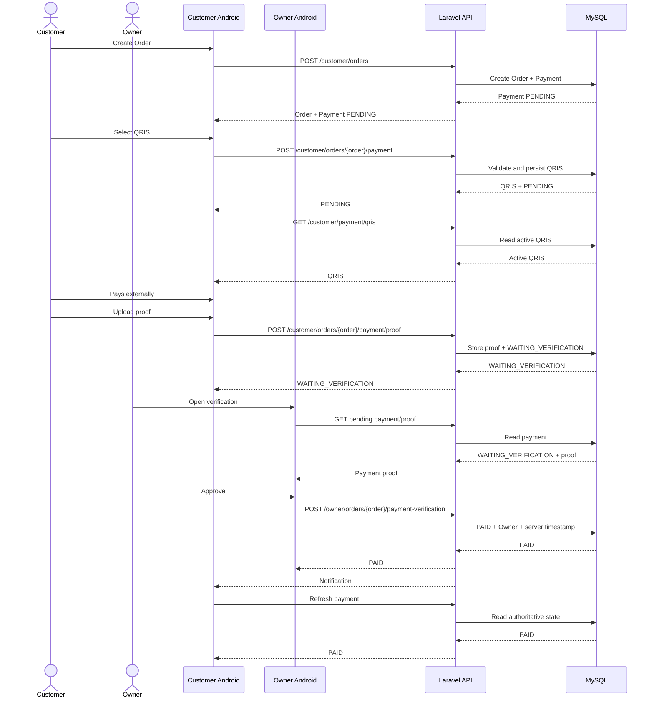
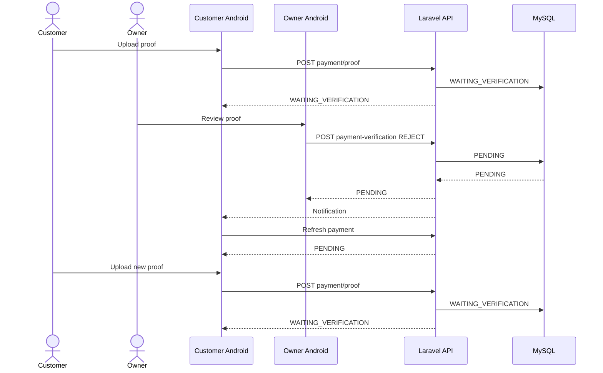
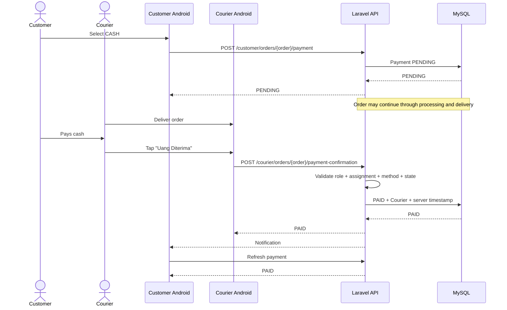

# KYŪSUI — INTEGRATION CONTRACT

**Project:** KYŪSUI  
**Study Case:** Berkah Water  
**Document:** `13_KYUSUI_INTEGRATION_CONTRACT.md`  
**Contract Version:** v2.0  
**Contract Status:** FINAL — PAYMENT ARCHITECTURE REBUILT  
**Platform:** Android Native  
**Android:** Kotlin + Jetpack Compose + MVVM + ViewModel + StateFlow  
**Backend:** Laravel 13 / PHP 8.3+  
**Database:** MySQL 8.x  
**Authentication:** Laravel Sanctum  
**Network:** Retrofit + OkHttp / HTTPS / REST / JSON  
**Notification:** Firebase Cloud Messaging  
**Maps / Location:** Google Maps SDK + Fused Location Provider  

---

# 1. Purpose

Dokumen ini adalah kontrak integrasi resmi antara Android Developer dan Backend Developer KYŪSUI.

Kontrak ini memastikan bahwa kedua sisi mengimplementasikan business flow, API, database, payment, authorization, state transition, actor, dan timestamp dengan interpretasi yang sama.

Kontrak ini menjadi boundary implementasi:

```text
Android
   ↓
Retrofit + OkHttp
   ↓
HTTPS / REST / JSON
   ↓
Laravel 13 API
   ↓
Authentication
   ↓
Authorization
   ↓
Validation
   ↓
Business Rule
   ↓
Database Transaction
   ↓
MySQL
   ↓
Authoritative State
   ↓
API Response / Notification
   ↓
Android StateFlow
   ↓
UI
```

Kontrak ini tidak menggantikan specification yang lebih tinggi. Kontrak ini mengikat implementasi Android dan Backend agar tetap konsisten dengan:

- database schema;
- API specification;
- Android architecture;
- payment specification;
- notification specification;
- workflow sistem.

---

# 2. Scope

Integration contract mencakup:

```text
Authentication
Authorization
Customer
Owner
Courier
Product
Order
Order Status
Payment
QRIS
CASH
Courier Assignment
Delivery
Tracking
Notification
Error Handling
Concurrency
Timestamp
Actor
Android Mapping
Backend Mapping
Testing Boundary
Change Control
```

Payment architecture yang aktif hanya:

```text
QRIS
CASH
```

Payment state yang aktif hanya:

```text
PENDING
WAITING_VERIFICATION
PAID
```

Tidak terdapat mekanisme pembayaran otomatis dari layanan eksternal. Pembayaran QRIS menggunakan QRIS statis milik Berkah Water dan verifikasi manual oleh Owner.

---

# 3. Authority and Source Documents

Implementasi harus diselaraskan dengan dokumen berikut:

```text
00_KYUSUI_MASTER_SPECIFICATION.md
01_KYUSUI_PROJECT_RULES.md
02_KYUSUI_SYSTEM_ARCHITECTURE.md
04_KYUSUI_SYSTEM_WORKFLOW_REBUILT.md
05_KYUSUI_DATABASE_SCHEMA_REBUILT.md
06_KYUSUI_API_SPECIFICATION_REBUILT.md
07_KYUSUI_ANDROID_ARCHITECTURE_REBUILT.md
08_KYUSUI_PAYMENT_SPECIFICATION_REBUILT.md
10_KYUSUI_NOTIFICATION_SPECIFICATION_REBUILT.md
11_KYUSUI_TESTING_SPECIFICATION_REBUILT.md
12_KYUSUI_VISUAL_DESIGN_SPECIFICATION_REBUILT.md
13_KYUSUI_DATABASE_FINALIZATION.md
```

Untuk domain payment, keputusan pada payment specification terbaru adalah canonical.

Untuk database, `payments` merupakan satu-satunya business payment record untuk setiap order.

Untuk Android, backend merupakan authority terhadap business state.

Jika terdapat perbedaan implementasi dengan kontrak ini, implementasi harus dihentikan pada bagian yang konflik sampai contract diperbarui secara eksplisit.

---

# 4. Core Integration Principles

## 4.1 Backend Is the Authority

Backend Laravel merupakan authority untuk:

```text
Authentication
Authorization
Ownership
Assignment
Order Status
Payment Method
Payment Status
Payment Amount
QRIS Configuration
Payment Verification
Cash Confirmation
Actor
Timestamp
Business Transition
```

Android hanya mengirim action/intent dan membaca hasil authoritative dari backend.

---

## 4.2 Android Is Not the Business Authority

Android tidak boleh menetapkan sendiri:

```text
payment = PAID
order = SELESAI
payment amount
verified_by
verified_at
courier assignment
active QRIS
ownership
authorization result
```

Android boleh melakukan local validation untuk UX, tetapi backend tetap melakukan validation final.

---

## 4.3 Android Does Not Determine PAID

Aturan wajib:

```text
Android action
    ↓
Backend validation
    ↓
Backend state transition
    ↓
Database commit
    ↓
API response
    ↓
Android reads authoritative state
```

Android tidak boleh:

```text
button click
    ↓
local paymentStatus = PAID
```

Android juga tidak boleh menganggap:

```text
upload success = PAID
```

Upload bukti QRIS hanya menghasilkan:

```text
WAITING_VERIFICATION
```

---

## 4.4 Notification Is Not Source of Truth

FCM hanya menyampaikan informasi.

Pola yang benar:

```text
Business Event
    ↓
Database Commit
    ↓
Notification
    ↓
Android opens screen
    ↓
Android refreshes API
    ↓
Backend returns current state
    ↓
Android renders current state
```

Payload notification tidak boleh menjadi satu-satunya dasar untuk menentukan business state.

---

# 5. System Boundary

```text
┌──────────────────────────────────────────────┐
│                ANDROID APP                   │
│                                              │
│ Compose                                       │
│ ViewModel                                     │
│ StateFlow                                     │
│ Repository                                    │
│ Retrofit + OkHttp                             │
│ DataStore                                     │
│ FCM Handler                                   │
│ Maps / Location                               │
└──────────────────────┬───────────────────────┘
                       │
                       │ HTTPS / REST / JSON
                       ▼
┌──────────────────────────────────────────────┐
│              LARAVEL BACKEND                 │
│                                              │
│ Sanctum                                       │
│ Authentication                               │
│ Authorization                                │
│ Validation                                   │
│ Policies                                     │
│ Business Services                            │
│ State Transition                             │
│ Notification Service                         │
└──────────────────────┬───────────────────────┘
                       │
                       ▼
┌──────────────────────────────────────────────┐
│                    MYSQL                     │
│                                              │
│ users                                         │
│ products                                      │
│ orders                                        │
│ order_items                                   │
│ payments                                      │
│ courier_assignments                           │
│ courier_locations                             │
│ notifications                                 │
│ business_settings                             │
└──────────────────────────────────────────────┘
```

Android tidak mengakses MySQL secara langsung.

---

# 6. Roles

Role canonical:

```text
CUSTOMER
OWNER
COURIER
```

Role ditentukan oleh backend.

Android menggunakan role untuk:

- navigation;
- screen selection;
- UI action availability;
- presentation.

Backend menggunakan role untuk:

- authorization;
- resource access;
- state transition;
- actor validation.

UI role check bukan pengganti authorization backend.

---

# 7. Integration Responsibility Matrix

| Area | Android | Backend |
|---|---|---|
| UI rendering | Responsible | No |
| User interaction | Responsible | No |
| Local UX validation | Responsible | Final validation |
| API request | Responsible | Receive |
| API response parsing | Responsible | Produce |
| Authentication | Session handling | Authority |
| Authorization | UI adaptation only | Authority |
| Ownership | Display context | Authority |
| Order state | Display | Authority |
| Payment state | Display | Authority |
| Payment amount | Display | Authority |
| QRIS configuration | Display | Authority |
| QRIS verification | No | Authority |
| CASH confirmation | Send action | Authority |
| Courier assignment | Display | Authority |
| Actor | Read response | Determine |
| Timestamp | Display | Generate |
| Notification | Receive/display | Create/send |
| Database | No direct access | Authority |
| Tracking presentation | Responsible | Data authorization |
| Tracking location submission | Courier action | Validate/store |

---

# 8. Canonical Domain Values

## 8.1 Payment Method

Only:

```text
QRIS
CASH
```

Android enum and backend enum/value mapping must use these exact canonical values.

Display labels may use Bahasa Indonesia:

```text
QRIS
Tunai
```

but API values remain:

```text
QRIS
CASH
```

---

## 8.2 Payment Status

Only:

```text
PENDING
WAITING_VERIFICATION
PAID
```

Recommended Android mapping:

```text
PENDING               → Menunggu Pembayaran
WAITING_VERIFICATION  → Menunggu Verifikasi
PAID                  → Pembayaran Berhasil
```

Display labels are presentation only. API/database values remain canonical.

---

## 8.3 Order Status

Order status remains a separate domain from payment status.

Baseline:

```text
MENUNGGU_PEMBAYARAN
MENUNGGU_DIPROSES
DIPROSES
DITUGASKAN
DALAM_PENGANTARAN
SELESAI
```

Payment state must not be confused with order state.

Example:

```text
CASH payment = PENDING
Order         = DIPROSES
```

is valid according to the cash workflow.

---

# 9. Database Integration Contract

## 9.1 Order → Payment

Relationship:

```text
orders 1 ───── 1 payments
```

Constraint:

```text
UNIQUE(payments.order_id)
```

One order must not create multiple business payment records.

---

## 9.2 Payment Schema

Canonical fields:

```text
payments
├── id
├── order_id
├── payment_method
├── payment_status
├── amount
├── proof_image
├── verified_by
├── verified_at
├── created_at
└── updated_at
```

Field meaning:

| Field | Authority | Meaning |
|---|---|---|
| `id` | Backend/DB | Payment identifier |
| `order_id` | Backend/DB | Related order |
| `payment_method` | Backend | QRIS/CASH |
| `payment_status` | Backend | Current payment state |
| `amount` | Backend | Authoritative order payment amount |
| `proof_image` | Backend | QRIS proof reference |
| `verified_by` | Backend | Actor who made valid final confirmation |
| `verified_at` | Backend | Server timestamp of final confirmation |
| `created_at` | Backend/DB | Record creation timestamp |
| `updated_at` | Backend/DB | Last record update timestamp |

---

## 9.3 Payment Amount

Payment amount is derived by backend:

```text
products
   ↓
order_items
   ↓
subtotal
   ↓
delivery fee according to approved business rule
   ↓
order total
   ↓
payment.amount
```

Android must not recalculate or override the authoritative payment amount.

Android may format:

```text
16000.00
```

as:

```text
Rp 16.000
```

without changing the underlying value.

---

## 9.4 Verification Fields

For non-final payment states:

```text
verified_by  = NULL
verified_at  = NULL
```

For `PAID`:

```text
verified_by  != NULL
verified_at  != NULL
```

Actor meaning depends on payment method:

```text
QRIS + PAID
→ verified_by = Owner

CASH + PAID
→ verified_by = Assigned Courier
```

The backend creates the timestamp.

Android never sends `verified_by` or `verified_at` as authoritative values.

---

# 10. API Contract

Base API:

```text
/api/v1
```

Private request:

```http
Accept: application/json
Authorization: Bearer <sanctum-token>
```

JSON request:

```http
Content-Type: application/json
```

Proof upload:

```http
Content-Type: multipart/form-data
```

---

# 11. Authentication Contract

Canonical endpoints:

```http
POST /auth/register
POST /auth/login
POST /auth/logout
GET  /auth/me
```

Backend responsibilities:

```text
authenticate
validate credentials
create session/token
revoke session/token
return authenticated user
```

Android responsibilities:

```text
submit credentials
store session token securely
attach token to private requests
handle 401
clear session when logout/session invalid
```

Android does not manufacture authentication identity or authorization claims.

---

# 12. Customer Order and Payment Flow

## 12.1 Create Order

Canonical endpoint:

```http
POST /customer/orders
```

Flow:

```text
Customer Android
      ↓
Create Order
      ↓
POST /customer/orders
      ↓
Laravel authentication
      ↓
Customer authorization
      ↓
Validate items
      ↓
Calculate authoritative amount
      ↓
Create order
      ↓
Create one payment record
      ↓
payment_status = PENDING
      ↓
COMMIT
      ↓
Response
```

The payment method is selected through the payment endpoint according to API contract.

---

# 13. Customer Payment Selection

Endpoint:

```http
POST /customer/orders/{order}/payment
```

Request:

```json
{
  "payment_method": "QRIS"
}
```

or:

```json
{
  "payment_method": "CASH"
}
```

Backend validates:

```text
authenticated customer
        ↓
order exists
        ↓
order belongs to customer
        ↓
payment exists
        ↓
payment method valid
        ↓
current payment state allows action
        ↓
business workflow allows selection
```

Backend returns the authoritative payment resource.

Android renders the response.

---

# 14. QRIS Integration Contract

## 14.1 QRIS Architecture

QRIS is a static QRIS belonging to Berkah Water.

At one time:

```text
ONE DEPOT
   ↓
ONE ACTIVE QRIS
```

Customer can read it.

Owner can replace it.

Customer cannot modify it.

---

## 14.2 Get Active QRIS

Endpoint:

```http
GET /customer/payment/qris
```

Purpose:

```text
Read active QRIS
```

Customer authorization:

```text
CUSTOMER
```

Customer access:

```text
READ ONLY
```

The active QRIS is business configuration, not a payment success signal.

---

## 14.3 QRIS Customer Flow

Canonical sequence:

```text
Customer
   ↓
Create Order
   ↓
Select QRIS
   ↓
Payment PENDING
   ↓
Get Active QRIS
   ↓
Display QRIS + Authoritative Amount
   ↓
Customer Pays
   ↓
Customer Uploads Proof
   ↓
WAITING_VERIFICATION
   ↓
Owner Reviews Proof
   ↓
Owner Verifies
   ↓
PAID
```

This sequence is the primary QRIS integration contract.

---

# 15. QRIS Proof Upload

Endpoint:

```http
POST /customer/orders/{order}/payment/proof
```

Role:

```text
CUSTOMER
```

Content type:

```text
multipart/form-data
```

Field:

```text
proof_image=<image-file>
```

Backend validates:

```text
authenticated customer
order ownership
payment exists
payment_method = QRIS
payment_status = PENDING
order state allows proof submission
file exists
allowed image type
MIME type
extension
file size
file integrity
safe storage path
```

Successful transition:

```text
PENDING
   ↓
WAITING_VERIFICATION
```

Upload success does not mean:

```text
PAID
```

---

# 16. QRIS Proof Re-upload

If Owner rejects a QRIS proof:

```text
WAITING_VERIFICATION
        ↓
Owner rejects
        ↓
PENDING
```

Customer may then upload a new proof:

```text
PENDING
   ↓
Upload new proof
   ↓
WAITING_VERIFICATION
```

The re-upload must use the same business payment record.

It must not create:

```text
second payment
```

for the same order.

---

# 17. Owner QRIS Verification

## 17.1 Pending Verification List

Endpoint:

```http
GET /owner/payments/pending
```

Role:

```text
OWNER
```

Server filter:

```text
payment_method = QRIS
payment_status = WAITING_VERIFICATION
```

---

## 17.2 View QRIS Proof

Endpoint:

```http
GET /owner/orders/{order}/payment/proof
```

Backend validates:

```text
authenticated Owner
Owner operational scope
order exists
payment exists
payment_method = QRIS
proof exists
```

Proof must remain protected by backend authorization.

---

## 17.3 Verify or Reject

Endpoint:

```http
POST /owner/orders/{order}/payment-verification
```

Approve request:

```json
{
  "action": "APPROVE"
}
```

Reject request:

```json
{
  "action": "REJECT",
  "note": "Bukti pembayaran tidak dapat diverifikasi."
}
```

Allowed actions:

```text
APPROVE
REJECT
```

---

# 18. QRIS State Transition Contract

Allowed:

```text
PENDING
    ↓
WAITING_VERIFICATION
```

```text
WAITING_VERIFICATION
    ↓
PAID
```

```text
WAITING_VERIFICATION
    ↓
PENDING
```

Meaning:

```text
PENDING → WAITING_VERIFICATION
= Customer uploads valid proof

WAITING_VERIFICATION → PAID
= Owner verifies proof

WAITING_VERIFICATION → PENDING
= Owner rejects proof
```

Forbidden:

```text
PENDING → PAID by Customer
PENDING → PAID without proof
WAITING_VERIFICATION → PAID by Customer
WAITING_VERIFICATION → PAID by Courier
PAID → PENDING
PAID → WAITING_VERIFICATION
```

---

# 19. QRIS Approval Backend Contract

When Owner approves:

```text
Authenticate Owner
        ↓
Authorize Owner
        ↓
Validate order scope
        ↓
Validate payment exists
        ↓
Validate payment_method = QRIS
        ↓
Validate payment_status = WAITING_VERIFICATION
        ↓
Validate proof exists
        ↓
Begin transaction
        ↓
payment_status = PAID
        ↓
verified_by = authenticated Owner
        ↓
verified_at = server timestamp
        ↓
COMMIT
        ↓
Emit payment notification
        ↓
Return authoritative payment
```

The actor is derived from the authenticated backend session.

Android does not send the Owner identity as a trusted field.

---

# 20. QRIS Rejection Backend Contract

When Owner rejects:

```text
Authenticate Owner
        ↓
Authorize Owner
        ↓
Validate QRIS
        ↓
Validate WAITING_VERIFICATION
        ↓
Validate proof
        ↓
Begin transaction
        ↓
payment_status = PENDING
        ↓
verified_by = NULL
        ↓
verified_at = NULL
        ↓
COMMIT
        ↓
Emit rejection notification
        ↓
Return authoritative payment
```

Rejection does not create a new payment state.

---

# 21. CASH Integration Contract

CASH is Cash on Delivery.

Initial state:

```text
PENDING
```

CASH payment may remain:

```text
PENDING
```

while the order continues through the delivery workflow.

---

# 22. CASH Customer Flow

Canonical sequence:

```text
Customer
   ↓
Create Order
   ↓
Select CASH
   ↓
Payment PENDING
   ↓
Order Processing
   ↓
Courier Assignment
   ↓
Delivery
   ↓
Customer Pays Cash
   ↓
Assigned Courier Confirms
   ↓
Backend Validates
   ↓
PAID
```

Customer has no payment action:

```text
Mark as Paid
Confirm Cash
```

Customer does not upload payment proof for CASH.

---

# 23. CASH Courier Confirmation

Endpoint:

```http
POST /courier/orders/{order}/payment-confirmation
```

Role:

```text
COURIER
```

The endpoint represents the Courier action:

```text
Uang Diterima
```

Backend must validate:

```text
authenticated user
        ↓
role = COURIER
        ↓
order exists
        ↓
payment exists
        ↓
payment_method = CASH
        ↓
payment_status = PENDING
        ↓
active courier assignment exists
        ↓
assignment belongs to authenticated courier
        ↓
transition allowed
```

Only after all validations pass:

```text
PENDING
   ↓
PAID
```

---

# 24. CASH Actor Contract

The confirmation actor is:

```text
Assigned Courier
```

Not:

```text
Customer
Owner
```

The backend derives:

```text
verified_by = authenticated Assigned Courier
```

and:

```text
verified_at = server timestamp
```

Owner has no Cash confirmation action.

Customer has no Cash confirmation action.

Courier A cannot confirm an order assigned to Courier B.

---

# 25. CASH Proof Contract

CASH does not require proof image.

For CASH:

```text
proof_image = NULL
```

The payment confirmation is represented by:

```text
payment_status
verified_by
verified_at
```

plus the valid courier assignment context.

---

# 26. CASH State Transition Contract

Allowed:

```text
PENDING → PAID
```

Condition:

```text
Assigned Courier
+
valid active assignment
+
payment_method = CASH
+
payment_status = PENDING
```

Forbidden:

```text
CASH PENDING → WAITING_VERIFICATION
CASH Customer → PAID
CASH Owner → PAID
CASH Unassigned Courier → PAID
PAID → PENDING
```

---

# 27. Payment State Machine

## 27.1 QRIS

```text
                ┌───────────────────────┐
                │                       │
                ▼                       │
             PENDING                    │
                │                       │
                │ upload proof          │
                ▼                       │
      WAITING_VERIFICATION             │
          │               │             │
          │ Owner         │ Owner       │
          │ verifies      │ rejects     │
          ▼               └─────────────┘
         PAID
```

## 27.2 CASH

```text
PENDING
   │
   │ Assigned Courier confirms
   ▼
PAID
```

## 27.3 Terminal Rule

```text
PAID
```

is terminal for the normal payment workflow.

No normal payment action may revert it.

---

# 28. Payment and Order State Independence

Payment state and order state are separate state machines.

Do not implement a universal rule:

```text
order can only proceed when payment = PAID
```

CASH explicitly permits:

```text
payment = PENDING
order = DIPROSES
```

and later:

```text
payment = PENDING
order = DALAM_PENGANTARAN
```

then:

```text
Courier receives cash
        ↓
payment = PAID
```

Order completion remains controlled by the order/delivery workflow.

---

# 29. Android Payment Architecture

Android payment layers:

```text
Compose Screen
      ↓
Payment ViewModel
      ↓
Payment Repository
      ↓
Retrofit API
      ↓
Laravel
```

Composable must not directly call Retrofit.

ViewModel must not implement backend business rules.

Repository handles API access and response mapping.

---

# 30. Android QRIS Responsibilities

Android may:

```text
show payment method
show total
load active QRIS
show QRIS image
open/select image
upload proof
show upload progress
show upload error
show WAITING_VERIFICATION
show rejection state
allow re-upload when backend says PENDING
refresh payment
display PAID returned by backend
```

Android must not:

```text
verify proof
decide proof validity
set PAID locally
determine verified_by
determine verified_at
change active QRIS
calculate authoritative payment amount
```

---

# 31. Android CASH Responsibilities

Customer Android may:

```text
show CASH option
show PENDING
show order continuation
show payment status returned by backend
```

Customer Android must not:

```text
confirm cash
set PAID
upload cash proof
```

Courier Android may:

```text
show assigned CASH order
show payment amount
show PENDING
show Uang Diterima action
send confirmation request
display backend result
refresh state
```

Courier Android must not:

```text
set PAID locally
confirm an unassigned order
confirm QRIS
override backend rejection
```

---

# 32. Android State Mapping

The Android UI should derive payment presentation from authoritative API state.

Example:

```text
PENDING
        ↓
PaymentPendingUiState

WAITING_VERIFICATION
        ↓
PaymentWaitingVerificationUiState

PAID
        ↓
PaymentPaidUiState
```

For QRIS:

```text
PENDING
→ show active QRIS
→ show Upload Bukti

WAITING_VERIFICATION
→ show proof submitted
→ disable normal upload action
→ show waiting state

PAID
→ show payment completed
→ no payment mutation action
```

For CASH:

```text
PENDING
→ show Cash on Delivery
→ Customer has no confirmation action

PAID
→ show payment completed
```

---

# 33. Backend State Mapping

Backend should treat client requests as actions, not arbitrary state assignments.

Bad contract:

```json
{
  "payment_status": "PAID"
}
```

Correct conceptual contract:

```text
Customer:
UPLOAD_PROOF

Owner:
APPROVE
REJECT

Courier:
CONFIRM_CASH
```

The backend translates valid actions into state transitions.

---

# 34. Actor Contract

Every authoritative payment transition must have a valid actor.

## QRIS

```text
Action:
Owner APPROVE

Actor:
authenticated Owner

Result:
WAITING_VERIFICATION → PAID
```

## QRIS Rejection

```text
Action:
Owner REJECT

Actor:
authenticated Owner

Result:
WAITING_VERIFICATION → PENDING
```

## CASH

```text
Action:
Courier CONFIRM_CASH

Actor:
authenticated Assigned Courier

Result:
PENDING → PAID
```

The actor is determined from the authenticated backend identity and resource authorization.

The Android client must not be trusted to identify the actor.

---

# 35. Timestamp Contract

Authoritative business timestamps are generated by backend.

For payment finalization:

```text
verified_at = server timestamp
```

Android may display the timestamp.

Android must not submit an authoritative verification timestamp.

Example:

```json
{
  "payment_status": "PAID",
  "verified_by": {
    "id": 20,
    "role": "COURIER"
  },
  "verified_at": "2026-09-30T11:30:00Z"
}
```

The values are backend-generated.

---

# 36. Notification Integration Contract

Payment notification events:

```text
PAYMENT_QRIS_PROOF_UPLOADED
PAYMENT_QRIS_APPROVED
PAYMENT_QRIS_REJECTED
PAYMENT_CASH_CONFIRMED
```

## QRIS Proof Uploaded

Trigger:

```text
Customer uploads valid proof
        ↓
WAITING_VERIFICATION
        ↓
COMMIT
        ↓
Owner notification
```

Recipient:

```text
OWNER
```

---

## QRIS Approved

Trigger:

```text
Owner verifies
        ↓
PAID
        ↓
COMMIT
        ↓
Customer notification
```

Recipient:

```text
CUSTOMER
```

---

## QRIS Rejected

Trigger:

```text
Owner rejects
        ↓
PENDING
        ↓
COMMIT
        ↓
Customer notification
```

Recipient:

```text
CUSTOMER
```

---

## CASH Confirmed

Trigger:

```text
Assigned Courier confirms cash
        ↓
Backend validates
        ↓
PAID
        ↓
COMMIT
        ↓
Customer notification
```

Recipient:

```text
CUSTOMER
```

Notification does not perform the state transition.

---

# 37. Notification Payload Contract

Minimum routing/context:

```text
schema_version
notification_id
type
resource_type
resource_id
order_id
target_route
created_at
```

Payment-specific context may include:

```text
payment_method
payment_status
```

Android must still refresh the relevant API after opening the notification.

---

# 38. API Error Contract

Common status:

| HTTP | Meaning |
|---|---|
| `200` | Successful read/update/action |
| `201` | Resource created |
| `204` | Successful action without body |
| `400` | Malformed request |
| `401` | Authentication failure |
| `403` | Authenticated but unauthorized |
| `404` | Resource unavailable/not visible |
| `409` | Business state conflict |
| `422` | Validation failure |
| `429` | Rate limited |
| `500` | Internal error |
| `503` | Service unavailable |

Android must not infer `PAID` from:

```text
HTTP 200
```

It must inspect the returned authoritative payment state.

---

# 39. Payment Error Handling

There is no separate payment failure state in the active contract.

Technical failure is handled as:

```text
API error
network error
validation error
authorization error
state conflict
server error
```

not as a new payment status.

---

# 40. Timeout Contract

If a payment action times out:

```text
Client does not know final result
        ↓
Do not assume success
        ↓
GET authoritative payment
        ↓
Render returned state
```

Example:

```text
Courier taps Uang Diterima
        ↓
Request timeout
        ↓
Android does NOT set PAID
        ↓
Refresh payment
        ↓
Backend returns PENDING or PAID
```

The backend state is authoritative.

---

# 41. Concurrency Contract

Payment mutations must be protected by backend state validation and database transaction boundaries.

## QRIS Example

Two Owners act concurrently:

```text
Owner A → APPROVE
Owner B → REJECT
```

Only a transition based on the valid current state may commit.

Once:

```text
PAID
```

is committed, a concurrent rejection must not revert it.

---

## CASH Example

Courier double-taps:

```text
Uang Diterima
Uang Diterima
```

Backend must prevent a second invalid transition after the payment is already `PAID`.

There remains:

```text
one order
→
one payment
```

---

# 42. Idempotency and Duplicate Mutation

The integration contract requires:

```text
one order
→
one payment
```

Re-upload after QRIS rejection:

```text
same payment record
```

not:

```text
new payment record
```

Repeated finalization requests must not create additional payment records.

The implementation may return a business conflict or the current authoritative state, but must not duplicate the payment entity.

---

# 43. QRIS Configuration Contract

QRIS configuration is separate from payment lifecycle.

Conceptual structure:

```text
business_settings
    ↓
single active QRIS configuration
```

Customer:

```text
READ
```

Owner:

```text
READ
REPLACE
```

Courier:

```text
NO PAYMENT QRIS CONFIGURATION ACCESS
```

Changing the active QRIS does not modify existing payment state.

Example:

```text
PENDING
```

remains:

```text
PENDING
```

after QRIS replacement.

Likewise:

```text
WAITING_VERIFICATION
```

remains:

```text
WAITING_VERIFICATION
```

and:

```text
PAID
```

remains:

```text
PAID
```

---

# 44. QRIS Proof Security Contract

Proof files are protected business data.

Backend must:

```text
validate MIME
validate extension
validate size
validate file integrity
generate controlled storage path
prevent arbitrary path injection
keep proof access authorized
```

Customer:

```text
own order only
```

Owner:

```text
operational scope only
```

Courier:

```text
no QRIS verification access
```

Proof must not be exposed as an unrestricted public resource.

---

# 45. Authorization Matrix

| Action | Customer | Owner | Assigned Courier | Backend |
|---|---:|---:|---:|---:|
| View active QRIS | Yes | Yes | No | Authorize |
| Replace active QRIS | No | Yes | No | Authorize |
| Select QRIS | Own order | According to workflow | No | Authorize |
| Upload QRIS proof | Own order | No | No | Authorize |
| Re-upload QRIS proof | Own order | No | No | Authorize |
| View QRIS proof | Own proof context | Owner scope | No | Authorize |
| Approve QRIS | No | Yes | No | Authorize |
| Reject QRIS | No | Yes | No | Authorize |
| Select CASH | Own order | According to workflow | No | Authorize |
| Confirm CASH | No | No | Assigned order only | Authorize |
| Set payment `PAID` directly | No | No | No | Only through valid workflow |

---

# 46. Endpoint Responsibility Matrix

## Customer

```http
POST /customer/orders
GET  /customer/orders
GET  /customer/orders/{order}
GET  /customer/orders/{order}/tracking

GET  /customer/payment/qris

POST /customer/orders/{order}/payment
POST /customer/orders/{order}/payment/proof
```

Customer payment responsibilities:

```text
Select QRIS/CASH
View active QRIS
Upload QRIS proof
Read payment state
```

---

## Owner

```http
GET  /owner/orders
GET  /owner/orders/{order}
PATCH /owner/orders/{order}/status
POST /owner/orders/{order}/assignment

GET  /owner/payments/pending
GET  /owner/orders/{order}/payment/proof
POST /owner/orders/{order}/payment-verification

GET  /owner/payment/qris
PUT  /owner/payment/qris
```

Owner payment responsibilities:

```text
Review QRIS proof
Approve QRIS
Reject QRIS
Read active QRIS
Replace active QRIS
```

---

## Courier

```http
GET  /courier/orders/{order}
POST /courier/orders/{order}/payment-confirmation
```

Courier payment responsibility:

```text
Confirm CASH for assigned delivery
```

---

# 47. API Response Mapping

Canonical payment resource:

```json
{
  "id": 7001,
  "order_id": 1001,
  "payment_method": "QRIS",
  "payment_status": "WAITING_VERIFICATION",
  "amount": "16000.00",
  "proof": {
    "available": true
  },
  "verified_by": null,
  "verified_at": null,
  "created_at": "2026-09-30T10:00:00Z",
  "updated_at": "2026-09-30T10:05:00Z"
}
```

For QRIS `PAID`:

```json
{
  "payment_method": "QRIS",
  "payment_status": "PAID",
  "verified_by": {
    "id": 10,
    "role": "OWNER"
  },
  "verified_at": "2026-09-30T10:20:00Z"
}
```

For CASH `PAID`:

```json
{
  "payment_method": "CASH",
  "payment_status": "PAID",
  "proof": {
    "available": false
  },
  "verified_by": {
    "id": 20,
    "role": "COURIER"
  },
  "verified_at": "2026-09-30T11:30:00Z"
}
```

Android maps these values directly into UI state.

---

# 48. Sequence — QRIS



---

# 49. Sequence — QRIS Rejection



---

# 50. Sequence — CASH



---

# 51. Failure and Recovery Contract

## Upload Proof Failure

```text
Upload request
    ↓
Error
    ↓
Payment remains authoritative server state
    ↓
Android shows error
    ↓
Retry
```

Do not locally set:

```text
WAITING_VERIFICATION
```

unless backend response confirms it.

---

## Owner Verification Failure

```text
Approve/Reject request
    ↓
Error
    ↓
Do not locally change payment
    ↓
Refresh API
```

---

## Courier Cash Confirmation Failure

```text
Uang Diterima
    ↓
API request
    ↓
Error
    ↓
Do not locally set PAID
    ↓
Show error
    ↓
Refresh authoritative payment
```

---

# 52. Security Boundary

Backend must validate every private payment action.

Required validation:

```text
Authentication
Role
Ownership
Operational Scope
Assignment
Payment Method
Payment Status
Order Context
Allowed Transition
Actor
```

Client-side hidden buttons are not sufficient.

Examples:

```text
Customer A → Order Customer B
= reject

Courier A → Order Courier B
= reject

Owner → Cash confirmation
= reject

Customer → QRIS approval
= reject

Courier → QRIS approval
= reject

Customer → direct PAID
= reject
```

---

# 53. Testing Contract

Minimum payment integration tests:

```text
PAY-001
Customer selects QRIS
→ PENDING

PAY-002
Customer uploads valid QRIS proof
→ WAITING_VERIFICATION

PAY-003
Owner approves QRIS
→ PAID

PAY-004
Owner rejects QRIS
→ PENDING

PAY-005
Customer re-uploads proof
→ WAITING_VERIFICATION

PAY-006
Re-upload does not create second payment

PAY-007
Customer cannot set PAID

PAY-008
Owner cannot approve QRIS without proof

PAY-009
Courier cannot verify QRIS

PAY-010
Customer selects CASH
→ PENDING

PAY-011
CASH can continue through delivery while PENDING

PAY-012
Assigned Courier confirms cash
→ PAID

PAY-013
Unassigned Courier cannot confirm cash

PAY-014
Owner cannot confirm cash

PAY-015
Customer cannot confirm cash

PAY-016
CASH has no proof requirement

PAY-017
PAID cannot return to PENDING

PAY-018
PAID cannot return to WAITING_VERIFICATION

PAY-019
Verification actor is stored correctly

PAY-020
Verification timestamp is generated by backend

PAY-021
Notification is emitted after committed transition

PAY-022
Notification does not become source of truth

PAY-023
Timeout does not cause Android to assume PAID

PAY-024
Concurrent finalization cannot create duplicate payment
```

---

# 54. Integration Acceptance Criteria

The integration is considered compliant only if all of the following are true:

```text
[✓] Android communicates only through Laravel API
[✓] Backend is business authority
[✓] MySQL is persistent source of truth
[✓] One order has one payment
[✓] Payment method = QRIS or CASH
[✓] Payment status = PENDING / WAITING_VERIFICATION / PAID
[✓] QRIS starts PENDING
[✓] QRIS proof upload → WAITING_VERIFICATION
[✓] Owner verification → PAID
[✓] Owner rejection → PENDING
[✓] QRIS re-upload uses same payment record
[✓] CASH starts PENDING
[✓] CASH can continue through delivery
[✓] Customer pays Courier
[✓] Assigned Courier confirms cash
[✓] Valid Cash confirmation → PAID
[✓] Owner does not confirm Cash
[✓] Customer does not confirm Cash
[✓] Unassigned Courier cannot confirm Cash
[✓] Android never sets PAID authoritatively
[✓] Android reads payment state from backend
[✓] Actor is derived by backend
[✓] Timestamp is generated by backend
[✓] Payment amount is authoritative from backend
[✓] Active QRIS is backend-controlled
[✓] QRIS proof is protected
[✓] Notifications follow committed business events
[✓] Notification does not mutate payment state
[✓] Payment concurrency is backend-controlled
[✓] No duplicate payment per order
```

---

# 55. Implementation Handoff

## Android Developer Must Implement

```text
1. API models
2. Retrofit service interfaces
3. Repository methods
4. Payment ViewModel
5. QRIS payment screen
6. QRIS proof upload
7. QRIS waiting verification state
8. QRIS rejection/re-upload state
9. QRIS paid state
10. CASH customer state
11. CASH courier confirmation action
12. Payment state mapping
13. Error handling
14. Timeout refresh
15. FCM payment notification handling
16. API refresh after notification
17. UI authorization visibility
```

Android must never implement backend business transition logic as authoritative local state.

---

## Backend Developer Must Implement

```text
1. Payment model
2. Payment relation
3. Payment validation
4. Customer payment selection
5. Active QRIS retrieval
6. QRIS proof upload
7. Owner pending payment list
8. Owner proof retrieval
9. Owner QRIS approve
10. Owner QRIS reject
11. QRIS replacement
12. Courier CASH confirmation
13. Actor validation
14. Assignment validation
15. State transition validation
16. Database transactions
17. Verification timestamp
18. Notification event creation
19. Authorization
20. Error responses
21. Concurrency protection
```

---

# 56. Contract Change Rules

Do not change:

```text
payment_method
payment_status
payment actor
payment transition
payment authority
database relationship
endpoint meaning
```

inside implementation without updating this contract and the affected source specification.

A change affecting both Android and Backend requires:

```text
Specification update
        ↓
Integration Contract update
        ↓
API update
        ↓
Database update if required
        ↓
Android update
        ↓
Backend update
        ↓
Integration test
```

Do not patch one side independently when the change alters the shared contract.

---

# 57. Final Canonical Payment Contract

## QRIS

```text
Customer
   ↓
Create Order
   ↓
Select QRIS
   ↓
Payment PENDING
   ↓
Get Active QRIS
   ↓
Customer Pays
   ↓
Upload Proof
   ↓
WAITING_VERIFICATION
   ↓
Owner Verify
   ↓
PAID
```

Rejection:

```text
WAITING_VERIFICATION
   ↓
Owner Reject
   ↓
PENDING
   ↓
Customer Uploads New Proof
   ↓
WAITING_VERIFICATION
```

---

## CASH

```text
Customer
   ↓
Create Order
   ↓
Select CASH
   ↓
Payment PENDING
   ↓
Order Processing
   ↓
Courier Assignment
   ↓
Delivery
   ↓
Customer Pays
   ↓
Assigned Courier Confirms
   ↓
Backend Validates
   ↓
PAID
```

---

# 58. Final Responsibility Boundary

```text
                         KYŪSUI PAYMENT
                              │
             ┌────────────────┴────────────────┐
             │                                 │
          ANDROID                           BACKEND
             │                                 │
             │                                 │
       Collect action                    Validate action
       Show state                        Authorize actor
       Upload proof                      Validate ownership
       Show QRIS                         Validate assignment
       Send confirmation                 Validate payment method
       Refresh state                     Validate current state
       Render response                   Transition state
       Receive notification              Generate actor
                                         Generate timestamp
                                         Commit database
                                         Emit notification
             │                                 │
             └────────────────┬────────────────┘
                              │
                         MYSQL STATE
                              │
                 ┌────────────┴────────────┐
                 │                         │
              Payment                   Business
                 │                         │
            PENDING                    Order State
            WAITING_                   Delivery
            VERIFICATION               Assignment
            PAID                       Tracking
```

The authoritative rule is:

```text
ANDROID SENDS ACTION
        ↓
BACKEND DECIDES
        ↓
MYSQL STORES
        ↓
BACKEND RETURNS STATE
        ↓
ANDROID RENDERS STATE
```

---

# 59. Final Contract Status

```text
INTEGRATION CONTRACT
        ↓
FINAL
        ↓
PAYMENT ARCHITECTURE SYNCHRONIZED
        ↓
READY FOR ANDROID ↔ BACKEND IMPLEMENTATION
```

The two developers must treat the canonical payment flows, actors, state transitions, database relationship, API responsibilities, and authority boundaries in this document as the shared integration contract.
